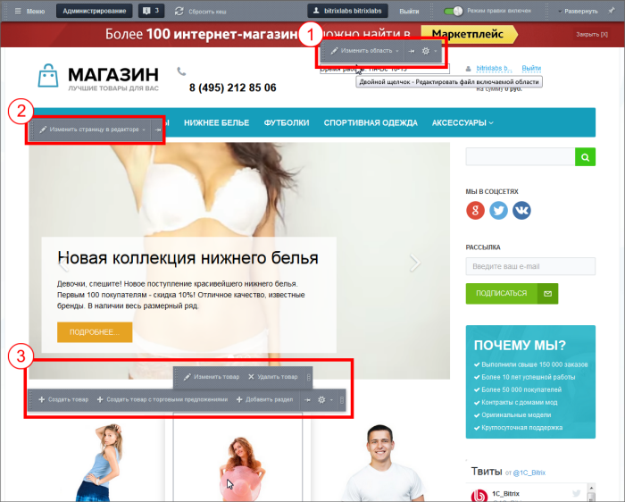

# Статическая и динамическая информация

**Навигация**
- [← Оглавление курса](index.md)
- [← Предыдущий: 10217 — Практические задания](lesson_10217.md)
- [Следующий: 9141 — Общее и отличия →](lesson_9141.md)

Официальная страница урока: https://dev.1c-bitrix.ru/learning/course/index.php?COURSE_ID=34&LESSON_ID=3397

### Два типа информации

На любой странице сайта посетитель встречает текст, картинки, таблички или видео. И ему всё равно как происходит добавление и вывод этих данных. Но для контент-менеджера всё не так однозначно. Информация делится на два типа. Такое деление облегчает работу контент-менеджера над содержанием сайта.  Хотя работа с текстом в обоих случаях происходит через

			Визуальный редактор

                    Визуальный редактор - инструмент, позволяющий отображать редактируемый текст в точности так же, как он будет выглядеть на странице, без использования HTML кода. [Подробнее...](https://dev.1c-bitrix.ru/learning/course/index.php?COURSE_ID=34&CHAPTER_ID=06299&LESSON_PATH=3905.6299)

		, эти два типа имеют существенные различия.

Первый тип информации называется "статический", второй тип - "динамический". Детальнее разницу поясним ниже, а пока: как же различать эти виды информации на сайте? При включённом

			режиме Правки

                    Режим Правки - специальный режим работы "1С-Битрикс: Управление сайтом", в котором

происходит изменение информации на сайте.

[Подробнее...](lesson_1832.md)

		 при наведении на блок (элемент) появляется панель. По тексту на панельке можно понять какая информация содержится в редактируемом элементе (блоке). Рассмотрим примеры панелек и виды информации в них:

1. **Изменить область** - редактирование
  			Включаемой области
                      Включаемая область - специально выделенная область на странице сайта, которую можно редактировать отдельно от основного содержания страницы. [Подробнее](lesson_1879.md)...
  		 - статическая или динамическая
  			информация
                      В большинстве своём эти области служат для размещения статической информации: авторских прав, графических ссылок, контактной информации, логотипа компании и т.п. Кроме этого в них с помощью компонентов может выводиться и динамическая информация: различные формы (подписка, голосование, опросы), новости или фотографии.
  		.
2. **Изменить страницу в редакторе** - редактирование текста непосредственно на странице - статическая информация.
3. **Создать/Изменить товар** - создание/редактирование текста, выводимого
  			компонентом
                      Компонент – это программный код, оформленный в визуальную оболочку, выполняющий определённую функцию какого-либо модуля по выводу данных в Публичной части. Мы можем вставлять этот блок кода на страницы сайта без непосредственного написания кода. [Подробнее...](https://dev.1c-bitrix.ru/learning/course/index.php?COURSE_ID=34&CHAPTER_ID=04457)
  		 - динамическая информация. На иллюстрации - каталог товаров и на панельке используется фраза «‎Создать товар». В случае новостей отображается «‎Изменить новость». Для каждого отдельного вида динамической информации используется своё слово / фраза.

### Зачем нужно такое деление?

Казалось бы, и там, и там - текст, картинки и видео. Зачем городить огород и создавать два вида информации? Позвольте пояснить вам разницу.

Представьте себе: стоит задача добавить на сайт текст "О компании". Как часто вы это делаете? Один раз, при создании сайта. И редактируется такой текст не часто.

А теперь представьте: стоит задача добавить 100 видов товаров в каталог. А если у товара несколько меняющихся параметров? Например, футболка - цвет и размер. Цветов пусть - 3, а размеров - 4. Если добавлять как отдельный товар каждую из 100 футболок со своим цветом и размером, то получится - 1200 товаров.  А это - 1200 созданных вручную страниц сайта, если создавать как статичную информацию. А товарам ещё задаются поисковые слова для индексации Яндексом или Google, задаются цены. Товары могут кончаться на складе и надо снимать с показа временно отсутствующие товары. Просто ад для контент-менеджера если делать это всё вручную.

В случае динамической информации "1С-Битрикс: Управление сайтом" всю рутинную работу Контент-менеджера берёт на себя. Система сама создаёт страницы для товара, подставляет типовые значения в поля описаний и ключевых слов для поисковых машин, сама отслеживает актуальность информации и так далее.

### Зачем нужно понимать, где какая информация?

Для простой работы с содержанием сайта прочитанного вами до этого момента вполне достаточно. Вы знаете, как различать статическую и динамическую информацию по панелькам. Но квалифицированный Контент-менеджер должен уметь несколько больше. Понимание разницы между этими видами информации позволит разобраться:

- какой вид информации предпочтителен для каких задач,
- почему в некоторых случаях не показываются те самые панельки на редактирование,
- с принципами работы с любым содержанием: каталог, фотогалерея, блоги и так далее,
- как создавать целые разделы сайта в несколько кликов,
- как упростить ввод больших объёмов данных с помощью импорта,
- и многое другое.

|  | **Из высказываний владельца веб-студии** 
 Как я нанимаю контент-менеджера? Да очень просто! Спрашиваю может ли он добавлять информацию в каталог?  
 Как правило, отвечают - "Да!" Я тут же даю доступ к тестовому сайту и файлик с информацией. Файлик, замечу, в формате CSV. Если претендент начинает добавление с открытия страницы **Импорт CSV**, то собеседование идёт дальше. Если начинает добавлять вручную, то мы прощаемся. |
| --- | --- |

### Заключение

Вы научились различать два вида информации, которые вам встретятся в "1С-Битрикс: Управление сайтом". Уяснили почему нужно такое деление. Повторим:

> **Статическая информация** - это **редко изменяемая** информация, которая выводится непосредственно в тексте самой страницы сайта вручную контент-менеджером.

> **Динамическая информация** - это **часто изменяемая однотипная** информация, выводимая на страницах сайта с помощью специальных программных компонентов системы.

На следующих страницах мы подробнее расскажем о двух типах информации: что у них общее и что разное, что такое физическая и виртуальная страница (раздел) сайта и дадим пример размещения двух типов информации.
