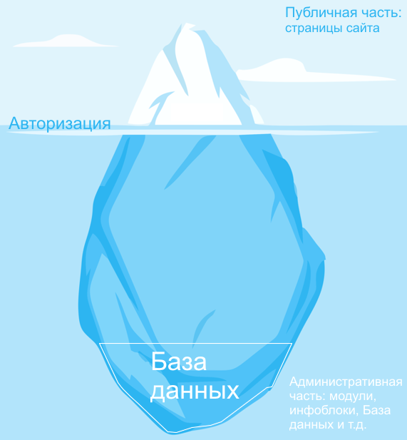

# Публичная и административная части

**Навигация**
- [← Оглавление курса](index.md)
- [← Предыдущий: 26432 — Архитектура Битрикса. Видеоурок](lesson_26432.md)
- [Следующий: 1977 — Файловая система →](lesson_1977.md)

Официальная страница урока: https://dev.1c-bitrix.ru/learning/course/index.php?COURSE_ID=34&LESSON_ID=3446

|  | Это ознакомительный материал. Детальнее смотрите в главе [Элементы Управления](https://dev.1c-bitrix.ru/learning/course/index.php?COURSE_ID=34&CHAPTER_ID=04455&LESSON_PATH=3905.4455) |
| --- | --- |

|  | ### Публичная и административная части |
| --- | --- |

Ваш сайт на Битриксе подобен айсбергу:

- небольшая видимая часть - собственно сайт, доступный посетителям - Публичный раздел.
- большая невидимая часть, где происходит вся работа программного кода системы управления сайтом - Административный раздел
- Граница между ними - процесс
  			авторизации
                      **Авторизация** - процесс с помощью которого система отличает тех, кому можно работать с ней, от тех, кто может только просматривать сайт.
   [Подробнее...](https://dev.1c-bitrix.ru/learning/course/index.php?COURSE_ID=34&CHAPTER_ID=02339&LESSON_PATH=3905.2339)
  		 контент-менеджера на сайте.

|  | #### База данных |
| --- | --- |

Универсальное место хранения информации на сайте.

			Специальная программа

                    В *"1С-Битрикс: Управление сайтом"* используется База данных [MySQL](https://ru.wikipedia.org/wiki/MySQL).

		, легко загружающая и выгружающая любую информацию. Существенно экономит место на хостинге, время при обработке информации, вычислительные ресурсы сервера. Без Базы данных не работает ни одна современная система управления сайтом.

Саму Базу данных вы нигде не увидите. Она упрятана глубоко в коде Административной системы, глубоко в подводной части айсберга. Работать с ней вы будете через модули и компоненты.

|  | #### Важно запомнить! |
| --- | --- |

- На сайте есть две неравнозначные части: Публичная и Административная. Публичную видят все, Административную - только кому положено.
- База данных - место хранения информации, работа с БД происходит через инструменты CMS.
