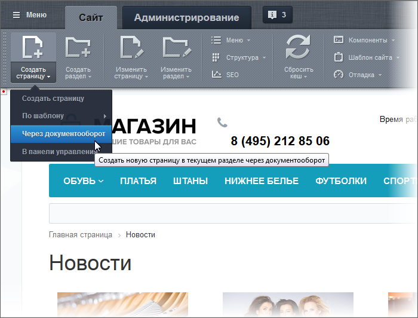
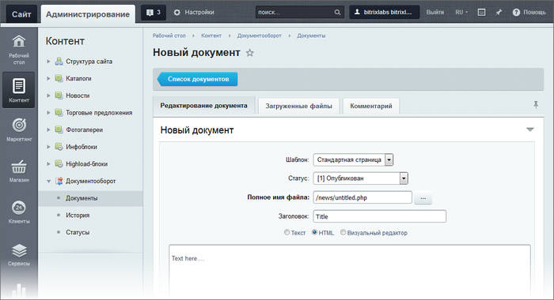

# Создание страниц через документооборот

**Навигация**
- [← Оглавление курса](index.md)
- [← Предыдущий: 2038 — Документы и история](lesson_2038.md)
- [Следующий: 5217 — Как настроить инфоблок на документооборот →](lesson_5217.md)

Официальная страница урока: https://dev.1c-bitrix.ru/learning/course/index.php?COURSE_ID=34&LESSON_ID=3447

Документооборот - полезная функция, если требуется организовать процесс создания, наполнения и публикации страниц с контролем со стороны заказчика или администратора сайта.

### Видеоурок

### Пошаговое создание страницы через документооборот

Для создания новой страницы через **Документооборот**:

1. Воспользуйтесь в Публичной части сайта командой **Через документооборот**:
  
  В Административном отделе системы откроется форма создания страницы:
  
2. Заполните поля формы. Краткие пояснения полей:

  - Поле **Статус** - выбирается текущий статус страницы. Для всеобщего доступа документ должен иметь статус **Опубликован**.
  - Поле **Полное имя файла** - имя файла и путь до него в структуре файловой системы сайта. Возможно изменение и имени, и пути.

### Важно запомнить!

**Внимание!** Использование этой возможности имеет ограничения:

- нельзя сразу назначить странице пункт меню,
- нельзя задать ключевые слова и теги,
- недоступно использование автоматической
  			транслитерации
  **Транслитерация** – точная передача знаков одной письменности знаками другой письменности, при которой каждый знак (или последовательность знаков) одной системы письма передаётся соответствующим знаком (или последовательностью знаков) другой системы письма.
  [Подробнее](https://ru.wikipedia.org/wiki/%D0%A2%D1%80%D0%B0%D0%BD%D1%81%D0%BB%D0%B8%D1%82%D0%B5%D1%80%D0%B0%D1%86%D0%B8%D1%8F)...
  		.
