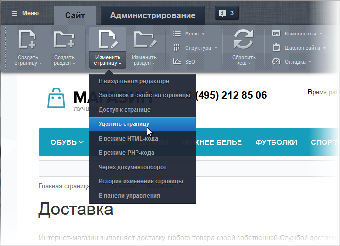
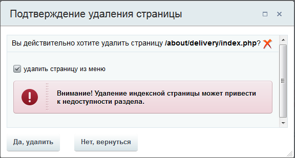

# Удаление страниц и разделов

**Навигация**
- [← Оглавление курса](index.md)
- [← Предыдущий: 3450 — Создание разделов](lesson_3450.md)
- [Следующий: 10269 — Средства навигации на сайте →](lesson_10269.md)

Официальная страница урока: https://dev.1c-bitrix.ru/learning/course/index.php?COURSE_ID=34&LESSON_ID=3448

Удаление страниц - очень простая, в два шага, операция. Пользуйтесь этой операцией обдумано, так как восстановление страниц Контент-менеджеру недоступно. Если для сайта создавался резервный архив, то администратор сайта может восстановить страницу из архива.

### Видеоурок

### Удаление страниц

**Внимание!** Страницы удаляются без возможности восстановления!

Для удаления страницы:

1. Воспользуйтесь командой **Удалить страницу**:
  
2. В окне подтверждения выберите **Удалить страницу**:
  
  При снятой галочке **удалить страницу из меню** удалится только файл страницы из структуры сайта, а пункт в меню сайта останется. Если кликнуть по оставшемуся пункту меню, то будет показываться 404 ошибка, пока не будет создан новый файл для данной страницы.

### Удаление разделов

Удаление разделов легче всего реализовать с помощью

			кнопки Структура

                    Кнопка Структура - удобный и практичный инструмент для наглядного представления всей структуры сайта без перехода в административный раздел. Кнопка позволяет выполнять управление структурой. [Подробнее](lesson_1852.md)...

		.

Разделы можно удалять и через физическую структуру, но на уровне Контент-менеджера этой возможностью лучше не пользоваться: вы случайно можете удалить что-то жизненно важное для работы системы.

### Важно запомнить!

**Внимание!**

1. Удаление индексной (главной) страницы раздела может привести к недоступности всего раздела;
2. Удаление раздела означает и удаление всех страниц, расположенных в нём с потерей всех данных.
