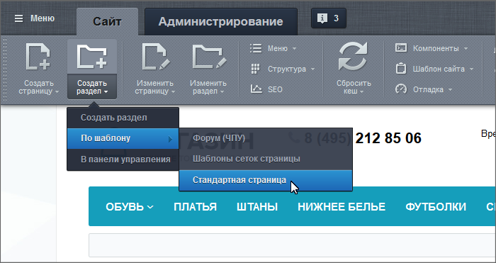

# Создание разделов

**Навигация**
- [← Оглавление курса](index.md)
- [← Предыдущий: 1911 — Создание физических страниц](lesson_1911.md)
- [Следующий: 3448 — Удаление страниц и разделов →](lesson_3448.md)

Официальная страница урока: https://dev.1c-bitrix.ru/learning/course/index.php?COURSE_ID=34&LESSON_ID=3450

|  | ### Создаём новый раздел |
| --- | --- |

Раздел создаётся с помощью кнопки:

Все шаги по его созданию идентичны

			созданию страницы

                    Создание страниц доступно с помощью Мастера, по шаблону и через документооборот. Самый простой и рекомендуемый нами способ - с помощью Мастера.

[Подробнее ...](lesson_1911.md)

		.

**Внимание!** При

			создании раздела

		 автоматически создается страница **index.php**. Она отображается на сайте как главная страница раздела. Её удаление приведет к тому, что раздел станет недоступен для просмотра.

При создании страниц и разделов система автоматически переходит на созданную страницу или раздел соответственно. Поэтому, если требуется создать нескольких страниц  в одном разделе, то не забывайте каждый раз возвращаться на главную страницу раздела. Если страница, все же, случайно создана в другом месте, то перенесите ее с помощью

			кнопки Структура

                    Кнопка Структура - удобный и практичный инструмент для наглядного представления всей структуры сайта без перехода в административную часть сайта. Кнопка позволяет выполнять управление структурой.
[Подробнее](lesson_1852.md)...

		.
