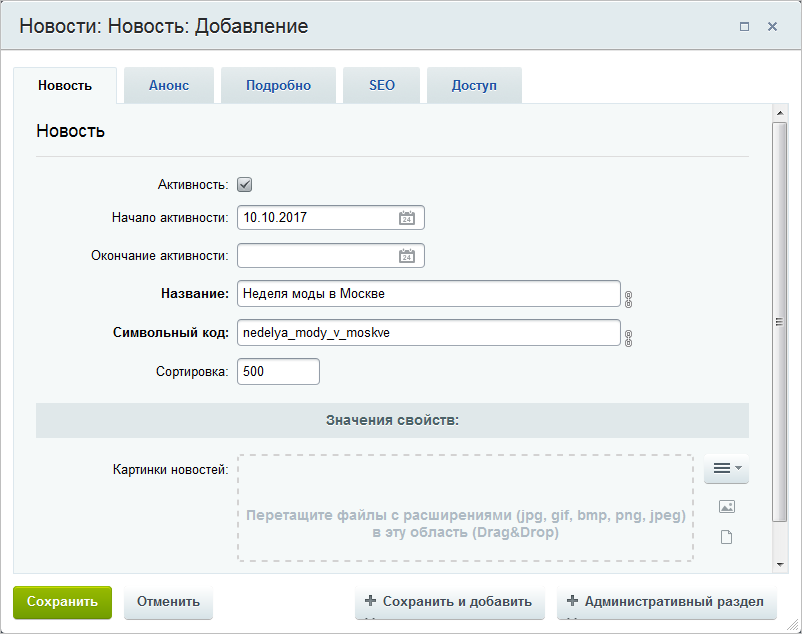

# Как добавить новость

**Навигация**
- [← Оглавление курса](index.md)
- [← Предыдущий: 13596 — Как массово поменять картинки в товарах каталога](lesson_13596.md)
- [Следующий: 5523 — Как закрепить новость наверху списка →](lesson_5523.md)

Официальная страница урока: https://dev.1c-bitrix.ru/learning/course/index.php?COURSE_ID=34&LESSON_ID=3512

### Как добавить новость

Представьте, что на сайте уже есть новостной раздел и вам требуется добавить свежую новость. Не тратьте время на поиски инфоблока в административном разделе, создавайте новости из публичного раздела:

1. Откройте страницу со
  			списком новостей
                      
  		 (страница должна быть создана с помощью [новостных компонентов](https://dev.1c-bitrix.ru/user_help/components/content/articles_and_news/index.php)).
2. Включите
  			режим правки
                      
  		.
3. Наведите курсор мыши на область новостей и нажмите **Добавить новость**:
  
  **Важно!** Добавление новости возможно, если вы обладаете правом доступа к новостному инфоблоку **Изменение** или **Полный доступ**. Если вы не можете добавлять новости, обратитесь к администратору.
4. Заполните поля
  			формы создания новости
                      
  		:

  - Отметьте опцию **Активность**, чтобы новость публиковалась на сайте.
  - Укажите заголовок новости, ее дату, анонс и детальное описание.
  - Все остальные параметры укажите необходимым для вас образом.
5. Нажмите **Сохранить**.

Итак, новость добавлена на сайт:

**Примечание:**чтобы при детальном просмотре новости в заголовке вкладки браузера отображалось название этой новости, в списке полей **Дополнительные наcтройки** формы настроек компонента должна быть отмечена опция **Устанавливать заголовок страницы**.

### Видео-пример

Содержание видеоролика внешним видом несколько отличается от текущей версии продукта.

### Заключение

Как видно из урока, процесс добавления новости прост и занимает всего пару минут. Закрепите ваши знания, создайте новость на своем сайте.
