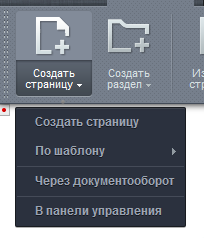
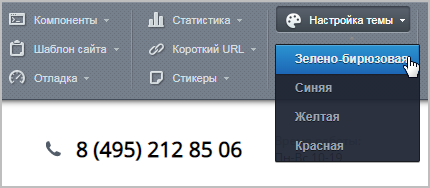

# Публичный раздел

**Навигация**
- [← Оглавление курса](index.md)
- [← Предыдущий: 2460 — Проверьте себя](lesson_2460.md)
- [Следующий: 1831 — Панель управления →](lesson_1831.md)

Официальная страница урока: https://dev.1c-bitrix.ru/learning/course/index.php?COURSE_ID=34&LESSON_ID=3557

### Что видит контент-менеджер после авторизации

Панель управления - наш основной инструмент по работе с содержимым сайта. Находясь на вкладке **Сайт**, контент-менеджер может вносить изменения в публичную часть сайта и сразу видеть результат. Это значительно облегчает повседневную работу.

Стоит отметить, что набор инструментов на панели зависит от текущей страницы и прав пользователя. То есть администратор может ограничить доступ пользователя к определенным инструментам. В этой главе мы будем рассматривать полный состав панели управления, доступный администратору сайта.

**Примечание**: ограничения на доступ касаются не только кнопок **Панели управления**, но и некоторого другого функционала, например, задания прав доступа при создании страниц.

### Видеоурок

Давайте разберем все команды на вкладке **Сайт**. Самые важные операции мы подробно рассмотрим позже в курсе, а пока дадим лишь короткое описание.

**Примечание**: большинство кнопок на панели позволяют выполнить целый ряд операций. Стрелочка рядом с кнопкой открывает

			выпадающий список

                    

		 возможных функций.

### Что означает каждая кнопка

- **Создать страницу/Создать раздел** - пункты позволяют создать новую страницу или раздел
  			различными способами
  Страница или раздел могут быть созданы с помощью:
  - мастера;
  - документооборота;
  - шаблонов
  - напрямую через панель управления.
  [Подробнее о создании страниц и разделов...](https://dev.1c-bitrix.ru/learning/course/index.php?COURSE_ID=34&CHAPTER_ID=08437&LESSON_PATH=3905.4460.8437)
  		.
- **Изменить страницу/Изменить раздел** - а эти пункты понадобятся нам для редактирования страниц и разделов. Редактирование - это целый комплекс операций:

  - изменение содержимого
                        Изменение внешнего вида страницы и информации на ней в визуальном редакторе. [Подробнее...](https://dev.1c-bitrix.ru/learning/course/index.php?COURSE_ID=34&CHAPTER_ID=06299&LESSON_PATH=3905.6299)
    		;
  - настройка заголовка и
    			свойств
                        Изменение описания страницы или раздела, ключевых и продвигаемых слов. [Подробнее...](https://dev.1c-bitrix.ru/learning/course/index.php?COURSE_ID=34&CHAPTER_ID=01850&LESSON_PATH=3905.4461.1850)
    		;
  - определение
    			прав доступа
                        Запрет или разрешение доступа к информации и инструментам. [Подробнее...](https://dev.1c-bitrix.ru/learning/course/index.php?COURSE_ID=34&CHAPTER_ID=06675&LESSON_PATH=3905.4461.6675)
    		.
- **Меню** - пункт для работы с
  			навигацией
                      Меню в системе может быть расположено в разных местах и включать несколько уровней вложенности. [Подробнее...](https://dev.1c-bitrix.ru/learning/course/index.php?COURSE_ID=34&CHAPTER_ID=010227&LESSON_PATH=3905.4460.10227)
  		. Если мы хотим добавить или отредактировать меню на странице - нам сюда.
- **Структура** - меню для доступа к
  			управлению структурой
                      Получить доступ к любому файлу или папке, переместить или изменить файлы - все это мы можем сделать с помощью инструмента **Управление структурой**. [Подробнее...](https://dev.1c-bitrix.ru/learning/course/index.php?COURSE_ID=34&CHAPTER_ID=04460&LESSON_PATH=3905.4460)
  		 системы.
- **SEO** - инструменты
  			поисковой оптимизации
                      **Поисковая оптимизация** - комплекс действий по улучшению позиций сайта в результатах поисковых систем. [Подробнее...](https://dev.1c-bitrix.ru/learning/course/index.php?COURSE_ID=139&CHAPTER_ID=04545&LESSON_PATH=11427.4545)
  		. С помощью этого инструмента мы можем управлять ключевыми словами, заголовками и даже получить конкретные рекомендации системы по оптимизации.
- **Сбросить
  			кэш
                      Кеш - это некое хранилище для ускорения просмотра информации на сайте. Когда пользователь просматривает информацию на сайте, то она не всегда запрашивается из базы данных, а берется из кеша.** - пункт для работы с
  			кэшированием
                      Инструменты панели управления позволяют сбросить кэш всей страницы, компонентов или не использовать кэш вообще. [Подробнее...](/learning/course/index.php?COURSE_ID=35&LESSON_ID=7077)
  		. Работа с кэшем требует определенных знаний, поэтому советуем сначала обратиться к администратору.
- **Компоненты** - пункт для быстрого перехода к редактированию
  			компонентов
                      **Компонент** - готовый элемент сайта, со своими функциями. Из компонентов, как из деталей, можно собрать всю конструкцию сайта. [Подробнее...](/learning/course/?COURSE_ID=34&CHAPTER_ID=04457&LESSON_PATH=3905.4457)
  		.
- **Шаблон сайта/Отладка** - эти два пункта предназначены для разработчиков, поскольку затрагивают вопросы
  			администрирования
                      Вопросы администрирования рассматриваются в отдельных курсах для администраторов. [Подробнее...](/learning/course/index.php?COURSE_ID=35)
  		 и изменения кода. Поэтому не рекомендуем использовать их контент-менеджеру, легко можно что-то сломать:)
- **A/B-тест** - кнопка, появляющаяся при запущенном
  			A/B-тесте.
  **Модуль A/B-тестирование** - это инструмент маркетингового исследования, с помощью которого можно сравнить два варианта страницы, шаблона сайта или сайта целиком, чтобы убедиться, какой из вариантов имеет более высокую конверсию и многие другие дополнительные показатели.
  [Подробнее](https://dev.1c-bitrix.ru/learning/course/index.php?COURSE_ID=41&CHAPTER_ID=06747&LESSON_PATH=3911.6747)...
  		 С помощью этой кнопки можно переключаться между режимами **A/B** и видеть, как сайт отображается для посетителей каждой тестируемой группы.
- **Статистика** - инструмент для просмотра данных
  			веб-аналитики
                      **Веб-аналитика** - система измерения, сбора, анализа информации о посетителях веб-сайтов с целью оптимизации. [Подробнее...](https://dev.1c-bitrix.ru/learning/course/index.php?COURSE_ID=139&CHAPTER_ID=04544&LESSON_PATH=11427.4544)
  		 - графика посещаемости страниц и статистики переходов.
- **Короткий URL** - пункт для создания
  			короткой ссылки
                      Функционал, позволяющий изменить вид адреса любой страницы в рамках системы. [Подробнее...](lesson_3080.md)
  		 на текущую страницу. К примеру, длинный адрес `http://ваш_сайт.ru/catalog/sportswear/sports-suit-evening-activities/` мы можем преобразовать в `http://ваш_сайт.ru/~Вечерний спорт`.
- **Стикеры** - постоянно забываете что-то? Создайте заметку для себя и коллег прямо на странице с помощью
  			стикеров
                      Функционал для создания заметок, которые могут быть привязаны к какой-то области или элементу на странице. [Подробнее...](https://dev.1c-bitrix.ru/learning/course/?COURSE_ID=34&CHAPTER_ID=04621&LESSON_PATH=3905.4478.4621)
  		.
- **Настройка темы** - с помощью этой кнопки можно быстро
  			сменить
  
  		 текущую цветовую тему
  			шаблона сайта
  **Шаблон дизайна** задаёт внешний вид сайта. В нём определяется расположение различных элементов на сайте, художественный стиль и способ отображения страниц.
  [Подробнее](lesson_1994.md)...
  		 (если такая возможность предусмотрена шаблоном).
- **Мастер настройки** - для установки любого решения на базе *"1С-Битрикс: Управление сайтом"* мы используем
  			мастер настройки
                      Пошаговый мастер, который помогает нам установить и настроить систему. [Подробнее...](https://dev.1c-bitrix.ru/learning/course/index.php?COURSE_ID=35&LESSON_ID=1980)
  		. С помощью этого пункта меню мы можем вернуться к этому мастеру и что-то изменить. Как вы понимаете, это инструмент больше нужен администраторам, но контент-менеджеру необходимо знать о его существовании:)
- **Протестировать новое решение** - ещё один инструмент разработчика. При установке системы мы выбираем какое-то готовое решение (например, интернет-магазин или информационный портал). С помощью этой кнопки мы можем быстро перейти к установке другого решения. В большинстве случаев этот элемент на панели управления будет недоступен контент-менеджеру.

### Заключение

На панели расположены самые нужные контент-менеджеру инструменты. Функции сгруппированы по смыслу и могут быть недоступны, если не хватает прав доступа.
