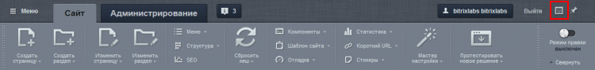

# Горячие клавиши

**Навигация**
- [← Оглавление курса](index.md)
- [← Предыдущий: 1832 — Режим правки](lesson_1832.md)
- [Следующий: 10179 — Проверьте себя →](lesson_10179.md)

Официальная страница урока: https://dev.1c-bitrix.ru/learning/course/index.php?COURSE_ID=34&LESSON_ID=3567

### Видеоурок

Многие операции в системе *"1С-Битрикс: Управление сайтом"* гораздо удобнее и быстрее выполнять не мышью, а с помощью комбинаций горячих клавиш. Причем вы можете задать комбинации, удобные именно вам.

### Горячие клавиши: ускорь свою работу

Настройка горячих клавиш производится с помощью кнопки **Горячие клавиши** на панели управления.

Как вы видите, изначально определены комбинации только для нескольких основных операций. Клавиши для остальных операций вы можете задать на свое усмотрение.

Если вы забыли какие горячие клавиши назначены  для действия, то при наведении курсора мыши на данную кнопку всплывёт подсказка:

