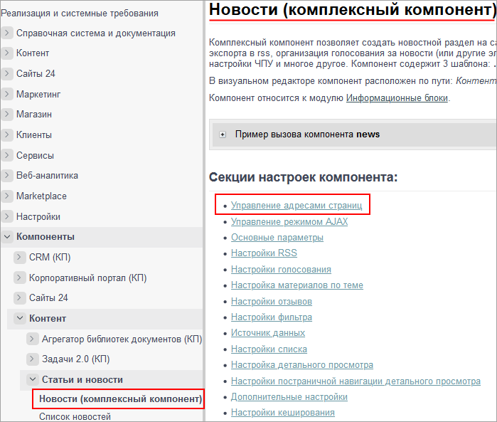
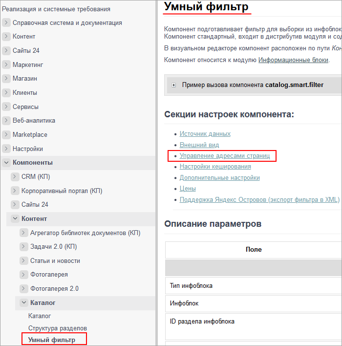
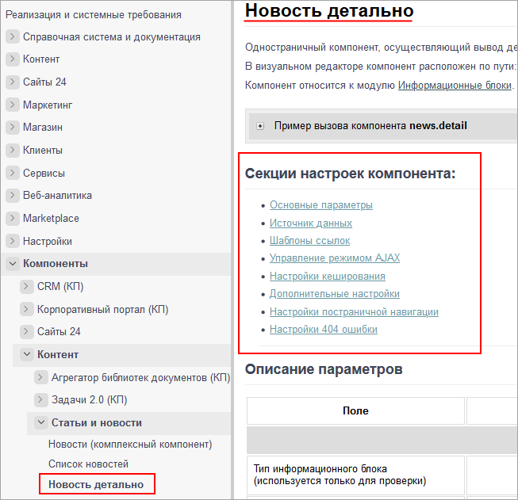
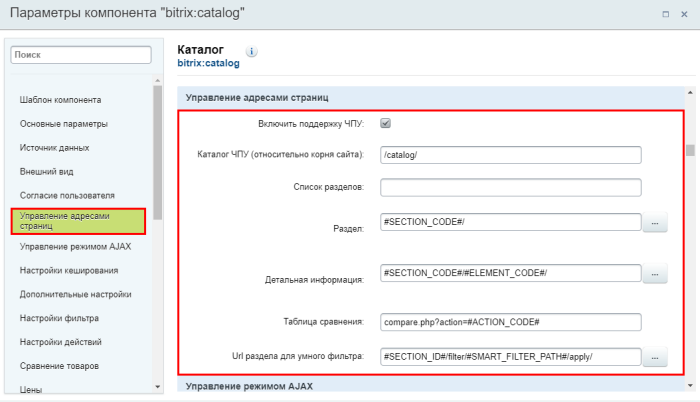
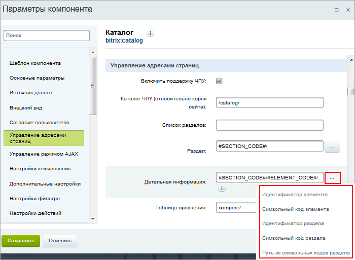

# Человеко-понятные URL

**Навигация**
- [← Оглавление курса](index.md)
- [← Предыдущий: 12838 — Как формируются ссылки](lesson_12838.md)
- [Следующий: 3080 — Короткие ссылки →](lesson_3080.md)

Официальная страница урока: https://dev.1c-bitrix.ru/learning/course/index.php?COURSE_ID=34&LESSON_ID=3579

### Человеко-понятные URL

Вы обращали внимание, что при публикации на сайте

			динамической информации

                    Динамическая информация - информация, хранимая в Базе Данных сайта и выводимая специальными компонентами системы. Как правило, это - часто изменяемая информация со множеством свойств. [Подробнее...](https://dev.1c-bitrix.ru/learning/course/index.php?COURSE_ID=34&CHAPTER_ID=01848&LESSON_PATH=3905.4461.1848)

		 ссылки на материалы имеют примерно такой вид:

Согласитесь, что они не несут большой информативности особенно для тех, кто не знаком со структурой веб-адресов. Средства *«1С-Битрикс: Управление сайтом»* позволяют сделать ссылки более понятными с помощью специальной функции. Функция встроена во все комплексные

			компоненты

                    Компонент – это программный код, оформленный в визуальную оболочку, выполняющий определённую функцию какого-либо модуля по выводу данных в Публичной части. Мы можем вставлять этот блок кода на страницы сайта без непосредственного написания кода. [Подробнее...](https://dev.1c-bitrix.ru/learning/course/index.php?COURSE_ID=34&CHAPTER_ID=04457)

		 (и отдельные простые) и преобразует стандартный веб-адрес в так называемый человеко-понятный URL (сокращенно ЧПУ).

> Посмотреть, есть ли в конкретном компоненте возможность включить поддержку ЧПУ, можно на странице описания этого компонента в [Пользовательской документации](https://dev.1c-bitrix.ru/user_help/components/index.php). Например, такая возможность есть в комплексном компоненте
>
> 			Новости
>
>
>
>                     
>
>
>
> 		, в простом компоненте
>
> 			Умный фильтр
>
>
>
>                     
>
>
>
> 		, но нет в простом компоненте
>
> 			Новость детально
>
>
>
>                     
>
>
>
> 		.

Например:

### Видеоурок

### Где и как настроить ЧПУ

Чтобы изменить вид адресов на более приятный и понятный, выполните следующие действия:

**Важно!** Включение ЧПУ должно быть согласовано с администратором сайта.

- Откройте на
  			редактирование
                      Мы разместили на странице компонент , теперь приступим к настройке. Настройка выполняется двумя способами:
  	 Из визуального редактора;
  	 Из публичной части сайта.
   [Подробнее ...](lesson_9165.md)
  		 параметры компонента и найдите секцию **Управление адресами страниц**.
- Поставьте галочку в поле **Включить поддержку ЧПУ**. Отобразятся
  			поля для настройки
                      
  		 адресов.

  - Поле **Каталог ЧПУ** – это путь до папки, с которой работает компонент. Может быть как настоящим, так и
    			нет
                        Например, компонент размещен на странице **/communication/index.php**. В поле **Каталог ЧПУ** по умолчанию указано **communication/**. Это настоящий существующий раздел.
    		 Вы можете указать и несуществующий раздел **communication/forum/**, адреса будут строится уже относительно каталога **communication/forum/**, а не **communication/**.
    		 Тем самым, вы можете подменять раздел, относительно которого строятся адреса.
    		. Относительно этого каталога строятся пути к выводимым на сайт материалам.
  - Остальные поля секции содержат настройки по умолчанию и могут быть как пустыми, так и содержать вариант настройки адресов.
    Важную роль в настройке адресов динамической информации играют **макросы**. Макрос – это такой код, который автоматически находит и подставляет в адрес определенную информацию. Например макрос #SECTION_ID# будет подставлять
    			идентификатор
                        Уникальный числовой номер.
    		 раздела, а #ELEMENT_CODE# –
    			символьный код
                        Осмысленный код на латинице. Часто это название, записанное латиницей или переведенное на английский язык.
    		 элемента.
    Макросы (#FID#, #TID#, #COURSE_ID#, #SECTION_ID#, #ELEMENT_ID# и т.д.) допускают использование произвольных префиксов и постфиксов: например, forum-#FID#/ или #FID#.html. Перечень допустимых макросов, вместо которых в адреса подставятся идентификаторы форума, темы, курса, раздела, элемента и т.д., определяются конкретным компонентом.
    > Посмотреть
    >
    > 			список допустимых макросов
    >
    >
    >
    >                     
    >
    >
    >
    > 		 для каждого поля cекции можно, нажав кнопку **[...]**.
    		 Возможно, для их использования следует провести некоторые дополнительные настройки в системе. Уточните этот момент у вашего администратора сайта.
    		 Самым богатым набором допустимых к использованию макросов обладают компоненты
    			Информационных блоков
                        Информационный блок - это всего лишь хранилище данных. Выберите компонент и опубликуйте свои материалы. Сделайте все по своему вкусу с широкими возможностями компонентов...
     [Подробнее ...](https://dev.1c-bitrix.ru/learning/course/index.php?COURSE_ID=34&CHAPTER_ID=09909&LESSON_PATH=3905.4477.9909)
    		. В них помимо параметров, принимающих идентификаторы (#SECTION_ID#, #ELEMENT_ID#), можно использовать параметры, принимающие символьные коды (#SECTION_CODE_PATH#, #SECTION_CODE#, #ELEMENT_CODE#).
    **Примечание:** если поле **Символьный код** не показывается в форме раздела и/или элемента, то выполните
    			настройку форм.
    Настройка формы выполняется только из административной части сайта.
    Если собираетесь настроить форму редактирования элемента, то откройте страницу со списком
    элементов инфоблока. Если же нужно настроить форму раздела, то страницу со списком разделов.
    Откройте на редактирование любой элемент (или раздел соответственно). В правой части формы нажмите на «шестеренку»  . Откроется окно с настройками
    [Подробнее](lesson_1883.md)...
    		 Кроме того, настройте обязательность заполнения поля **Символьный код** и вы не будете забывать указывать код при создании новых разделов и элементов. Дополнительно можете включить
    			автогенерацию кода
                        
    		 из названия раздела/элемента путем транслитерации.
    Настоятельно рекомендуется сделать настройки символьных кодов **ДО** добавления разделов/элементов в инфоблок. Так как для того, чтобы прописать символьные коды в уже добавленных разделах/элементах, придется открывать каждый элемент и транслитерировать название вручную.
    **Примечание:** про настройку ЧПУ в инфоблоках читайте в
    			отдельном уроке
                        Согласитесь, что ссылка на некий элемент инфоблока http://mysite.ru/catalog/pants/pants-striped-flight/ гораздо понятнее посетителям, чем http://mysite.ru/catalog/?SECTION_ID=8&ELEMENT_ID=4 . Весомым аргументом в пользу человеко-понятных адресов является и то, что такие адреса лучше воспринимаются поисковыми машинами.
     [Подробнее ...](lesson_10233.md)
    		.
    		 Остальные компоненты "работают" только через параметры, принимающие идентификаторы (#FID#, #TID#, #COURSE_ID# и т.д.). Но, если для компонента выполнить
    			кастомизацию
                        Кастомизация стандартного компонента - копирование стандартного компонента в собственное пространство имён и изменение логики его работы с целью изменения/добавления функционала. Выполняется разработчиком сайта.
    		, провести дополнительные настройки в системе, то для него становится возможным использование параметров, принимающих другие данные (например, символьные коды или названия на латинице) учебных курсов, форумов и т.п.
- Задайте в полях подходящие для вас шаблоны построения адресов. При этом обязательно учитывайте архитектуру выводимых данных и переданные в компонент данные. Так, например, при построении адреса темы форума следует помнить, что тема прикреплена к некоторому форуму. Поэтому адрес темы должен содержать не только номер темы, но и номер форума.
- Сохраните параметры компонента и проверьте ваши адреса.

> **Совет:** Определитесь с видом ссылок (с ЧПУ или без) до того, как будете публиковать ссылки где-либо (в статьях, на форуме и т.д.). При изменении настроек, связанных с ЧПУ, структура ссылок на страницы изменится. Как следствие, ссылки, созданные при старых настройках, станут недействительными. Потребуется замена старых ссылок, что может оказаться очень трудоемко и не всегда возможно, особенно если ссылки размещены на сторонних ресурсах.

### Заключение

Вы узнали что такое ЧПУ и для чего оно используется.

> **ЧПУ** (англ. Friendly URL) — веб-адреса, удобные для восприятия человеком (а также систем и методов построения таких адресов). Является аббревиатурой от словосочетания «человеко-понятный урл» (где «урл» — жаргонное обозначение URL).

Настройка сайта на работу с ЧПУ не сложна: необходимо учесть переданные в компонент данные и выполнить подходящую вам настройку компонента в секции **Управление адресами страниц**.
