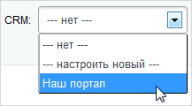
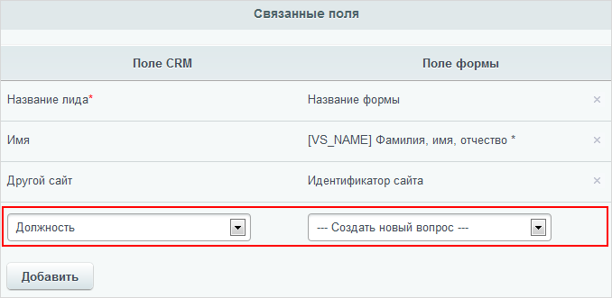
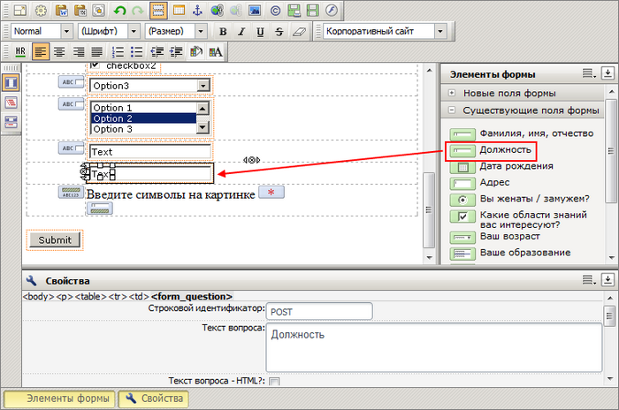

# Интеграции веб-формы и CRM Битрикс24

**Навигация**
- [← Оглавление курса](index.md)
- [← Предыдущий: 5156 — Создание полей веб-формы](lesson_5156.md)
- [Следующий: 9265 — Отправка результатов веб-формы на почту →](lesson_9265.md)

Официальная страница урока: https://dev.1c-bitrix.ru/learning/course/index.php?COURSE_ID=34&LESSON_ID=3642

### Обмен данными с CRM

С версии 11.5 "1С-Битрикс: Управление сайтом" любая веб-форма передаёт данные в

			CRM

**CRM-система** (Customer Relationship Management) - система управления взаимоотношениями с клиентами. CRM служит для учета потенциальных и текущих клиентов, журналистов, партнеров и других «лидов». В CRM встроен каталог товаров и услуг.

		 корпоративного

			портала

Портал **Битрикс24** – это набор из пяти важных и полезных инструментов, которые помогают бизнесу работать: CRM, Задачи и проекты, Контакт-центр, Сайты и магазины, Офис.

[Подробнее](https://www.bitrix24.ru/whatisthis/)...

		 в качестве нового

			лида.

**Лид** (интерес) - потенциальная сделка, проявленный интерес, «зацепка». Это неявный, еще «призрачный» контакт, полученный любым способом - допустим, кто-то позвонил в компанию, дал свою визитную карту, заполнил форму при скачивании дистрибутивов продукта и т.п. Лиды могут вводиться сотрудниками компании (обработка форм, анкет и т.д.) либо через веб-сервисы на сайте - автоматически подгружаться с форм в CRM для дальнейшей обработки. Лид может содержать данные потенциального Контакта (телефон, адрес, e-mail).

[Подробнее](https://helpdesk.bitrix24.ru/open/1357950/)...

		 Поля созданной веб-формы сопоставляются с полями CRM, и когда клиент заполнит веб-форму на сайте, эти данные отправляются на портал.

Рассмотрим на примере, как это можно сделать.

На странице Сервисы &gt; Веб-формы &gt; Настройка форм откройте нужную форму для редактирования либо

			создайте новую

                    Если вы создаете новую форму, то сначала введите как минимум ее название, примените внесенные изменения, после чего вам будут доступны действия на закладке **CRM**.

		, нажав **Создать** на контекстной панели.

В открывшейся форме перейдите на закладку **CRM**:

Откройте

			выпадающий список

                    

		 поля **CRM**, где сейчас стоит **нет**. В выпадающем списке будут перечислены уже имеющиеся привязки к серверам CRM, выберите нужный портал. Если привязанных порталов нет, то создайте связь, выбрав пункт меню **настроить новый**.

## Настройка привязки новой CRM

- **Название** – произвольное название портала;
- **Сервер CRM** – адрес портала;
- **Путь** – адрес страницы с компонентом интеграции относительного корневого каталога сервера (по умолчанию адрес уже задан, и его **менять не нужно**);
- **Логин**,  **Пароль** – логин и пароль сотрудника портала, который будет выполнять обработку лидов.

После того, как привязанная CRM выбрана, закладка примет следующий вид:

- Выберите **Способ отсылки**: при ручном режиме данные передаются в CRM менеджером после их обработки. При автоматическом режиме результаты заполнения сразу передаются в CRM.
- В секции **Связанные поля** укажите, каким данным веб-формы (показаны справа) будет соответствовать какое-либо поле лида (показаны слева). Чтобы задать новое соответствие, нажмите кнопку **Добавить**.
  **Внимание!**
  Если не видны поля CRM, сохраните форму настройки и откройте ее снова.
  Для корректной передачи данных в CRM, к полю **Название лида** обязательно должно быть привязано какое-либо из полей веб-формы.

Если в веб-форме нет данных, подходящих нужному полю лида, выберите пункт

			Создать новый вопрос

                    

		. Сохраните настройки веб-формы по кнопке **Применить** и вопрос создастся автоматически.

**Примечание**. Если в веб-форме используется шаблон формы по умолчанию, то созданный вопрос автоматически отобразится в форме. Если используется свой шаблон, то откройте шаблон на редактирование и в разделе **Существующие поля формы**

			добавьте вопрос в шаблон формы

                    

		.

### Передача данных в CRM

Допустим, что посетитель заполнил вашу веб-форму.  Если в настройках был указан ручной способ отсылки, то на странице с результатами заполнения формы сотрудник, ответственный за их обработку, сможет отправить их в CRM, выбрав соответствующий пункт контекстного меню:

Если данные переданы успешно, выведется сообщение о

			добавлении лида

                    

		. Результаты заполнения веб-формы можно отправить в CRM неограниченное количество раз, лиды в таком случае будут отличаться только значением **ID**.

Если в настройках указана автоматическая передача, то соответствующие лиды сразу появятся в CRM:

**Примечание**: в случае автоматической отсылки повторная отправка лида осуществляется уже вручную.

### Документация по теме

- [Настройки связи с CRM](http://dev.1c-bitrix.ru/user_help/service/form/form_edit.php#crm)
