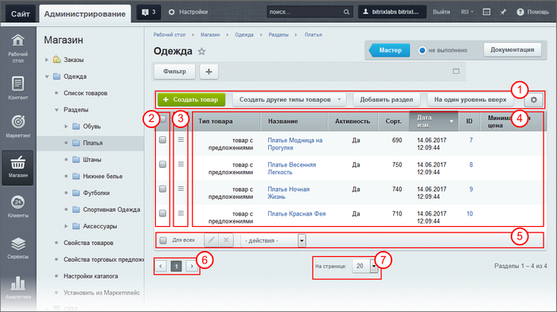
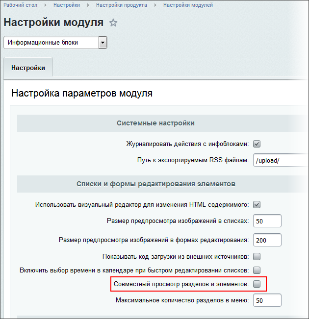

# Список элементов (старый интерфейс)

**Навигация**
- [← Оглавление курса](index.md)
- [← Предыдущий: 11771 — Фильтр (новый интерфейс)](lesson_11771.md)
- [Следующий: 11767 — Список элементов (новый интерфейс) →](lesson_11767.md)

Официальная страница урока: https://dev.1c-bitrix.ru/learning/course/index.php?COURSE_ID=34&LESSON_ID=3643

### Видеоурок

Список элементов - основной способ представления информации в системе. Он используется везде: список баннеров, список элементов инфоблока, список страниц сайта и так далее. Вне зависимости от того, что список отображает он имеет общие составные части.

### Структура списка элементов

1 - Контекстная панель. Состав панели может сильно различаться в зависимости от списка элементов.

2 - Колонка флажков.  Позволяет выбрать элементы, над которыми нужно совершить какие-то действия.

3 - Меню действий. Список команд, которые можно выполнить над одним элементом.

4 - Собственно список элементов.

5 - Панель действий. Действия, которые можно совершить над

			элементами, выбранными

                    Очень удобно выбирать несколько элементов с использованием клавиши **Shift**.

		 в Колонке флажков.

6 - Постраничная навигация.

7 - Окно выбора числа элементов на одной странице списка.

### Как работать со Списком элементов

Список элементов позволяет не только просмотреть все или быстро найти нужный элемент. Он позволяет и выполнять некоторые другие действия: активировать/деактивировать элементы, переносить их в другие разделы, менять статус элемента в

			Документообороте

                    Документооборот - инструмент, с помощью которого можно организовать выпуск информации на сайте по определённым правилам. Например: контент-менеджер создаёт страницу, Редактор её проверяет и утверждает, Администратор - публикует.

[Подробнее...](lesson_3447.md)

		 и многое другое. Возможности действий зависят от того, список каких элементов в данный момент просматривается.

В **Меню действий** отображается то, что можно совершить над одним элементом. Набор команд в этом меню так же

			зависит от самого списка элементов

                    Например, элементы таблицы страницы **Статьи**
(Контент &gt; Статьи &gt; Статьи) предполагают
 такие действия:

		.

В **Панели действий** (при выполнении действий над выбранной и отмеченной группой элементов) доступны следующие действия:

- Удаление.
- Изменение
                      Кнопка Быстрое редактирование: 
  		 наиболее важных и часто используемых свойств одновременно у всех выбранных элементов без переключения в форму редактирования. Рекомендуем пользоваться этими возможностями только для групповых операций небольших по объему параметров типа
  			**Сортировки**
                      Выбор сортировки полей по возрастанию или убыванию в административном разделе никак не влияет на отображение элементов в Публичной части. Но есть одно особое поле, изменение значений в котором будет влиять на расположение элементов и в Административной части, и в публичной. Оно называется, как правило, **Сортировка**.
  [Подробнее](lesson_4568.md#sort)...
  		 или **Названия**. В крайнем случае – анонсов. Редактирование объемных текстов новостей или статей таким способом неудобно, лучше пользоваться формой редактирования.
- Выполнение одного из
  			возможных действий
                      
   Возможности команд на всех панелях различны
   для разных списков. Как правило, добавление и удаление
  есть везде, а вот остальные команды будут различаться.
  		. Список действий различен для разных таблиц элементов.

Для группового выбора есть несколько дополнительных инструментов. Это флажок **Для всех** и заглавный флажок в Колонке флажков. Разница между ними в том, что первый отмечает вообще все элементы списка. А второй отмечает только элементы на открытой странице.

|  | #### Как просмотреть все элементы информационного блока |
| --- | --- |

По умолчанию в списке отображается иерархическая структура: сначала разделы, потом элементы. Если есть потребность просматривать все элементы единым списком вне зависимости от разделов, то в настройках модуля Информационные блоки надо снять флажок с поля

			Совместный просмотр разделов и элементов

                    

		. Если у вас нет прав на это действие, обратитесь к администратору сайта.

### Быстрое редактирование нескольких элементов

Отметьте элементы

                    

		, которые нужно отредактировать, и на Панели групповых действий нажмите кнопку

			Быстрое редактирование

                    

		, после чего станет возможно редактирование прямо на данной странице:

Внесите нужные изменения и сохраните их. Всё, дело сделано!

|  | #### Пример быстрого редактирования группы элементов |
| --- | --- |

Необходимо отредактировать список новостей из новостного инфоблока:

- изменить порядок их вывода на странице,
- поменять название
- одну новость сделать неактивной на определенный промежуток времени
- одну новость удалить
