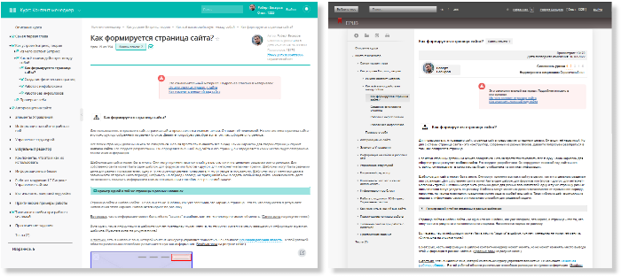
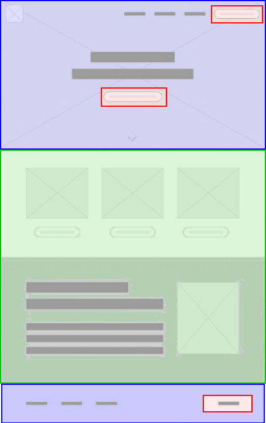

# Как формируется страница сайта?

**Навигация**
- [← Оглавление курса](index.md)
- [← Предыдущий: 3070 — Зачем всё это нужно](lesson_3070.md)
- [Следующий: 7981 — Создание физических страниц →](lesson_7981.md)

Официальная страница урока: https://dev.1c-bitrix.ru/learning/course/index.php?COURSE_ID=34&LESSON_ID=3742

|  | Это ознакомительный материал. Подробнее описано в материалах:  [Из чего состоит страница сайта](lesson_1847.md) 
 [Как изменить внешний вид сайта](https://dev.1c-bitrix.ru/learning/course/index.php?COURSE_ID=34&CHAPTER_ID=01851) |
| --- | --- |

|  | ### Как формируется страница сайта? |
| --- | --- |

Для пользователя, открывшего сайт, страница сайта представляется единым целым. Он видит её неделимой. Но для системы страница сайта - это конструктор, собранный из разных блоков. Давайте попробуем разобраться в том, как собирается страница.

Все блоки страницы должны на чём-то собираться. Нельзя просто так вывалить всё в кучу. Таким каркасом для сборки страницы служит **шаблон сайта**. Его создают разработчики. Он определяет внешний вид сайта и его страниц, он определяет в каких местах будет отображена та или иная информация.

Шаблонов для сайта может быть много. Они могут применяться как к сайту в целом, так и к отдельным разделам или страницам. Для собственно сайта может быть один шаблон, для форумов или блогов - другой, для интернет-магазина - третий. Шаблоны могут быть разными даже для разных пользователей: одну и ту же страницу разные пользователи могут увидеть по-разному. Шаблоны могут меняться даже в зависимости от временного периода, например, на период новогодних праздников можно задать особый вид сайта. Такая гибкость даёт возможность подавать информацию самым оптимальным способом для решаемой задачи.

## Пример одной и той же страницы в разных шаблонах

Вот так выглядит страница этого урока в разных шаблонах:

Страница сайта и шаблон сайта - не одно и то же. Шаблон, как уже говорили, это каркас, а страница - это то, что получается в результате наполнения этого каркаса. Наполняется каркас по-разному.

Во-первых, часть информации может быть жёстко "зашита" в шаблон, контент-менеджер не может её менять. (Синие зоны на рисунке ниже.)

Во-вторых, часть информации в шаблоне контент-менеджер может менять, но не может изменять место вывода этой информации в рамках шаблона. (Красные зоны на рисунке ниже.)

В-третьих, есть в шаблоне зона, которой контент-менеджер управляет полностью. Её называют

			**Основная рабочая область**

                    А для программистов: Work area.

		. В этой рабочей области различными способами размещается нужная информация. (Зелёная зона на рисунке ниже.)

Со способами вывода информации вы познакомитесь ниже, пока же кратко повторим:

- Страница сайта создаётся на основе шаблона.
- Часть информации в шаблоне контент-менеджер может менять, часть - нет.
- Основная информация на странице размещается в **Основной рабочей области**, которой и управляет контент-менеджер.
