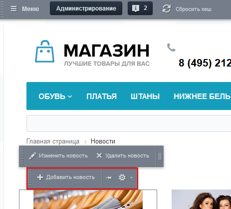
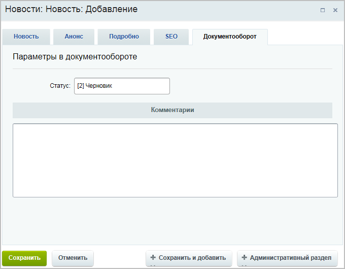
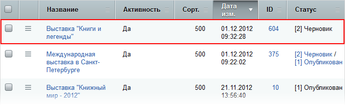
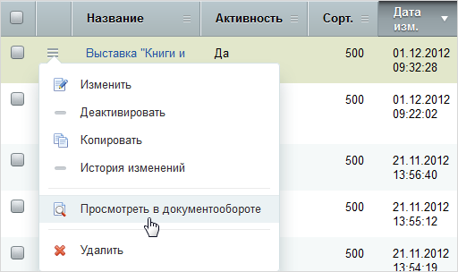
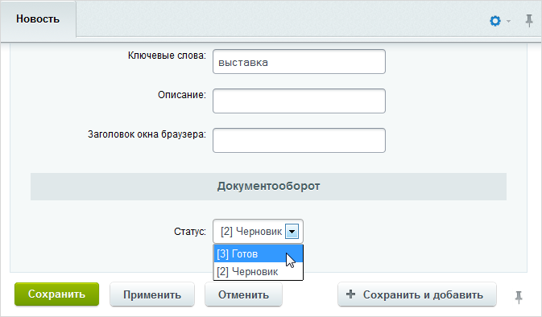
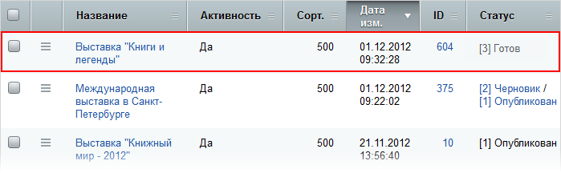
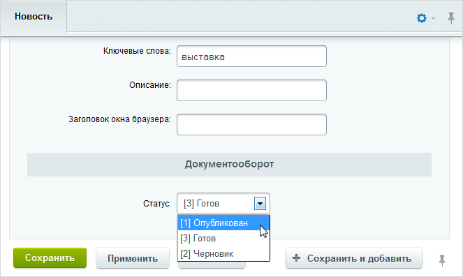
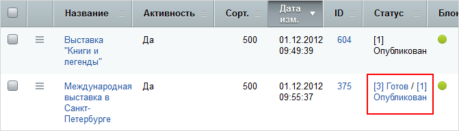

# Создание новости через документооборот

**Навигация**
- [← Оглавление курса](index.md)
- [← Предыдущий: 5217 — Как настроить инфоблок на документооборот](lesson_5217.md)
- [Следующий: 12988 — Проверьте себя →](lesson_12988.md)

Официальная страница урока: https://dev.1c-bitrix.ru/learning/course/index.php?COURSE_ID=34&LESSON_ID=3835

### Введение

Как создаются новости (а также - товары в каталоге и вообще всё, что может храниться в

			инфоблоках

                    Информационный блок (или Инфоблок) – специальный инструмент "1С-Битрикс: Управление сайтом" с помощью которого заносится информация в Базу данных.
 [Подробнее...](https://dev.1c-bitrix.ru/learning/course/index.php?COURSE_ID=34&CHAPTER_ID=04477&LESSON_PATH=3905.4477)

		) с позиций пользователей, которые отвечают за каждый этап их создания. Пусть новость, перед тем как появится на сайте проходит три этапа: создание, проверка содержания, публикация. Это делают разные сотрудники, пусть они называются:

- **Редакторы** - создают новости;
- **Корректоры** -  редактируют новости;
- **Администраторы интернет-магазина** - окончательно проверяют и публикуют.

### Видеоурок

### Создание новости

Для создания новости редактор нажимает на

			Добавить новость

                    

		 при включённом режиме

			Правка

                    Режим Правки - специальный режим работы "1С-Битрикс: Управление сайтом", в котором

происходит изменение информации на сайте.

[Подробнее...](lesson_1832.md)

		.

Откроется форма создания:

Если администратор настроил всё верно, то в форме появится закладка **Документооборот** с установленным статусом **Черновик**. Сейчас новость не видна в публичной части, её можно редактировать. Правда, делать это придётся с

			административной части

                    Список элементов по адресу: Контент &gt; Новости &gt; Новости для нашего случая, у вас путь будет другим.

 сайта.

### Правка и корректура

### Корректоры

Корректор находит в

			списке новостей

                    

		 элементы в статусе Черновик и, для оценки того, как новость будет смотреться после ее публикации, выбирает в ее меню действий пункт

			Просмотреть в документообороте

                    

		.

Если новость следует откорректировать, то в меню выбирается пункт **Изменить**. После корректуры ей устанавливается статус

			Готов

                    

		.

Если по каким-то причинам корректор считает, что ему в новости делать нечего. (В смысле текст оформлен неправильно или "сырой" по содержанию, он оставляет статус Черновик и уведомляет редактора сайта о необходимости переделок.)

### Проверка и возврат или публикация

Администратор находит в

			списке новостей

                    

		 элементы в статусе Готов и, для оценки того, как новость будет смотреться после ее публикации, выбирает в ее меню действий пункт

			Просмотреть в документообороте

                    

		. Посматривает историю изменений новости администратор с помощью кнопки **История изменений**, расположенной в том же меню.

Если новость удовлетворяет всем требованиям публикации, то в форме её редактирования  устанавливается статус

			Опубликован

                    

		. После чего новость появляется на сайте.

### Двойной статус

Новость может иметь несколько статусов:

Двойной статус появляется автоматически, когда новость возвращается из статуса Опубликован в какой-то из более низких статусов. Это означает, что на сайте новость отображается в том виде в каком она получила статус Опубликован, но ее можно редактировать и изменения вступят в силу после повторной установки статуса Опубликован. При публикации второй версии новости она заменит уже имеющуюся на сайте.
