# Блоги с позиции блогера (как управлять своим блогом)

**Навигация**
- [← Оглавление курса](index.md)
- [← Предыдущий: 3867 — Создание сообщения блога](lesson_3867.md)
- [Следующий: 2933 — Добавление модератора блога →](lesson_2933.md)

Официальная страница урока: https://dev.1c-bitrix.ru/learning/course/index.php?COURSE_ID=34&LESSON_ID=3866

В этом уроке рассмотрим простые, но, тем не менее, важные вопросы: как же обычному пользователю создать свой блог и как управлять им. То есть разберем действия владельца блога - блогера.

### Видеоурок

### Создание личного блога

Для создания собственного блога нажмите

			Создать свой блог

 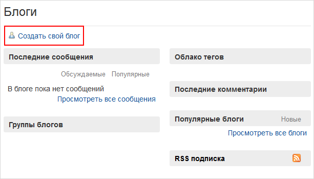

		, откроется страница с параметрами нового блога:

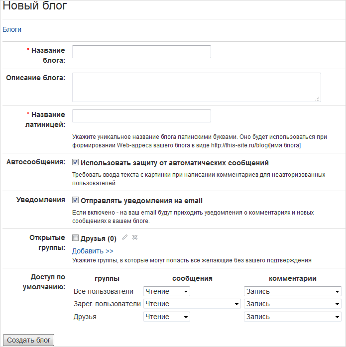

Процесс задания параметров не должен вызвать вопросов, кроме, пожалуй, двух последних пунктов:

- **Открытые группы** -  группы, в которые и Вы сможете добавлять других пользователей, и другие пользователи сами смогут добавляться без Вашего участия;
  Чтобы добавить новую группу, нажмите ссылку
  			Добавить
  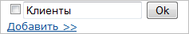
  		 и в появившейся строке введите название группы. Нажмите **Ok**, и группа добавится. Чтобы далее задать права этим группам, нажмите кнопку **Применить**.
  Чтобы редактировать название группы или удалить ее, нажмите пиктограмму карандаша или крестика соответственно.
- **Доступ по умолчанию** - задаются права по умолчанию для двух стандартных групп (**Все пользователи** и **Зарегистрированные пользователи**), а также для созданных открытых групп.

**Примечание:** добавляясь в друзья, пользователь автоматически становится участником всех ваших открытых групп.

После заполнения всех полей для завершения настройки нажмите 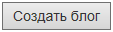, и блог будет

			 создан.

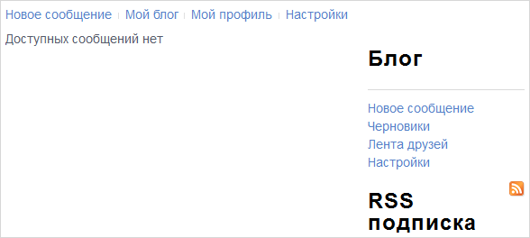

### Редактирование профиля

Вы можете отредактировать и добавить информацию о себе. Выберите **Мой профиль**, и откроется страница просмотра вашего профиля:

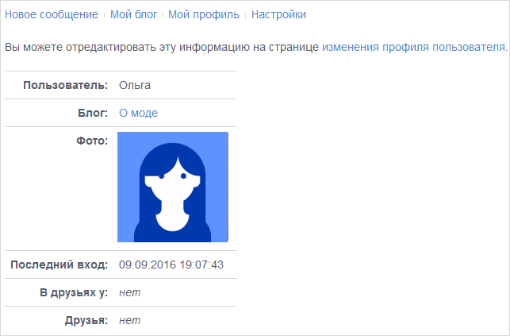

Кликните на **изменения профиля пользователя** для того, чтобы перейти к

			редактированию профиля.

Добавьте информацию и нажмите **Сохранить**.

Другие пользователи смогут просмотреть профиль владельца блога,

			наведя курсор на его имя.

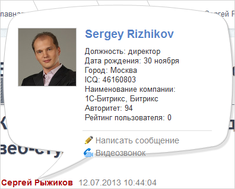

### Добавление в друзья

Находясь в блоге другого автора, Вы можете добавить его в друзья. Для этого у вас есть две ссылки в меню блога справа:

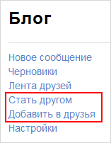

Чем же отличаются два созвучных действия: **Стать другом** и **Добавить в друзья**?

Рассмотрим на примере пользователя Ванеса (владелец блога "Минутка гордости: научные новости!", **отправитель** запроса), который хочет добавить в друзья пользователя Анну (владелец блога "Битрикс - Анна Кокина", **получатель** запроса).

Если проводить аналогию с популярными социальными сетями, то:

- **Стать другом** - отправить запрос на добавление в друзья. При этом и отправитель, и тот, кому отправили запрос, отображаются друг у друга в
  			Списке желающих стать друзьями
  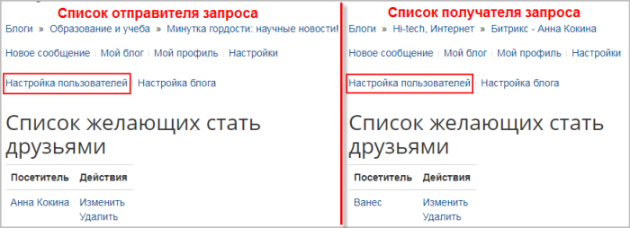
  		  (Настройки &gt; Настройки пользователей).
  Когда пользователи (отправитель и получатель) определят друг друга в одну из групп, они будут отображаться друг у друга в **Моем профиле**:
  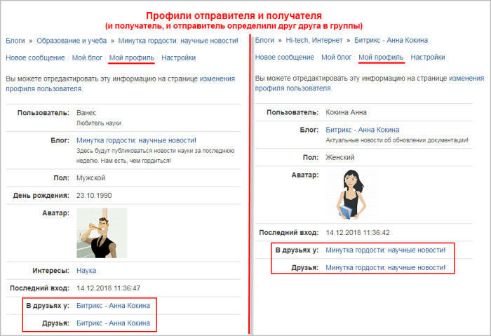
  **Правило**: когда вас добавляют в группу, в вашем профиле блог добавившего отображается в разделе **В друзьях у**, а если вы добавляете кого-то в группу, то в вашем профиле блог добавляемого отображается в разделе **Друзья**.
- **Добавить в друзья** - подписаться на пользователя. В этом случае **только у отправителя** добавляется пользователь в
  			Списке желающих стать друзьями.
  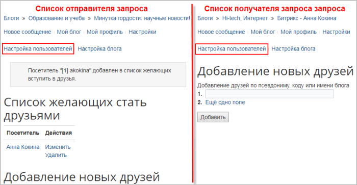
  После определения в одну из групп тот пользователь, кого добавили в друзья, появится в профиле отправителя в разделе **Друзья**, однако у получателя он будет только в списке **В друзьях у**.
  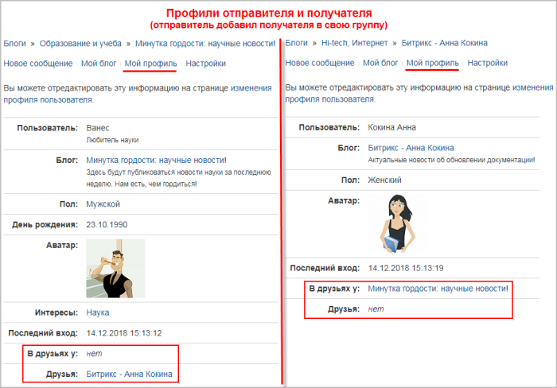
