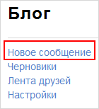
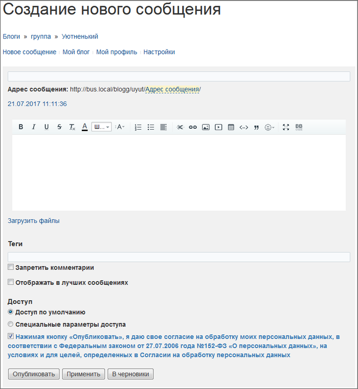
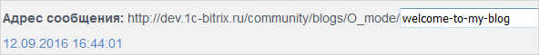
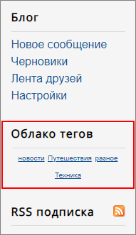
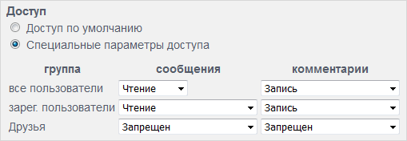
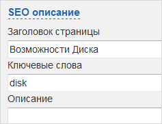
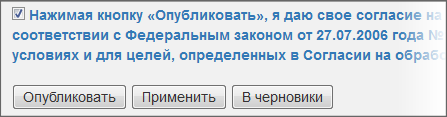
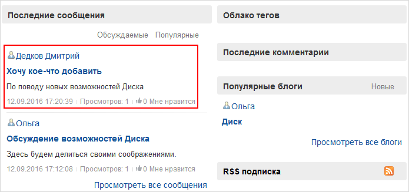
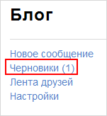
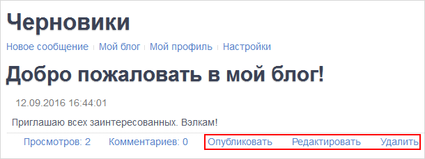

# Создание сообщения блога

**Навигация**
- [← Оглавление курса](index.md)
- [← Предыдущий: 4799 — Модерация блогов](lesson_4799.md)
- [Следующий: 3866 — Блоги с позиции блогера (как управлять своим блогом) →](lesson_3866.md)

Официальная страница урока: https://dev.1c-bitrix.ru/learning/course/index.php?COURSE_ID=34&LESSON_ID=3867

### Видеоурок

### Создание сообщения блога

После того, как вы создали свой блог, нажмите **Новое сообщение**. Кнопка может быть в меню

			справа

                    

		 если вы находитесь на странице своего блога, или вверху любой страницы, выведенной компонентом **Блоги**.

Откроется форма добавления сообщения в блог:

- Адрес сообщения блога генерируется из заголовка, однако Вы можете его изменить, кликнув по его
  			названию на латинице.
  
- Щелкнув по дате создания сообщения, Вы можете изменить и ее.
- Для создания тела сообщения вы можете использовать HTML-редактор.
- Используйте **теги** для сообщений, чтобы разбивать их по категориям. Теги отображаются в
  			облаке тегов
                      
  		. При нажатии на тег откроются все сообщения в блоге с этим тегом.
- **Отображать в лучших сообщениях** - поставьте галочку, и данное сообщение будет отображаться в разделе личного меню
  			Лучшие сообщения
  
  		 у всех пользователей, включая Вас.
- Если вы хотите, чтобы доступ к вашему сообщению определялся общими настройками блога, то оставьте флажок в поле **Доступ по умолчанию**.
  Для индивидуальных настроек доступа к сообщению установите флажок в поле **Специальные параметры доступа** и в появившейся
  			таблице опций
  
  		 укажите нужные Вам права.
  Для задания параметров поисковой оптимизации кликните ссылку
  			SEO описание.
  
  В развернувшихся полях вы можете указать SEO-описание страницы.

**Важно!** В соответствии ФЗ-152 необходимо дать согласие на обработку персональных данных. Если вы не согласны, то снимите флажок с поля **Нажимая кнопку...**

Нажмите **Опубликовать**, и запись будет добавлена в Ваш блог и

			отображена

		 у других пользователей.

Если вы нажмете **В черновики** или **Применить**, то сообщение публиковаться на сайте не будет, но оно сохранится у вас в блоге в разделе

			Черновики

 

		 и кроме Вас никому не будет доступно.

Сообщение в черновике можно

			редактировать, публиковать, удалять.

