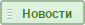
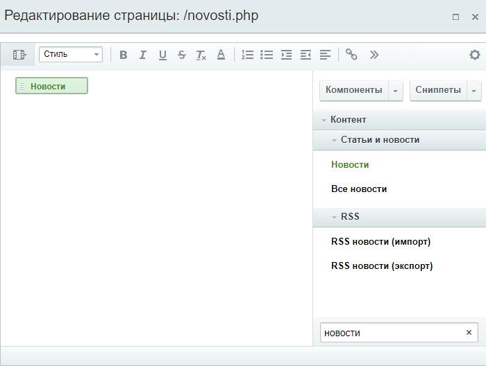
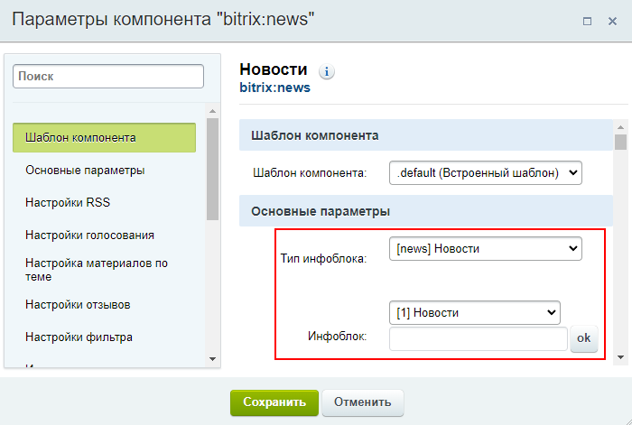
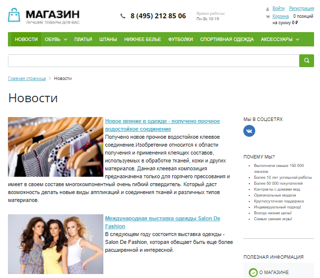
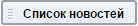
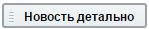
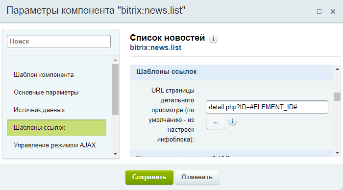
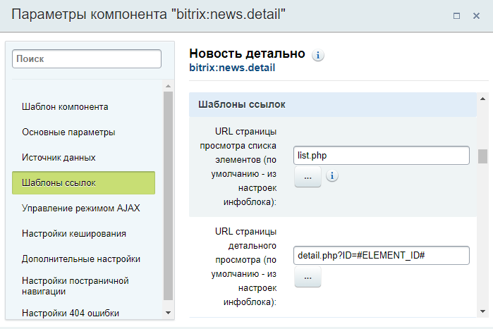
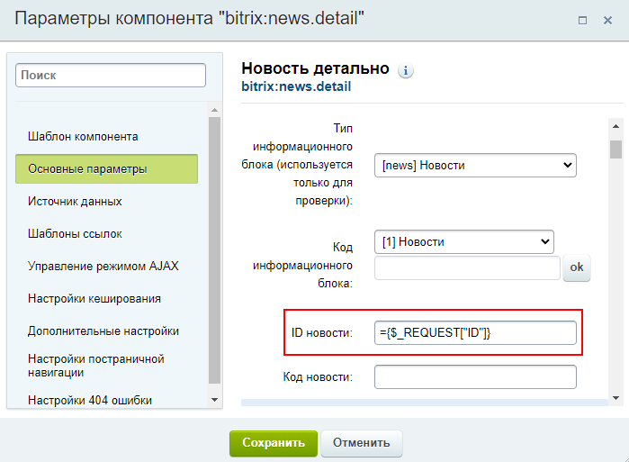

# Пример работы с компонентами: создаем новостной раздел

**Навигация**
- [← Оглавление курса](index.md)
- [← Предыдущий: 9165 — Как настроить компонент](lesson_9165.md)
- [Следующий: 10189 — Проверьте себя →](lesson_10189.md)

Официальная страница урока: https://dev.1c-bitrix.ru/learning/course/index.php?COURSE_ID=34&LESSON_ID=4486

Посмотрим работу с комплексными и простыми компонентами на примере создания Новостного раздела.

### Видео

В примере работать будем с существующим инфоблоком Новости. Этот инфоблок есть в демо установке *1С-Битрикс: управление сайтом*. Инфоблок простой, без разделов. Содержит только три новости.

Сначала создадим новостной раздел в публичной части сайта с помощью комплексного компонента. Затем, попробуем сделать такой же раздел, но с помощью простых компонентов. Таким образом вы на примере поймете, как отличается работа с разными типами компонентов и на что важно обратить внимание при настройке простых компонентов.

### Кратко о типах компонентов

Вспомним, что мы знаем о комплексных и простых компонентах.

Комплексный компонент объединяет в себе логику простых компонентов и выполняет широкий набор функций. Работать с ним просто, т.к. комплексный компонент:

- создаёт сложную структуру страниц и разделов всего на одной "физической странице";
- автоматически устанавливает все связи между страницами;
- позволяет быстро менять вид страниц, т.к. все настройки находятся в одном месте.

Каждый простой компонент отвечает за одну функцию. Работать с ними немного сложнее, если требуется создать сложную структуру, потому что:

- каждую страницу в структуре нужно создавать вручную;
- требуется внимательная настройка всех связей страниц;
- внесение изменений может требовать правок нескольких компонентов.

Но в ряде случаев простые компоненты полезны, т.к. позволяют создать более

			гибкую

                    В случае с простыми компонентами вы сами определяете какие страницы создавать и какие компоненты будут размещены на этих страницах.

		 структуру, в отличии от комплексных, которые создают всю структуру сами.

### Комплексный компонент

Начнем с комплексного компонента . Выполним несколько простых шагов:

1. Создадим новую страницу
                      
  		, которую мы будем использовать для отображения новостей (мы рассматривали создание страниц в [предыдущих уроках](https://dev.1c-bitrix.ru/learning/course/index.php?COURSE_ID=34&CHAPTER_ID=08437&LESSON_PATH=3905.4460.8437));
2. С помощью
  			визуального редактора
  **Визуальный редактор** - инструмент, позволяющий отображать редактируемый текст в точности так же, как он будет выглядеть на странице, без использования HTML кода.
  [Подробнее](https://dev.1c-bitrix.ru/learning/course/index.php?COURSE_ID=34&CHAPTER_ID=06299&LESSON_PATH=3905.6299)...
  		 разместим на странице компонент **Новости** (мы рассматривали размещение компонента в [предыдущих уроках](lesson_9163.md)):
  
3. Произведите базовую настройку компонента. Понадобится только группа **Основные параметры**, все остальные параметры менять не будем:
  
  Укажем тип
  			инфоблока
                      Информационный блок (или Инфоблок) – специальный инструмент "1С-Битрикс: Управление сайтом" с помощью которого заносится информация в Базу данных.
   [Подробнее...](https://dev.1c-bitrix.ru/learning/course/index.php?COURSE_ID=34&CHAPTER_ID=04477&LESSON_PATH=3905.4477)
  		 **Новости** и выберем инфоблок, содержащий новости.
4. На этом всё! Система автоматически создаст страницу со списком новостей:
  
  и страницу для каждой новости:
  

Мы совершили всего несколько простых действий, а остальное комплексный компонент **Новости** сделал за нас. В итоге мы получили целый новостной раздел.

### Простые компоненты

В качестве дополнительного примера рассмотрим публикацию таких же новостей с помощью простых компонентов. Этот процесс сложнее, мы будем создавать несколько страниц и производить дополнительные настройки. Кроме того, обратим внимание, что новостной инфоблок у нас простой, без разделов (этот момент влияет на построение шаблонов ссылок).

Сначала создадим структуру из страниц:

1. Создадим страницу для списка новостей (например, **list.php**);
2. Разместим на ней компонент  и выберем инфоблок Новости. Этот компонент выводит на странице список элементов (новостей) их инфоблока с заголовками, текстом анонса и другой информацией (в зависимости от настроек). Каждый элемент списка новостей - ссылка на страницу просмотра подробной информации по этой новости;
3. Теперь создадим страницу для показа подробной информации об отдельной новости (например, **detail.php**);
4. Разместим на этой странице компонент  и выберем инфоблок новости.

Перейдем к настройке связей между страницами в настройках компонента. Без этих настроек наш новостной раздел не заработает полноценно.

1. В настройках компонента **Список новостей** (страница **list.php** в примере) нас интересует группа параметров **Шаблоны ссылок**. Здесь мы настроим ссылку для перехода к отдельной новости (на страницу **detail.php**). Зададим адрес нужной нам страницы (**detail.php**), а также параметр ID и значение параметра в виде шаблона **#ELEMENT_ID#**. Параметр будет передавать в себе идентификатор той новости, которая была выбрана пользователем. А подставляться этот идентификатор будет системой с помощью шаблона **#ELEMENT_ID#**: `detail.php?ID=#ELEMENT_ID#`.
  
2. В компоненте **Новость детально** (страница **detail.php** в примере):

  - В блоке **Шаблоны ссылок** нужно настроить два параметра.
    

    - Сначала зададим параметр **URL страницы просмотра списка элементов**. Эта страница всегда неизменна, поэтому просто указываем название страницы **list.php** с компонентом **Список новостей**. Параметр обеспечит возврат к списку новостей.
    - **URL страницы детального просмотра** заполним точно так же, как и в компоненте **Список новостей**: `detail.php?ID=#ELEMENT_ID#`. Эти пути - одинаковы в обоих компонентах.
  - В группе **Основные параметры** зададим параметр **ID новости**. Помните мы выше задавали параметр для списка новостей, который содержал код выбранной новости? Здесь мы получаем этот параметр и запрашиваем в базе данных содержание этой новости. Т.е. если параметр в шаблоне ссылки называется **ID**, то и тут должен быть указан ID внутри кавычек:
    
    **Примечание**: Вы можете указать любое название для параметра. Например, ARTICLE или ELEMENT, вместо ID. Главное, чтобы в шаблонах ссылок и **ID новости** он был одинаков.

Таким образом мы создали новостной раздел, аналогичный тому, что был создан комплексным компонентом. Как видите на примере, при работе с простыми компонентами нам понадобилось создать больше страниц и настраивать различные связи.

### Заключение

В этом уроке мы рассмотрели пример создания новостного раздела на сайте. Аналогично мы можем разместить на сайте каталог товаров, фотогалерею и т.д.

Если вы рассмотрели оба примера - становится понятно, что лучше использовать комплексные компоненты. Они значительно облегчают нам жизнь и выполняют за нас большой объем мелкой работы.
