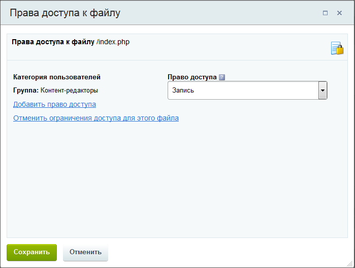

# Управление доступом к информации

**Навигация**
- [← Оглавление курса](index.md)
- [← Предыдущий: 1959 — Управление свойствами раздела](lesson_1959.md)
- [Следующий: 6676 — Назначение прав доступа к статическим страницам →](lesson_6676.md)

Официальная страница урока: https://dev.1c-bitrix.ru/learning/course/index.php?COURSE_ID=34&LESSON_ID=4492

### Как разрешать или запрещать просмотр

Запрет на доступ к той или иной информации на сайте — достаточно частая операция. Если страница ещё не доделана, то зачем показывать её посетителю? Если часть новостей компании предназначена только для клиентов, то как не показывать её всем посетителям? В "1С-Битрикс: Управление сайтом" создана гибкая система задачи прав на доступ к информации, вы всегда можете показать только то, что хотите и кому хотите.

На сайте максимальными правами доступа обладает администратор этого сайта. Администратор назначает контент-менеджеру определённый набор прав. Чтобы понять, как пользоваться этими возможностями, сначала разберёмся в теории прав доступа.

### Как организована раздача прав

- **Первое**: ни один пользователь на сайте не может быть сам по себе. Он обязательно будет добавлен к одной из групп пользователей. Если это просто посетитель, который просматривает сайт, то система запомнит его и отнесёт к группе **Неавторизованные пользователи**. Это группа с самым низким уровнем доступа. Посетители из этой группы могут только смотреть на сайте то, что им разрешат администратор или контент-менеджер.
  Если посетитель авторизовался, то система отнесёт его к группе **Зарегистрированные пользователи**. Такому посетителю может быть доступно больше: возможность писать сообщения в блоге, отвечать на форуме, просматривать какие-то страницы, недоступные для неавторизованных посетителей.
  Зарегистрированного пользователя администратор сайта может добавить уже в другие группы, которые имеют разный уровень доступа к информации и инструментам системы.
- **Второе**: права доступа на страницу, к
  			Информационному блоку
                      Информационный блок (или Инфоблок) – специальный инструмент "1С-Битрикс: Управление сайтом" с помощью которого заносится информация в Базу данных.
   [Подробнее...](https://dev.1c-bitrix.ru/learning/course/index.php?COURSE_ID=34&CHAPTER_ID=04477&LESSON_PATH=3905.4477)
  		 и другим инструментам системы задаются,
  			как правило
  У подавляющего большинства инструментов в форме настроек прав доступа есть только выбор **групп**
  пользователей.
  Однако в некоторых случаях можно выбрать не только группы пользователей, но и конкретных
  пользователей. Например, при настройке прав доступа к информационному блоку можно включить
  [Расширенное управление правами](lesson_9411.md) и выбрать конкретных пользователей:
  
  		, для групп, а не для отдельного пользователя.
- **Третье**: права доступа задаются на каждую конкретную страницу (раздел), информационный блок,
  			модуль системы
                      Модуль - часть программного кода CMS, отвечающий за функционал определённой направленности. Например, модуль Интернет-магазин отвечает за продажи, модуль Блоги дает возможность ведения блогов на сайте и так далее. Модуль виден только в Административном разделе.
  [Подробнее...](lesson_7987.md)
  		.
- **Четвёртое**: права назначаются разные от минимального ("Чтение" или "Закрыт доступ") до максимального ("Полный доступ").
- **Пятое**: права доступа наследуются от "родительского" объекта (раздела) к "дочерним" объектам (подразделам и страницам).
- **Шестое** и последнее: права доступа конкретного пользователя складываются из
  			суммы прав
                      Каждый посетитель сайта относится к одной или нескольким группам пользователей сайта. Какой уровень прав есть у группы, такой же уровень прав есть и у пользователя. Если пользователь приписан к нескольким группам, то он обладает максимальным уровнем прав из доступных для него в рамках этих групп.
  [Подробнее в курсе Администратор.Базовый](https://dev.1c-bitrix.ru/learning/course/index.php?COURSE_ID=35&LESSON_ID=7173)
  		 всех групп, в которых этот пользователь состоит.

Вот сочетание этих причин и определяет, что пользователь видит, а что — нет.

### Что даёт такая система

Описанная выше система кажется сложной. Но это не так. Научившись ей пользоваться, вы убедитесь в её удобстве и гибкости. Она позволяет:

- Установить права доступа отдельно на
  			динамические
                      Динамическая информация — информация, хранимая в Базе Данных сайта и выводимая специальными компонентами системы. Как правило, это — часто изменяемая информация со множеством свойств. [Подробнее](https://dev.1c-bitrix.ru/learning/course/index.php?COURSE_ID=34&CHAPTER_ID=01848&LESSON_PATH=3905.4461.1848)...
  		 и на
  			статические
                      Статическая информация — это информация, которая редко меняется с течением времени. Например, рекламные тексты, история компании, контактная информация. Статическая информация создается и редактируется вручную. [Подробнее](https://dev.1c-bitrix.ru/learning/course/index.php?COURSE_ID=34&CHAPTER_ID=01848&LESSON_PATH=3905.4461.1848)...
  		 страницы. И какая-либо группа пользователей, к примеру, будет видеть заголовок сайта, логотип компании, адрес и контактную информацию, но не будет видеть ленту новостей или определенный раздел каталога.
- Задать права только на чтение/изменение каких-либо отдельных страниц или разделов только для отдельных групп пользователей. В результате два контент-менеджера, работающие над одним проектом, не смогут вносить изменения в "зону ответственности" друг друга.
- Запретить какой-то группе пользователей некоторые действия, например, редактирование пунктов меню.
- Закрывать от просмотра посетителями недоделанные страницы, при этом сам контент-менеджер будет видеть их и сможет работать на них.
- Гибко управлять статусами (и возможностями) посетителей форумов, фотогалерей, опросов, голосований.
- и так далее.

### Заключение

Вы познакомились с принципами задания прав доступа в "1С-Битрикс: Управление сайтом".

> **Право доступа** — набор правил, определяющих, каким уровнем доступа обладает та или иная группа пользователей. (Например, «чтение» — это просмотр содержимого страницы или раздела). Права доступа обладают свойством "наследования". То есть если для текущего раздела/страницы явно не задан уровень прав, то устанавливается то право, которое задано для вышележащего раздела.

В уроках ниже мы расскажем о технике задания прав в конкретных случаях.
