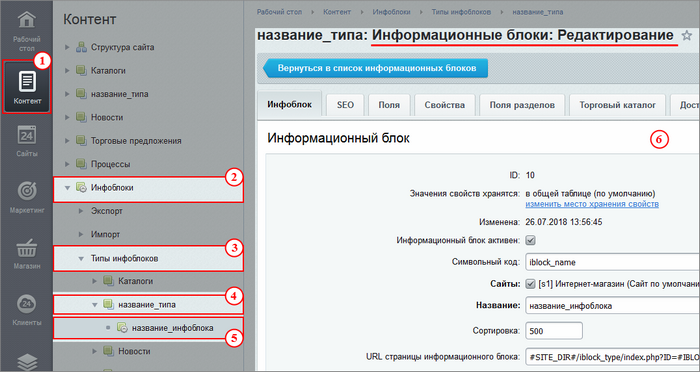
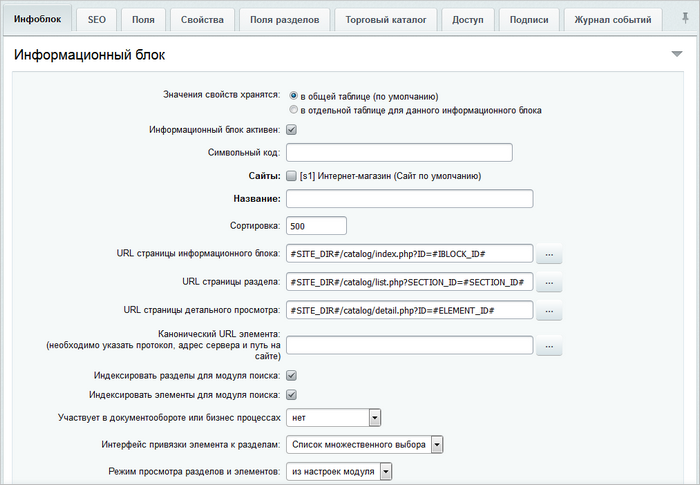
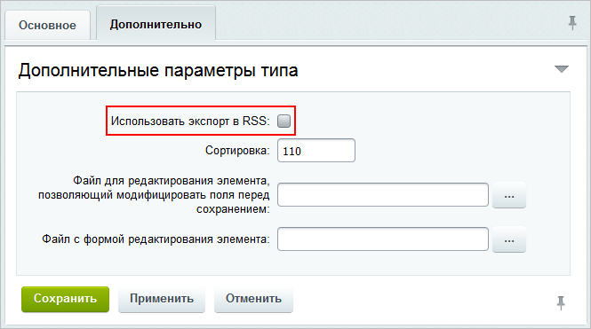
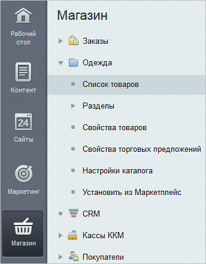
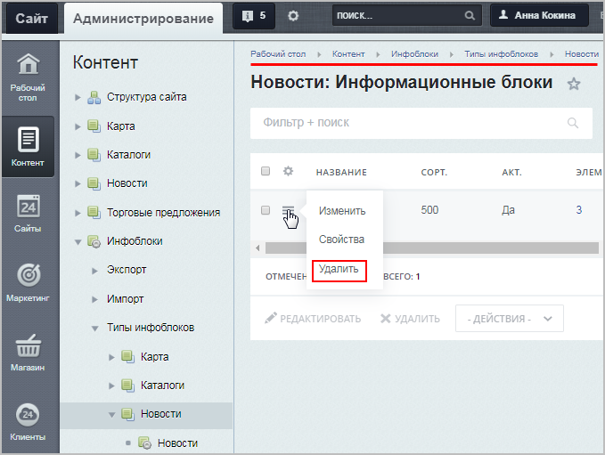

# Создание, редактирование и удаление инфоблока

**Навигация**
- [← Оглавление курса](index.md)
- [← Предыдущий: 2010 — Типы информационных блоков](lesson_2010.md)
- [Следующий: 9253 — Основные настройки →](lesson_9253.md)

Официальная страница урока: https://dev.1c-bitrix.ru/learning/course/index.php?COURSE_ID=34&LESSON_ID=4534

### Как добавить новый инфоблок?

1. Откройте страницу Контент 1 &gt; Инфоблоки 2 &gt; Типы инфоблоков 3 &gt; название_типа 4, где вместо *название_типа* у вас отображается реальное название нужного типа инфоблоков (учтите, что после создания инфоблока его тип уже нельзя будет поменять).
2. Нажмите кнопку **Добавить инфоблок** 5.
3. Заполните поля [формы редактирования инфоблока](lesson_4534.md#iblock_form) (см. далее).

### Как отредактировать параметры?

1. Откройте страницу Контент 1 &gt; Инфоблоки 2 &gt; Типы инфоблоков 3 &gt; название_типа 4 &gt; название_инфоблока 5, где вместо *название_типа* и *название_инфоблока* у вас отображаются реальные названия нужного типа и самого инфоблока.
2. Измените данные в [форме редактирования инфоблока](lesson_4534.md#iblock_form) 6.

### Форма создания/редактирования

Форма создания/редактирования параметров инфоблока состоит из вкладок:

- **Инфоблок** - содержит настройки общих параметров информационного блока. Подробную информацию по заполнению полей данной вкладки читайте в уроке
  			Основные настройки.
                       Настройка инфоблока начинается с указания общих параметров, а именно с вкладки **Инфоблок**:.
  - **Информационный блок активен** - опция, конечно, должна быть отмечена, если инфоблок
    		используется на сайте.
  - **Символьный код** - это заданный латиницей осмысленный код, который может
    		использоваться при обращении к инфоблоку через программный код или компоненты, когда не
    		используется идентификатор инфоблока.
  - **Сайты** - отмечаются сайты, на которых инфоблок доступен для показа.
    		Если сайт у вас один, то он обязательно должен быть отмечен. В случае многосайтовости
    		следует отметить только необходимые сайты.
  - **Название** - указывается название, отражающее тематику хранимой информации
    		в инфоблоке.
   [Подробнее](lesson_9253.md)...
- **SEO** - служит для настройки шаблонов SEO данных сразу целиком для всех разделов и элементов инфоблока. Подробности в уроке
  			Настройка SEO данных в инфоблоке.
                       Настройки шаблонов метаданных можно выполнять как для всего инфоблока, так и для конкретных разделов или для некоторых элементов конкретного раздела. При этом вы всегда можете сделать настройку для всего инфоблока, а потом для конкретного раздела (или элементов раздела) переопределить на свою персональную.
  	[Подробнее](lesson_5840.md)...
- **Поля** и **Поля разделов** - вкладки, которые позволяют задать
  			предустановленные данные для полей форм элементов и разделов
                       Стандартные формы редактирования элементов и разделов имеют множество полей, что создает трудности при заполнении. Облегчите свою ежедневную работу вместе с предустановленными данными для полей. Выполните настройки на вкладках **Поля** и **Поля разделов** формы редактирования инфоблока.
  	[Подробнее](lesson_1912.md)...
  		 инфоблока. Выполненные настройки на этих вкладках очень облегчают работу контент-менеджеров по наполнению инфоблока материалами.
- **Свойства** - содержит список свойств (собственных полей) для элементов инфоблока. О работе со свойствами читайте в уроке
  			Свойства элементов.
                       Согласитесь, что посетителям сайта приятнее читать статьи, где указан автор и добавлены фотографии. Выбирать товары в интернет-магазине удобнее, если приведены их характеристики. Создавайте в инфоблоке свойства и храните информацию в элементах наиболее полно.
  	[Подробнее](lesson_9407.md)...
- **RSS** - содержит параметры выгрузки данных в RSS. Вкладка не отображается, если не отмечена опция
  			Использовать экспорт в RSS
                      
  		 в настройках типа инфоблока. Подробнее о настройках данной вкладки смотрите в [документации по продукту](https://dev.1c-bitrix.ru/user_help/content/iblock/iblock_edit.php#rss).
- **Торговый каталог** - параметры вкладки настраиваются только в том случае, если инфоблок необходимо настроить на работу
  			в режиме торгового каталога.
                       Чтобы нужный информационный блок работал в режиме торговых каталогов, необходимо отметить его флажком в поле **Является торговым каталогом** на странице настроек модуля **Торговый каталог** (Настройки &gt; Настройки продукта &gt; Настройки модулей &gt; Торговый каталог).
  	[Подробнее](/learning/course/index.php?COURSE_ID=42&LESSON_ID=3456)...
  		 Дальнейшую работу с разделами, элементами и свойствами инфоблока рекомендуется вести в разделе
  			Магазин
                      
  		.
- **Доступ** - задание прав на
  			доступ к данному инфоблоку.
                       Регулирование доступа к инфоблоку - это ответственный этап его настройки. Неправильно заданные права могут привести к тому, что:
  - информацию увидят те пользователи, которым видеть ее не положено
  - пользователям не будет доступна полагающаяся информация.
   [Подробнее](lesson_9411.md)...
  		 Помните про следующую особенность системы: даже если задан доступ к странице, на которой выводятся материалы инфоблока, но не задан доступ к материалам инфоблока, то посетитель не увидит информацию на сайте.
- **Подписи** - позволяет задать
  			новые заголовки
                       Если инфоблок предназначен для показа на сайте некой продукции, то в форме
  	редактирования инфоблока на вкладке Подписи фразы Элементы и Элемент логично
  	заменить на Товары и Товар соответственно, а названия для кнопок: Добавить элемент,
  	Изменить элемент, Удалить элемент - на Добавить товар, Изменить товар, Удалить товар.
  	 Если у вас новостной инфоблок или инфоблок с услугами, то во всех фразах слово
  	элемент предпочтительно заменить на новость или услуга.
  	 Настройки подписей для разделов доступны в том случае, если в инфоблоке разрешено
  	создание самих разделов . Тогда в фразах разделов слово раздел заменяется, например,
  	для товаров на категория, для каталога книг на жанр и т.д.
  	 В результате с материалами инфоблока гораздо приятнее и понятнее работать, как из
  	публичной , так и из административной части сайта.
  	[Подробнее](lesson_9409.md)...
  		 объектов инфоблока.
- **Шаблоны бизнес-процессов** - доступна только при наличии в системе модуля **Бизнес-процессы** и при выборе на вкладке **Инфоблок** в выпадающем списке **Участвует в документообороте или бизнес процессах** значения **бизнес процессы**. Подробнее о бизнес-процессах читайте в специальном
  			учебном курсе.
                       Курс полностью посвящен бизнес-процессам и содержит в себе всю информацию о них, включённую в разные ролевые учебные курсы.
  	 Он включает в себя уроки и главы по работе с бизнес-процессами, их настройке и созданию. Также в курсе присутствуют примеры и приемы использования бизнес-процессов и отдельная глава, предназначенная для разработчиков.
  	[Подробнее](https://dev.1c-bitrix.ru/learning/course/index.php?COURSE_ID=57)...
- **Журнал изменений** - выбираются параметры, которые нужно контролировать с помощью одноименного
  			компонента.
                      Одностраничный компонент позволяет вывести историю изменений, произошедших на проекте.
  						[Описание компонента «Журнал изменений» в пользовательской документации.](http://dev.1c-bitrix.ru/user_help/detail.php?ID=341576)

**Примечание:** подробное описание полей и вкладок приведено в [документации по продукту](http://dev.1c-bitrix.ru/user_help/content/iblock/iblock_edit.php).

**Внимание!** В версии PHP 5.3.9 был добавлен параметр **max_input_vars**, значения по умолчанию которого не хватает для форм инфоблоков. Рекомендуемое значение этого параметра - не меньше 5000. Для установки этого значения необходимо обратиться к администратору хостинга.

### Пример

Простой пример создания инфоблока Видеотека:

**Примечание.** С ещё одним видеопримером создания инфоблоков можно ознакомиться [в уроке](https://dev.1c-bitrix.ru/learning/course/index.php?COURSE_ID=42&LESSON_ID=5211) курса «Администратор. Бизнес».

### Удаление инфоблока

Инфоблок можно удалить на странице со списком инфоблоков конкретного типа (Контент&gt; Инфоблоки &gt; Типы инфоблоков &gt; [ваш тип инфоблока]):

**Примечание**: если инфоблок не получается удалить, то проверьте, является ли он

			торговым каталогом.

Для **удаления торгового каталога** нужно предварительно сделать его обычным инфоблоком, выполнив два действия.

[Подробнее](https://dev.1c-bitrix.ru/learning/course/index.php?bitrix_include_areas=Y&COURSE_ID=42&LESSON_ID=3456)...

### Документация по теме

- [Как простой заполненный инфоблок сделать торговым каталогом](https://dev.1c-bitrix.ru/learning/course/?COURSE_ID=42&LESSON_ID=12808) (курс "Администратор. Бизнес")
