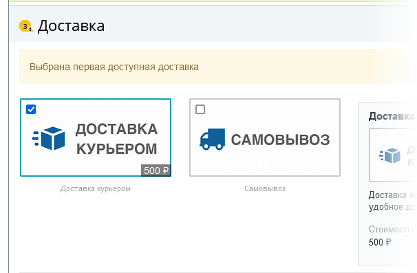
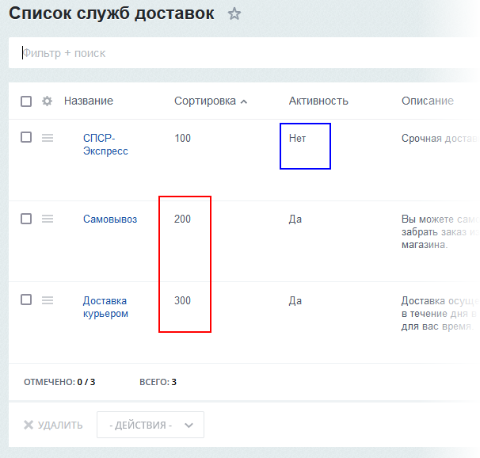
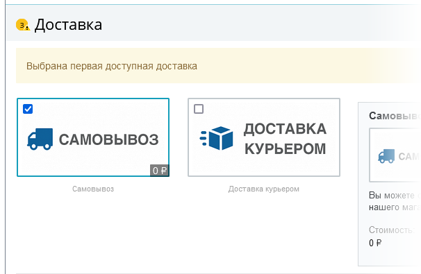

# Порядок элементов в списке

**Навигация**
- [← Оглавление курса](index.md)
- [← Предыдущий: 11767 — Список элементов (новый интерфейс)](lesson_11767.md)
- [Следующий: 2776 — Настройка списка элементов (старый интерфейс) →](lesson_2776.md)

Официальная страница урока: https://dev.1c-bitrix.ru/learning/course/index.php?COURSE_ID=34&LESSON_ID=4568

Управлять порядком элементов в списке можно несколькими способами.

### По возрастанию или убыванию

Порядок элементов в списке можно изменить, отсортировав ту или иную колонку по возрастанию или по убыванию. Колонку, по которой происходит сортировка, можно узнать по:

- более тёмному цвету колонки и стрелке (в старом интерфейсе):
  
- наличию стрелки (в новом интерфейсе):
  

В обоих случаях стрелка указывает на направление выбранной сортировки.

Принцип сортировки по возрастанию или убыванию среди элементов определяется в зависимости от типа колонки. Если значения в колонке:

- числовые, то "по возрастанию" - это от минимального числа до максимального,
- текстовые, то "по возрастанию" - это от А до Я (от A до Z, если латиница),
- да/нет, то "по возрастанию" - это первым будет "нет".

Соответственно, "по убыванию" - это всё наоборот:

### Поле Сортировка

Выбор сортировки полей по возрастанию или убыванию в административном разделе никак не влияет на отображение элементов в Публичной части. Но есть одно особое поле, изменение значений в котором будет влиять на расположение элементов и в Административной части, и в публичной. Оно называется, как правило, **Сортировка**. Но в ряде списков название может быть другим. Например, в списке баннеров это называется **Вес**. А в некоторых списках эта возможность отсутствует совсем, например, в списке Обращений модуля Техподдержка.

Принцип работы этого поля простой: чем меньше число, тем в Публичном разделе выше в списке располагается элемент. Рассмотрим несложный пример: список служб доставки в форме создания заказа и в Административном разделе.

## Текстовое содержание видео

В Административном разделе список служб доставки выглядит так (СПСР - неактивна и в форме заказа не выводится):

В форме заказа соответственно первой стоит **Доставка курьером**, так как она имеет меньшую сортировку.

Поменяли в Административной части значения сортировки, теперь меньшее число стоит у **Самовывоза**.

Поменялись местами и службы доставки в форме оформления заказа:

