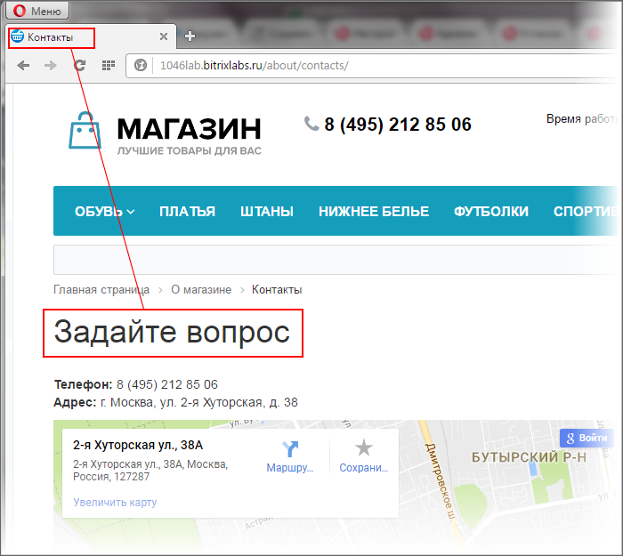
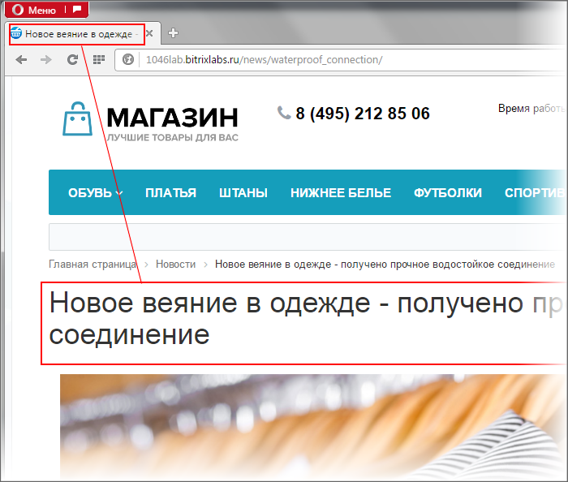

# Управление заголовком

**Навигация**
- [← Оглавление курса](index.md)
- [← Предыдущий: 1847 — Из чего состоит страница сайта](lesson_1847.md)
- [Следующий: 1962 — Управление свойствами страницы →](lesson_1962.md)

Официальная страница урока: https://dev.1c-bitrix.ru/learning/course/index.php?COURSE_ID=34&LESSON_ID=4576

### Видеоурок

### Зачем нужны свойства страниц и как ими управлять

Контент-менеджер управляет свойствами

			страниц

		 и

			разделов

		. Свойства нужны для тех, кто посещает ваш сайт, например: с их помощью строится

			цепочка навигации

                    Цепочка навигации - один из способов навигации по сайту, состоит из последовательности названий разделов от главной страницы сайта до той, где находится посетитель.

		, в заголовке браузера выводится название страницы. Свойства сайта индексируются

			поисковыми системами

                    Поисковая система - способ поиска нужной информации в Интернете. Примеры: Яндекс, Google

		 и по ним ваш сайт попадает в результаты выдачи.

Основное свойство страницы - Заголовок. Использование заголовка помогает привлечь внимание пользователей к странице сайта, а также создать общее представление о ее содержании и назначении.

Заголовок страницы выводится:

- во вкладке браузера;
- на самой странице.

Контент-менеджер управляет заголовком страницы и либо:

- устанавливает
  			одинаковый заголовок
                       
  		 для страницы сайта и вкладки веб-браузера;
- задаёт
  			различные
                      
  		 заголовки для страницы сайта и окна веб-браузера;
- либо задаёт
  			автоматический вывод заголовка страницы и окна веб-браузера
                      
  		 с использованием или названия
  			элемента
                      Элемент инфоблока - элемент системы, где непосредственно хранятся данные, выводимые компонентами. [Подробнее](lesson_1881.md)...
  		 или
  			SEO данных
                      SEO данные - информация, которую используют поисковые машины для определения места нахождения вашего сайта на странице результатов поиска. [Подробнее](lesson_6305.md)...
  		.

О том как это сделать вы узнаете в следующем уроке.

**Примечание:** Некоторые

			компоненты

                    Компонент - специальный элемент системы, предназначенный для вывода информации из Базы данных сайта. [Подробнее](https://dev.1c-bitrix.ru/learning/course/index.php?COURSE_ID=34&CHAPTER_ID=04457&LESSON_PATH=3905.4457)...

		 самостоятельно устанавливают заголовок, учитывайте это при работе.

### Заключение

Контент-менеджер управляет свойствами страниц. Задаёт их вывод в различном виде и различным способом.

> **Свойства раздела и страницы** — это параметры, которые влияют на отображение страницы в браузере и ее взаимодействие с поисковыми системами.

На следующих страницах вы научитесь управлять свойствами страниц и разделов.

### Документация по теме

- [Свойства папки](https://dev.1c-bitrix.ru/user_help/content/fileman/fileman/fileman_folder.php)
