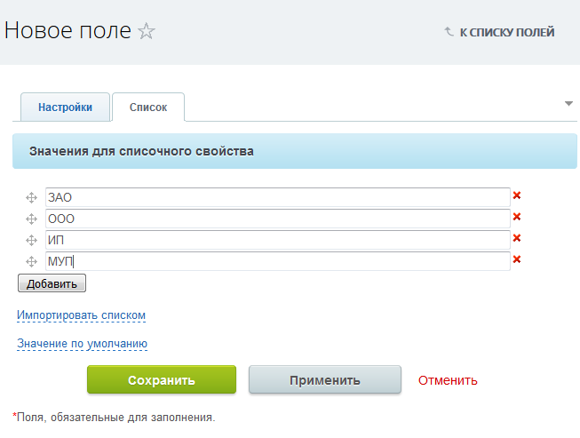
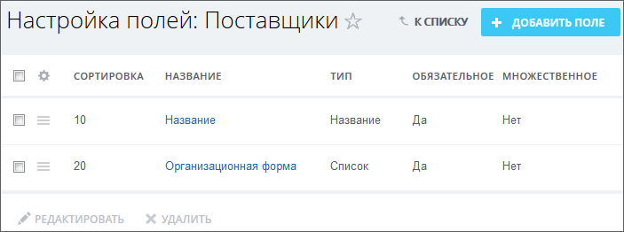

# Пример создания полей

**Навигация**
- [← Оглавление курса](index.md)
- [← Предыдущий: 2956 — Пример настройки Универсального списка](lesson_2956.md)
- [Следующий: 4530 — Значения типов полей →](lesson_4530.md)

Официальная страница урока: https://dev.1c-bitrix.ru/learning/course/index.php?COURSE_ID=34&LESSON_ID=4746

Создание новых полей - основное действие при настройках созданного Универсального списка.

### Как создать поля списка

Например, добавим поле **Организационная форма**, в которой будет задаваться тип компании поставщика: ООО, ЗАО и так далее.

Для этого нажмите кнопку **Добавить поле**. Откроется форма следующего вида:

**Внимание!** Для каждого из [типов полей](lesson_4530.md) выводятся свои параметры и вкладки.

### Параметры формы

Заполните параметры формы:

- **Название** - введите фразу **организационная форма**.
- **Обязательное** - установите флаг, если создаваемое поле обязательно для заполнения.
- **Множественное** - будет ли создаваемое поле состоять из нескольких полей для заполнения. Здесь флажок не ставим, одна и та же фирма не будет и ООО и ЗАО одновременно.
- **Тип** - выбор типа поля. Выберите тип поля **Список**, форма перезагрузится, пропадет поле **Значение по умолчанию**, но появится вкладка Список.
- Перейдите на эту вкладку и
  			заполните поля
                      
  		 списочного свойства.
  **Примечание**: Если свойств много, а список этих свойств обширен, то с помощью ссылки **Импортировать списком** откройте дополнительное окно, в которое вставьте заготовленный заранее список свойств.
- Нажмите кнопку **Применить**, свойства сохранятся.
- С помощью ссылки **Значение по умолчанию** вызовите список добавленных свойств и установите свойство, которое будет использоваться чаще других. Это свойство будет по умолчанию отображаться в этом поле.
  **Примечание**: Значение по умолчанию выставляется только в случае, если создаваемое поле будет обязательным для заполнения.
- **Сортировка** - порядок расположения создаваемого поля в списке полей. Чем выше число, тем ниже расположено будет поле. Введите нужное вам значение.
- **Показывать ...** - эти параметры включают/отключают показ создаваемого поля в форме создания или редактирования.
- **Только для чтения ...** - эти параметры включают/отключают показ создаваемого поля в форме создания или редактирования в режиме "для чтения" то есть, без возможности изменения.
- **Показать поле при формировании ссылки на элемент списка.** - если планируется использовать ссылки на элементы в переписке, то рекомендуется использовать этот параметр для тех полей, которые будут отображаться в
  			богатых ссылках
                      **Богатые ссылки** позволяют сделать сообщение в Живой ленте или в Бизнес-чате более содержательным и красивым. Сообщение не нужно оформлять каким-то особым способом - ссылка на какой-либо ресурс, как правило, автоматически преобразуется в содержательный блок c информацией из ссылки.
  [Читать подробнее...](/learning/course/index.php?COURSE_ID=52&LESSON_ID=7561)
- Нажмите кнопку **Сохранить**, система вернется к
  			списку полей
                      
  		, в котором отобразится новое созданное поле.

Создайте аналогичным способом остальные поля для требуемого списка.

### Документация по теме

- Использование Универсальных списков в примере [KPI для отдела организации](https://dev.1c-bitrix.ru/learning/course/index.php?COURSE_ID=53&CHAPTER_ID=05045)
- Использование Универсальных списков в [системах учёта](http://dev.1c-bitrix.ru/learning/course/index.php?COURSE_ID=53&LESSON_ID=4761).
