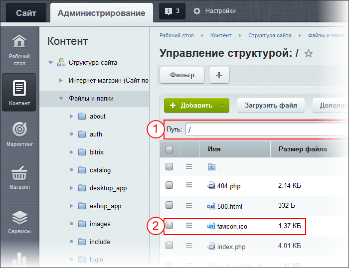
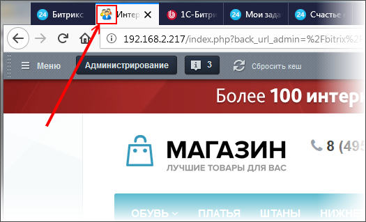
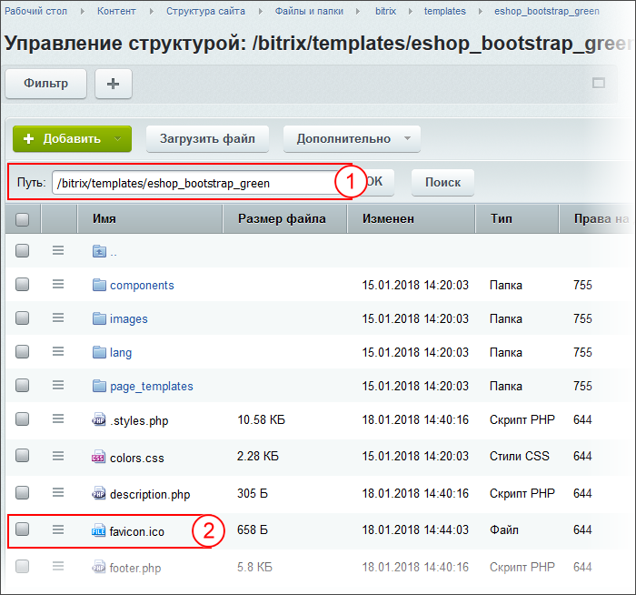
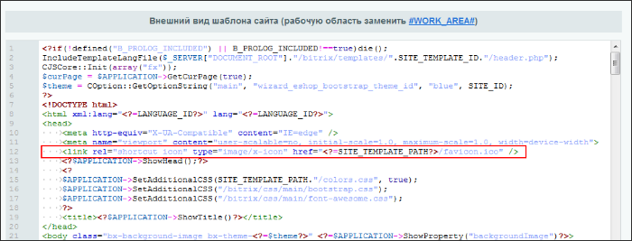

# Как заменить favicon.ico

**Навигация**
- [← Оглавление курса](index.md)
- [← Предыдущий: 1994 — Как работать с шаблонами сайта](lesson_1994.md)
- [Следующий: 12273 — Как изменить номер телефона на сайте →](lesson_12273.md)

Официальная страница урока: https://dev.1c-bitrix.ru/learning/course/index.php?COURSE_ID=34&LESSON_ID=4763

Замена файла

			favicon.ico

                    Favicon (от англ. FAVorite ICON - значок для избранного) - значок веб-сайта или
веб-страницы. Отображается браузером во вкладке перед названием страницы,
а также в качестве картинки рядом с закладкой.
 

		 - не частая задача. Как правило, её выполняют один раз на каждом сайте. Способ замены зависит от числа используемых шаблонов на сайте.


### Видеоурок

### Если шаблон единственный

Если на сайте используется один шаблон, в котором нет своего файла favicon.ico, то:

1. Подготовьте картинку размером 16х16 пикселей в формате jpg или png.
2. Переименуйте картинку в **favicon.ico**.
3. В файловой структуре сайта в корневой папке (1) найдите и замените существующий файл `favicon.ico` (2) на ваш файл.
  

После этого новый файл **favicon.ico** будет

			отображаться вместо старого

                    

		.

**Внимание:** Старый файл favicon.ico может быть закеширован браузером и поэтому продолжит отображаться какое-то время. Чтобы проверить, сработала ли замена файла, откройте ваш сайт с другого браузера или компьютера. Там изменения должны быть видны сразу.

### Если шаблонов несколько

Первый способ реализуем только если в единственном шаблоне сайта нет своего файла **favicon.ico**. Если в шаблоне есть своя иконка, то всё немного сложнее. Приоритет иконки из шаблона выше, чем приоритет файла **favicon.ico** в корне сайта. Это сделано для того, чтобы для каждого шаблона применять свою собственную иконку. Например, если сайт разделен на разделы, то у каждого раздела может быть свой шаблон и иконка.

Вам потребуются дополнительные права доступа к редактированию шаблонов сайта, которые вам даст администратор. Действия описаны для одного шаблона, если вы хотите менять иконку для каждого из шаблонов, произведите эти действия с каждым из них.

Первые шаги замены идентичны описанным выше:

1. Подготовьте картинку размером 16х16 пикселей в формате jpg или png.
2. Переименуйте её в **favicon.ico**.
3. Загрузите в
  			папку шаблона
                      
  		 (Контент &gt; Структура сайта &gt; Файлы и папки &gt; bitrix &gt; templates &gt; название вашего шаблона - 1) этот файл (2).
4. Откройте на редактирование шаблон сайта (Настройки &gt; Настройки продукта &gt; Сайты &gt; Шаблоны сайтов &gt; название вашего шаблона).
5. Посмотрите, есть ли в
  			коде шаблона
  
  		 в блоке `<head>` строка
  ```
  <link rel="icon" type="image/x-icon" href="<?=SITE_TEMPLATE_PATH?>/favicon.ico" />
  ```
  Если есть, то пропустите следующий шаг.
6. Если строки нет, то добавьте её. И сохраните шаблон.

После этого новый файл **favicon.ico** будет отображаться

			вместо старого

                    

		.

**Примечание**: старый файл favicon.ico может быть закеширован браузером. В этом случае изменения отобразятся не сразу, а через некоторое время (возможно, несколько дней). Если не хочется ждать, то добавьте к названию файла в шаблоне сайта через знак вопроса что-то вроде `v=2`, то есть строка должна выглядеть так:

```
<link rel="icon" type="image/x-icon" href="<?=SITE_TEMPLATE_PATH?>/favicon.ico?v=2" />
```

Желательно это знать:

- [HTMLbook](http://htmlbook.ru/) - справочник по HTML
