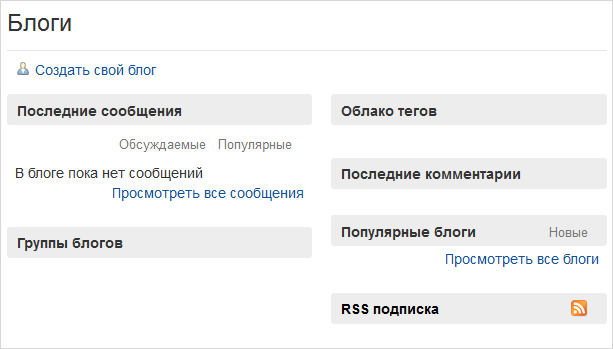
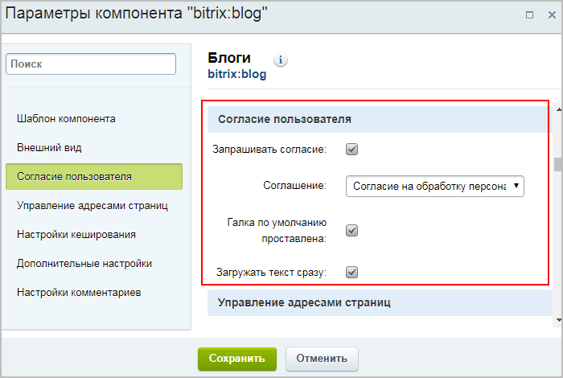

# Публикация списка блогов

**Навигация**
- [← Оглавление курса](index.md)
- [← Предыдущий: 2936 — Комментарии](lesson_2936.md)
- [Следующий: 4799 — Модерация блогов →](lesson_4799.md)

Официальная страница урока: https://dev.1c-bitrix.ru/learning/course/index.php?COURSE_ID=34&LESSON_ID=4798

До этого мы изучали работу с блогами в

			Административном разделе

                    **Административный раздел** - раздел системы, недоступный для просмотра обычным посетителям сайта. В нём производятся настройки сайта и системы для работы.

[Подробнее...](https://dev.1c-bitrix.ru/learning/course/index.php?COURSE_ID=34&CHAPTER_ID=04459&LESSON_PATH=3905.4455.4459)

		.
В этом уроке рассмотрим, как вывести блоги в

			Публичный раздел

                    **Публичный раздел** - это часть сайта, которая доступна всем пользователям ресурса. Иначе говоря, это сам сайт в том виде, в котором его видят посетители сайта. [Подробнее...](https://dev.1c-bitrix.ru/learning/course/index.php?COURSE_ID=34&CHAPTER_ID=04458&LESSON_PATH=3905.4455.4458)

		 (где их, собственно, и требуется видеть).

### Видеоурок

### Публикация блогов

Для публикации блогов достаточно

			создать страницу

[Подробнее](lesson_1911.md)...

		 и разместить на ней комплексный

			компонент

                    Компонент – это программный код, оформленный в визуальную оболочку, выполняющий определённую функцию какого-либо модуля по выводу данных в Публичной части. Мы можем вставлять этот блок кода на страницы сайта без непосредственного написания кода. [Подробнее...](https://dev.1c-bitrix.ru/learning/course/index.php?COURSE_ID=34&CHAPTER_ID=04457)

		  **Блоги (blog)**.

В настройках компонента вы можете задать внешний вид блогов, а также вам следует обязательно указать группу блогов, которую должен отображать компонент:

Если групп блогов нет, то следует

			создать

                    О том, как создать группу блогов, читайте в уроке [Группы блогов](lesson_2934.md).

		 как минимум одну.

В результате будет создан

			полноценный публичный интерфейс блогов.

**Важно!** Не забываем про закон ФЗ-152 (пользователь должен дать согласие на обработку своих персональных данных). Для реализации этого закона достаточно проставить соответствующие галки в пункте

			Согласие пользователя

		 в настройках компонента **Блоги (blog)**.

### Документация по теме

- [Описание компонентов модуля](https://dev.1c-bitrix.ru/user_help/components/obschenie/blogs/index.php)
