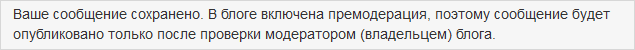
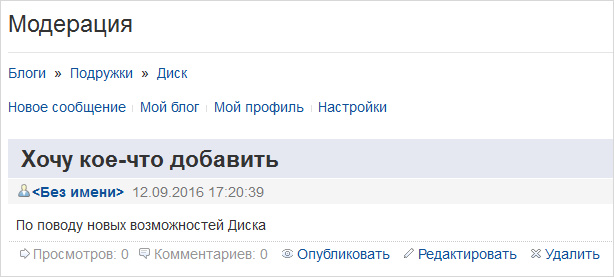

# Модерация блогов

**Навигация**
- [← Оглавление курса](index.md)
- [← Предыдущий: 4798 — Публикация списка блогов](lesson_4798.md)
- [Следующий: 3867 — Создание сообщения блога →](lesson_3867.md)

Официальная страница урока: https://dev.1c-bitrix.ru/learning/course/index.php?COURSE_ID=34&LESSON_ID=4799

### Отделяем зерна от плевел..

На сайте, имеющем блоги, одна из распространенных задач контент-менеджера - модерирование этих самых блогов.
Модерация - контроль соблюдения пользователями правил сайта. Модератор следит, чтобы дискуссия соответствовала заданной теме (если таковая имеется), а также установленным правилам и этическим принципам. При необходимости модератор может применить к участникам административные меры - от предупреждения пользователя до удаления каких-то сообщений или даже запрета доступа для некоторых пользователей.

Различают постмодерацию (или еще её называют просто модерацией) и премодерацию. Наиболее распространена постмодерация, при которой сообщения от участников публикуются постепенно, по мере поступления, а модератор лишь иногда просматривает блог и удаляет лишнее.

Премодерация используется реже, поскольку требует постоянной работы модератора - каждое поступившее сообщение сначала должно быть подтвеждено (разрешено) модератором, и только после этого публикуется.

Если в блоге включена премодерация, то при написании сообщения/комментария пользователю будет демонстрироваться сообщение об этом:

### Видео-пример работы модератора

### Как работает модератор

Находясь в своем блоге, Вы можете работать с его сообщениями с помощью ссылок **Скрыть**\**Опубликовать**, **Редактировать**, **Удалить**. В меню блога, рядом с пунктом **Модерация**, в скобочках указано число сообщений, требующих премодерации:

Ссылка **Скрыть** делает сообщение недоступным для просмотра посетителями блога и переносит его в раздел **Модерация** для дальнейшей обработки. Перейдите в данный раздел, чтобы отредактировать\опубликовать или удалить сообщение:

Модерация комментариев осуществляется в режиме детального просмотра сообщения:

Комментарии можно скрывать от показа, публиковать и удалять. Скрытые комментарии затемнены.

**Примечание**: у модератора могут быть два уровня прав:

- **стандартный** (скрывать/публиковать сообщения, редактировать комментарии);
- **расширенный** (помимо стандартных прав можно редактировать/удалять сообщения).

Для задания **стандартных прав** нужно в

			Настройке блога

		 установить уровень доступа "Модерирование", для задания **расширенных** прав - уровень доступа "Администрирование".
