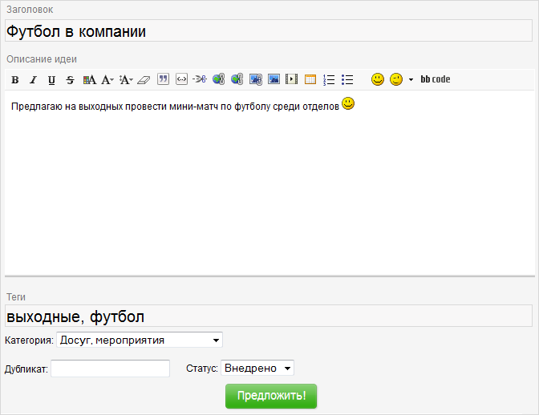
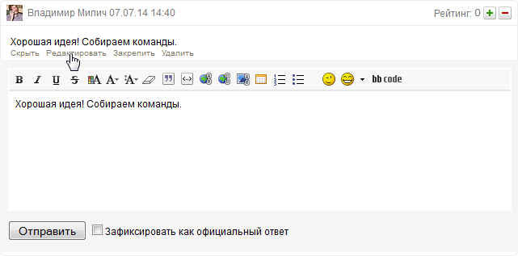
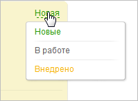
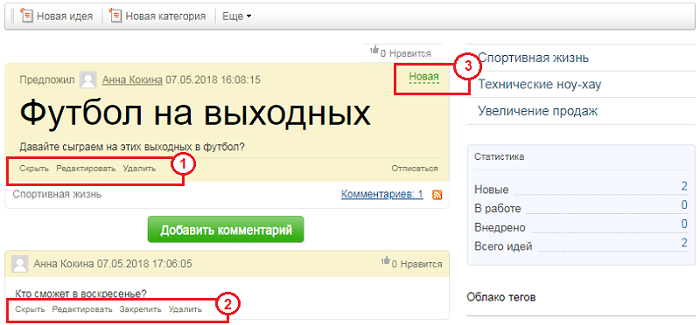
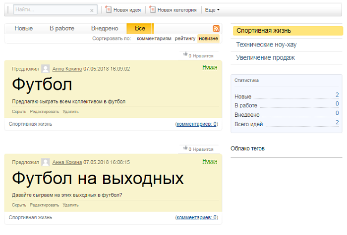
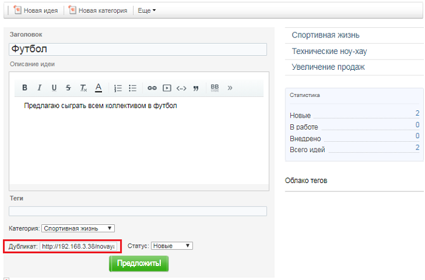
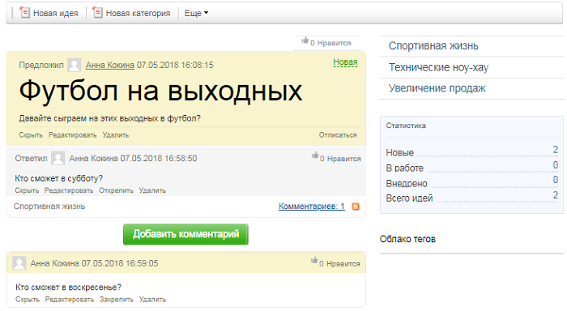
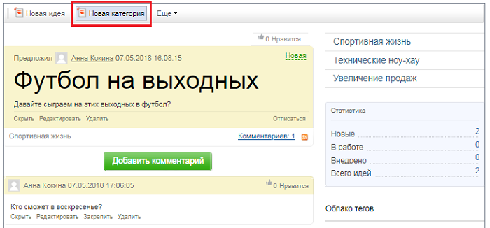
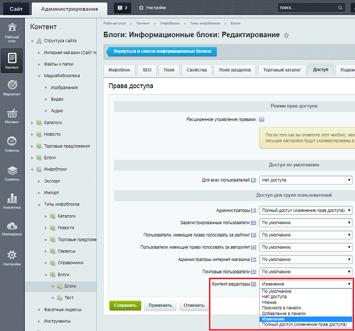
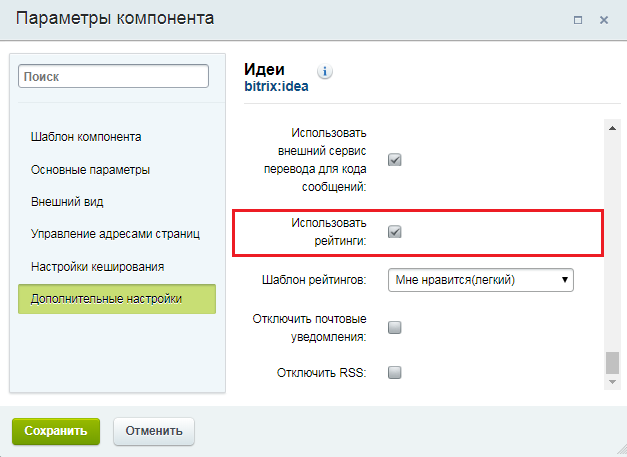

# Управление сервисом Менеджер идей

**Навигация**
- [← Оглавление курса](index.md)
- [← Предыдущий: 4695 — Создание Менеджера идей](lesson_4695.md)
- [Следующий: 26218 — Проверьте себя →](lesson_26218.md)

Официальная страница урока: https://dev.1c-bitrix.ru/learning/course/index.php?COURSE_ID=34&LESSON_ID=4994

Управлять сервисом **Менеджер идей** удобно и просто! В этом уроке вы познакомитесь с тремя возможностями Контент-менеджера, которые обеспечивают максимально эффективную работу сервиса:

### Модерирование идей и комментариев

Основная работа Контент-менеджера (с правами модератора) в сервисе **Менеджер идей** - это обработка предлагаемых идей. Права модератора позволяют:

1

			исправлять идеи

                    Редактирование идеи:

2

			редактировать комментарии

                    Редактирование комментария:

3

			менять статус идеи

                    Смена статуса идеи:

		.

Кроме того, модератор может устанавливать официальный ответ для каждого обращения (см. ссылку **Закрепить** для комментариев):

**Примечание:** по умолчанию модерировать сервис **Менеджер идей** могут только пользователи группы **Администраторы**. Чтобы разрешить другим группам пользователей модерировать сервис, необходимо выполнить два условия:

- В настройках
  			прав доступа
  Права доступа к группам блогов, блогам и комментариям блогов настраиваются на закладке **Права на доступ** на странице административного раздела (*Настройки &gt; Настройки продукта &gt; Настройки модулей &gt; Блоги*).
  [Подробнее](https://dev.1c-bitrix.ru/learning/course/index.php?COURSE_ID=41&LESSON_ID=5854)...
  		 к блогу идей Администратор сайта должен задать уровень **Администрирование** к сообщениям и комментариям для авторизованных посетителей.
- В настройках комплексного компонента идей (**bitrix:idea**) Контент-менеджер должен указать данную группу в параметре
  			Группы пользователей, которые могут добавлять специальный ответ
                       

### Полезные опции

опция **Дубликат** необходима в том случае, когда выдвинуто несколько схожих идей. Она позволяет указать идентификатор или прямую ссылку на уже предложенную ранее схожую идею

			(пример)

                    В этом примере две идеи несут одинаковую смысловую нагрузку:

		.

Для этого:

- откройте первоначальную идею и скопируйте ее адрес
- откройте дублирующую идею в режиме **Редактировать**, и там в поле
  			Дубликат
                      
  		 вставьте скопированный ранее адрес
- нажмите кнопку **Предложить**, и в идее появится соответствующее
  			сообщение со ссылкой на дубликат
                      

опция **Зафиксировать как официальный ответ** позволяет установить комментарий в качестве официального ответа на предложенную идею и закрепить его под описанием идеи

			(пример обычного комментария и официального ответа)

                     Здесь:

"Кто сможет в субботу?" - официальный ответ;

"Кто сможет в воскресенье?" - комментарий.

		.

### Создание категорий

Для модератора сервиса доступна возможность создания новых категорий идей. Для этого необходимо воспользоваться кнопкой

			Новая категория

                     

		 на странице со списком идей.

**Примечание:** в этом случае для группы модераторов сервиса должен быть задан уровень доступа

			Изменение

                     

		 к созданному ранее инфоблоку.

### Настройки рейтинга

Чтобы пользователи смогли голосовать за идеи, необходимо:

1. Администратору сайта в административной части (Сервисы &gt; Рейтинги &gt; Список рейтингов, Рейтинг) во вкладке **Блог** отметить
  			пункты
                      
  		:
  Контент-менеджеру в настройках комплексного компонента идей (**bitrix:idea**) отметить опцию
  			Использовать рейтинги
                      
  Включить пользователей в группу
  			Пользователи, имеющие право голосовать за рейтинг
                      

  - Голосование за сообщения пользователя в блогах
  - Голосование за комментарии пользователя в блогах

Подробнее с настройками рейтинга можно ознакомиться в уроке [Рейтинги (курс Администратор. Базовый)](https://dev.1c-bitrix.ru/learning/course/index.php?COURSE_ID=35&CHAPTER_ID=04975&LESSON_PATH=3906.4493.4975)
