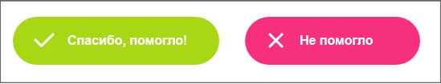

# Контекстная помощь

**Навигация**
- [← Оглавление курса](index.md)
- [← Предыдущий: 1990 — Избранное](lesson_1990.md)
- [Следующий: 5067 — Экспорт в MS Excel →](lesson_5067.md)

Официальная страница урока: https://dev.1c-bitrix.ru/learning/course/index.php?COURSE_ID=34&LESSON_ID=5081

Обилие справочной информации 1С-Битрикс иной раз создаёт проблему: где искать ответ на свой вопрос?

### О справке

> **Контекстная справка** – информация о функционале, открываемая "по месту требования". То есть в разделе Информационные блоки откроется окно с информацией только о работе с инфоблоками, а в разделе Медиабиблиотека – только о медиабиблиотеке.

Для облегчения поиска иголки в стоге сена создана

			Контекстная помощь

                    <!-- &lt;iframe title="Контекстная помощь" src="//www.youtube.com/embed/9JijcliWfQA?feature=oembed&rel=0" allowfullscreen="" frameborder="0" width="360" height="530"&gt;&lt;/iframe&gt; -->

		, доступная только в

			Административном разделе

                    **Административный раздел** - раздел системы, недоступный для просмотра обычным посетителям сайта. В нём производятся настройки сайта и системы для работы.

[Подробнее...](https://dev.1c-bitrix.ru/learning/course/index.php?COURSE_ID=34&CHAPTER_ID=04459&LESSON_PATH=3905.4455.4459)

		 системы. К ней обращаются нажатием на кнопку  в Административной панели. В Контекстной помощи отобразится вся информация по теме страницы, с которой она открывается. Если открываете со страницы Список баннеров, то выведется всё по работе с баннерами. Если открываете со страницы Заказы, то увидите всю информацию по заказам. И так далее.

**Примечание**: В Битрикс24 контекстная помощь есть как в административной, так и в публичной частях сайта.

### Разделы справки

Справка содержит следующие разделы (не все из них могут отображаться на каждой странице):

- **Почитайте готовые ответы** — это список быстрых вопросов и ответов. Здесь собраны типовые вопросы и ответы, которые поступали в службу поддержки.
- **Учебный курс** — список уроков из учебных курсов с детальным и подробным описанием функционала.
- **Советы пользователей** — статьи партнёров 1С-Битрикса о работе с тем или иным функционалом.
- **Посмотрите Видеоролики** — список видеороликов с общим рассказом о функционале и приёмах работы.
- **Пользовательская документация** — список страниц из [Пользовательской документации](http://dev.1c-bitrix.ru/user_help/).
- **Быстрый поиск** — поиск по всем справочным материалам. Иногда с его помощью можно быстрее получить ответ.
- **Расскажите, что вы искали и не нашли** — форма для отправки запроса на разъяснение тех или иных возможностей продукта.

Для администраторов в самом низу отображается ещё и форма для обращения в техподдержку компании "1С-Битрикс".

После клика по названию статьи, откроется сама статья. Есть несколько особенностей:

1. Для изучения функционала бывает полезно одновременно с чтением повторять действия, описанные в статье. Чтобы сделать это воспользуйтесь ссылкой
  			Открыть в новой вкладке
                      
  		. Статья откроется в новой вкладке, а на самом сайте вы сможете повторять действия, описанные в ней. Рекомендуется пользоваться этой опцией, так как функционал курсов имеет более широкие возможности, чем контекстная справка.
2. Вы можете высказать своё отношение к статье с помощью специальных кнопок:
  
