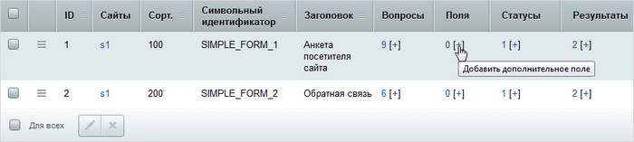
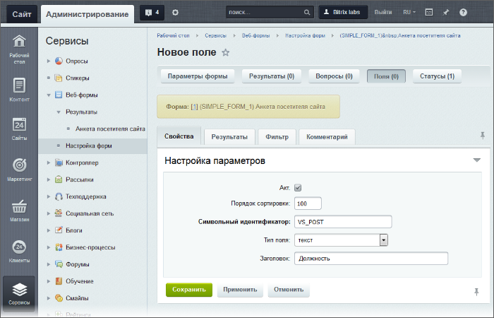
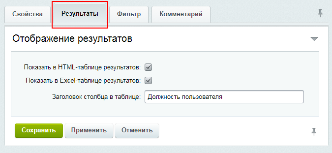

# Создание полей веб-формы

**Навигация**
- [← Оглавление курса](index.md)
- [← Предыдущий: 5154 — Настройка статусов веб-формы](lesson_5154.md)
- [Следующий: 3642 — Интеграции веб-формы и CRM Битрикс24 →](lesson_3642.md)

Официальная страница урока: https://dev.1c-bitrix.ru/learning/course/index.php?COURSE_ID=34&LESSON_ID=5156

### Видеоурок

### Как создать поле

*Поле формы* используется для хранения каких-либо данных, введённых после сохранения заполненной формы (после сохранения результата). Простейший пример: комментарий к ответу пользователя.

Самый простой способ создать поле - нажать на

			[+]

                    

		, расположенный в столбце **Поля** нужной формы. Откроется форма следующего вида:

Значения параметров понятны из их названия, в крайнем случае обратитесь [к документации](https://dev.1c-bitrix.ru/user_help/service/form/form_field_edit.php). Поясним некоторые моменты.

На закладке **Свойства** укажите:

- **Символьный идентификатор** поля (можно использовать латинские буквы, цифры и символ "_");
- **Тип поля** – используется для хранения данных в соответствующем формате:

  - текст (text);
  - число (integer);
  - дата (date).

На закладке

			Результаты

		 выберите, в какой форме должны выводиться результаты: в HTML-таблице и/или в Excel-таблице, а также укажите

			Заголовок столбца в таблице

Это текст, который будет выводиться в таблице результатов в качестве заголовка столбца, содержащего значения данного поля.

Если параметр не заполнен, в качестве заголовка выводится значение параметра **Заголовок** из закладки **Свойства** (если и оно не заполнено, то выводится значение обязательного параметра **Символьный идентификатор**).

		.

На закладке

			Фильтр

		 укажите типы полей, по значениям которых будет осуществляться фильтрация элементов на странице со списком форм, а в параметре

			Подпись к полю фильтра

Это текст, который будет выводиться в списке полей фильтра.

Если поле не заполнено, в качестве заголовка выводится значение поля **Заголовок** из закладки **Свойства** (если и оно не заполнено, то выводится значение обязательного поля **Символьный идентификатор**).

		 задайте надпись данного поля для фильтра.

**Примечание**:

В *однострочном текстовом поле фильтра* у Вас есть возможность использовать [логические выражения](https://dev.1c-bitrix.ru/user_help/help/filter.php), в синтаксис которых входят:

- &  - логическое И
- | - логическое ИЛИ
- ~ - логическое отрицание
- () - круглые скобки, помогающие задать порядок действия логических операторов (приоритет).

Сохраните поле с помощью кнопки **Сохранить** или **Применить**.

### Документация по теме

- [Список полей](https://dev.1c-bitrix.ru/user_help/service/form/form_field_list.php)
- [Создание и редактирование поля](https://dev.1c-bitrix.ru/user_help/service/form/form_field_edit.php)
- [Результаты веб-формы](https://dev.1c-bitrix.ru/user_help/service/form/form_result_list.php)
