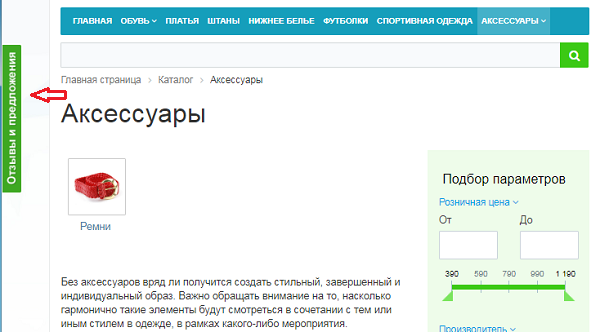

# Возможности модуля

**Навигация**
- [← Оглавление курса](index.md)
- [← Предыдущий: 12902 — Проверьте себя](lesson_12902.md)
- [Следующий: 4695 — Создание Менеджера идей →](lesson_4695.md)

Официальная страница урока: https://dev.1c-bitrix.ru/learning/course/index.php?COURSE_ID=34&LESSON_ID=5190

|  | ### Возможности модуля Менеджер идей |
| --- | --- |

Мнение клиентов о товаре, услугах или работе сайта – незаменимый источник идей для развития бизнеса. **Менеджер идей** (второе название *Есть идея!*) даст возможность совершенствовать ваш ресурс, ориентируясь на мнение самих пользователей.

Модуль позволяет:

- Добавлять
  			новые идеи
  
  		 и прикреплять файлы.
- Располагать на сайте
  			всплывающую форму добавления идеи
                      
  		. Требуется установка
  			компонента
                      Компонент – это программный код, оформленный в визуальную оболочку, выполняющий определённую функцию какого-либо модуля по выводу данных в Публичной части. Мы можем вставлять этот блок кода на страницы сайта без непосредственного написания кода. [Подробнее...](https://dev.1c-bitrix.ru/learning/course/index.php?COURSE_ID=34&CHAPTER_ID=04457)
  		 **Форма добавления идеи (popup).**
- Добавлять категории для удобной сортировки идей.
- Просматривать предложенные идеи в зависимости от интересующей категории и комментировать их.
- Голосовать за понравившуюся идею и выводить рейтинги.

|  | #### Администрирование модуля |
| --- | --- |

Администрирование модуля (настройка, задание прав) описано в курсе [Администратор. Модули](/learning/course/index.php?COURSE_ID=41&CHAPTER_ID=06470).

|  | #### Документация по теме: |
| --- | --- |

- [Пользовательская документация по модулю "Менеджер идей" ("Есть идея?")](https://dev.1c-bitrix.ru/user_help/service/idea/index.php)
