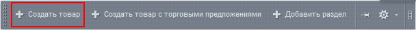
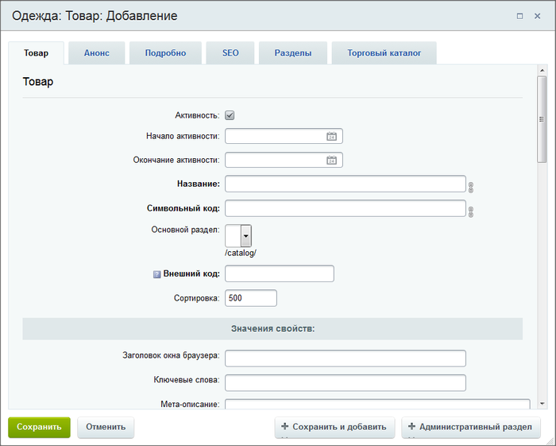
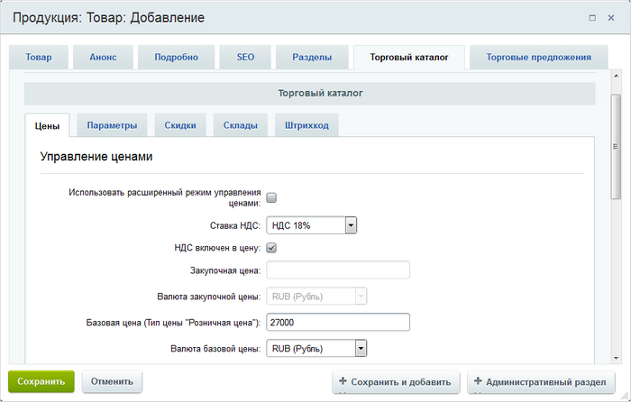
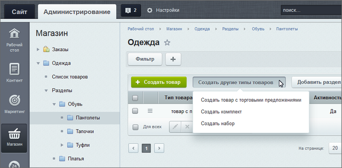

# Добавление товаров вручную

**Навигация**
- [← Оглавление курса](index.md)
- [← Предыдущий: 12884 — Практические задания](lesson_12884.md)
- [Следующий: 4515 — Добавление товаров через импорт →](lesson_4515.md)

Официальная страница урока: https://dev.1c-bitrix.ru/learning/course/index.php?COURSE_ID=34&LESSON_ID=5192

### Видеоурок

### Добавление из публичного раздела

Для добавления товаров из публичного раздела в публичной части используются команды **Создать товар** (для простых товаров) или **Создать товар с торговыми предложениями** (для товаров с предложениями)

			при включённом режиме Правка

                     

		. В обоих случаях откроется практически одинаковая форма:

**Важно!** Требование к уровню прав для добавления товаров: к используемому инфоблоку не ниже **Изменение** и к модулю **Торговый каталог** не ниже **Управление складами** (иначе невозможно будет указать цены и количество товара).

Кнопка **Создать товар с торговыми предложениями** доступна в том случае, если информационный блок товаров настроен на работу с

			торговыми предложениями

                    В настройках инфоблока на закладке **Торговый каталог** должна быть отмечена опция **Инфоблок имеет торговые предложения**.

[Читать подробнее...](/learning/course/index.php?COURSE_ID=42&LESSON_ID=3155)

		. Кроме того, для добавления предложений пользователь должен обладать правом доступа на информационный блок торговых предложений не ниже **Изменение**.

В форме задайте название товара, укажите его свойства, введите анонс и необходимое детальное описание. Если требуется, то выполните настройки SEO данных на соответствующей вкладке **SEO** (подробности в уроке [Настройка SEO информации](lesson_6305.md)).

На закладке

			Торговый каталог

                    

		 задаются:

- цена товара и ставка НДС;
  **Важно!** С 1 января 2019 года на территории России изменяется ставка НДС. Поэтому необходимо отредактировать старую ставку 18%, заменив название и значение на 20%. Создавать новую ставку нецелесообразно, поскольку значение ставки придется менять вручную во всех товарах.
- количество товара и доступность на складах вручную, если
  			складской учет
                      Складской учет включается в настройках модуля **Торговый каталог** (Настройки &gt; Настройки продукта &gt; Настройки модулей &gt; Торговый каталог).
  [Читать подробнее...](/learning/course/index.php?COURSE_ID=42&CHAPTER_ID=05296)
  		 в системе отключен (в этом случае соответствующие поля будут доступны для внесения данных);
  **Примечание:** при включенном складском учете необходимо после сохранения товара провести документ
  			Приход товара на склад
                      
  [Читать подробнее...](/learning/course/index.php?COURSE_ID=42&LESSON_ID=5297)
  		.
- активные скидки без купонов, распространяющиеся на данный товар;
- штрих-код товара.

В случае с товаром с торговыми предложениями заполняется ещё и закладка **Торговые предложения**:

Добавлять торговые предложения к товару можно двумя способами:

- вручную - для этого служит кнопка [Добавить](/learning/course/index.php?COURSE_ID=42&LESSON_ID=3155#add_sku);
- с помощью специального генератора, который открывается по кнопке [Генерировать торговые предложения](/learning/course/index.php?COURSE_ID=42&LESSON_ID=5847#generate).

По окончании всех настроек не забудьте сохранить товар.

### Добавление из административного раздела

Средства административного раздела позволяют более гибко создавать товары. Здесь вы сперва выбираете тип создаваемого товара:

А потом создаёте товар в форме, аналогичной форме в публичном разделе.

**Примечание:** наборы и комплекты доступны в продукте, начиная с редакции **Бизнес**.

Подробную информацию о том, как создать товар того или иного типа, смотрите в уроке [Типы товаров](/learning/course/index.php?COURSE_ID=42&LESSON_ID=5830).

### Документация по теме

- [Как простой заполненный инфоблок сделать торговым каталогом](https://dev.1c-bitrix.ru/learning/course/?COURSE_ID=42&LESSON_ID=12808)
