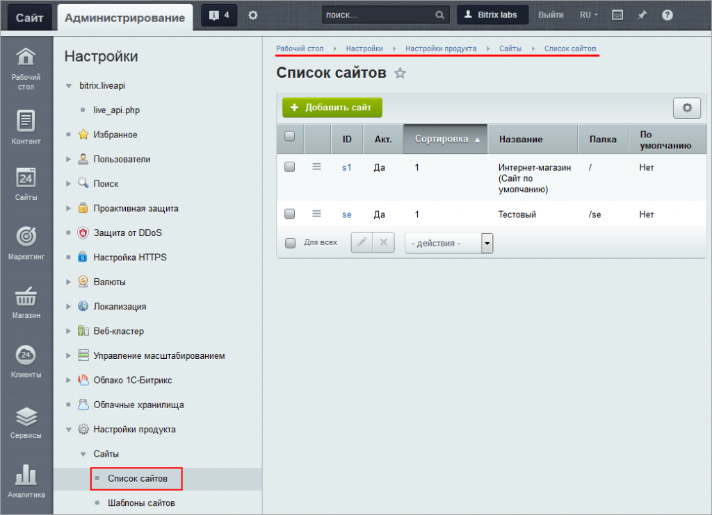
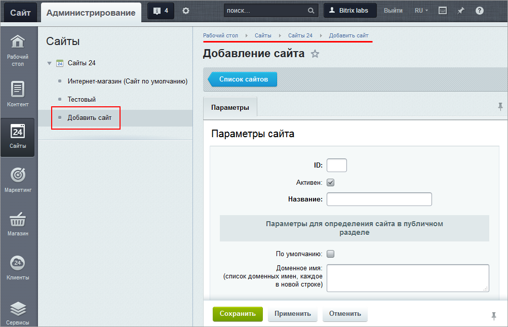
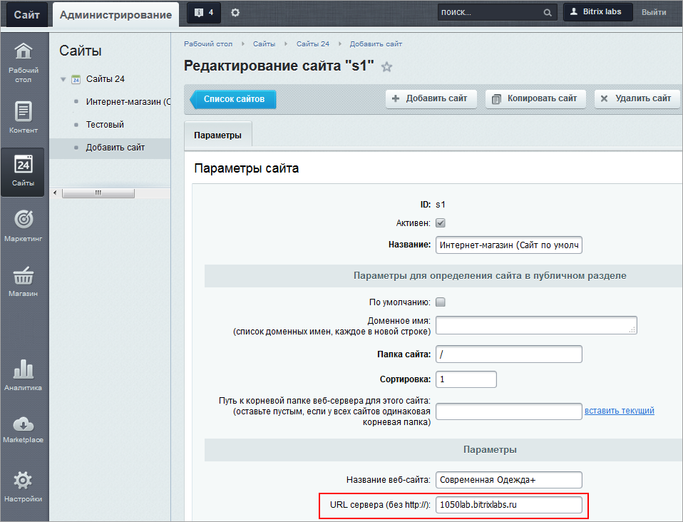

# Как создать сайт

**Навигация**
- [← Оглавление курса](index.md)
- [← Предыдущий: 26222 — Проверьте себя](lesson_26222.md)
- [Следующий: 11217 — Модуль Сайты - что это, зачем, как установить и работать →](lesson_11217.md)

Официальная страница урока: https://dev.1c-bitrix.ru/learning/course/index.php?COURSE_ID=34&LESSON_ID=5200

### Видеоурок

### Как на самом деле происходит создание сайта

Само создание сайта выполняется на странице **Список сайтов** (Настройки &gt; Настройки продукта &gt; Сайты &gt; Список сайтов). На этой странице каждый сайт представлен в виде отдельной записи. И здесь происходит всё [управление сайтами](https://dev.1c-bitrix.ru/learning/course/index.php?COURSE_ID=35&CHAPTER_ID=04502&LESSON_PATH=3906.4493.4502), то есть добавление, изменение, копирование, удаление.

> На этой же странице перечислены сайты, которые были [созданы](lesson_3557.md#new_resh) с использованием
>
> 			готовых решений
>
>
>
>                     resh.png)
>
>
>
> 		. Создание дополнительных страниц для них происходит полностью аналогично.

А в модуле **Сайты 24** можно создавать дополнительные страницы вашего сайта. Эти страницы можно публиковать автономно, что очень удобно, значительно повышает конверсию и улучшает поисковое продвижение (SEO).

Система «1C-Битрикс: Управление сайтом» поддерживает

			многосайтовость

                    **Многосайтовость** - возможность управлять разными сайтами из единой Панели управления.

		. Это значит, что можно создать несколько сайтов на одной копии продукта. При этом все сайты будут работать с использованием одной

			базы данных

                    **База данных** - универсальное место хранения информации на сайте. Специальная программа, легко загружающая и выгружающая любую информацию. [Подробнее...](lesson_3446.md)

		 и единого

			ядра продукта

                    **Ядро продукта** - основная программа. Обеспечивает управление и распределение ресурсов, управление процессами, поддержку файловых систем, управление памятью и т. п.

		.

**Внимание!** В редакции "Старт" вы можете создать два сайта с неограниченным количеством страниц. В других редакциях количество сайтов и страниц неограниченно.

Сравнить возможности разных редакций можно [здесь](https://www.1c-bitrix.ru/products/cms/editions/#compare).

При нажатии кнопки  происходит переход на страницу модуля **Сайты 24** и открывается специальная форма добавления сайта:

 

В этой форме нужно будет заполнить поля: ID, доменное имя, папка сайта и др., как в [примере](/learning/course/index.php?bitrix_include_areas=Y&COURSE_ID=35&LESSON_ID=1991#add_site).

То есть, по сути, заполняя эту форму, вы и создаёте сайт. А далее в модуле **Сайты 24** можно создавать и отдельно публиковать дополнительные страницы вашего сайта. Веб-адреса этих страниц будут включать в себя заданный при создании сайта URL сервера.

> Как настроить адреса, по которым ваши страницы будут доступны после публикации, подробно описано в [уроке](https://dev.1c-bitrix.ru/learning/course/index.php?COURSE_ID=41&LESSON_ID=11261) и [блоге](https://dev.1c-bitrix.ru/community/blogs/antonds/sayty24-and-private-domain-in-the-box.php).

### Возможности Сайтов 24

Инструмент позволяет:

- Быстро запустить ваш собственный сайт, используя обширную коллекцию готовых шаблонов.
- Менять дизайн шаблона - фоны, шрифты, тексты, изображения и др.
- Создавать собственные шаблоны.
- Работать с включаемыми областями шаблонов как с отдельными страницами.
- Использовать готовые блоки из каталога.
- Редактировать блоки - менять палитру, шрифты, кнопки, добавлять анимацию и др.
- Выводить на сайт данные из "1С-Битрикс: Управление сайтом", в том числе товары каталогов и др.
- Адаптировать сайт к мобильным устройствам сразу в процессе создания.
- Хранить создаваемый сайт на своем хостинге и
  			домене
                      У пользователей довольно часто встречается такая потребность - публиковать сайты и лендинги с привязкой к отдельному домену. Например, чтобы не дезориентировать посетителей или не загромождать интернет-магазин лишними страницами.
  [Подробнее в курсе "Администратор.Модули".](https://dev.1c-bitrix.ru/learning/course/index.php?COURSE_ID=41&LESSON_ID=12629)
  		.

### Администрирование модуля

Администрирование модуля (настройка, задание прав) описано в курсе [Администратор. Модули](/learning/course/index.php?COURSE_ID=41&LESSON_ID=11261).
