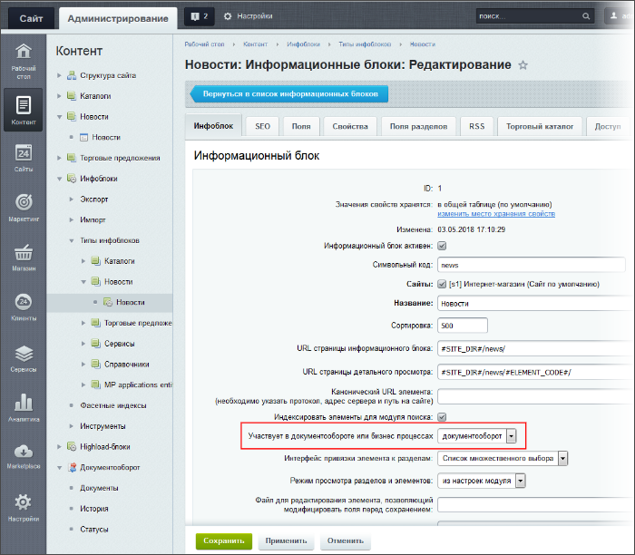
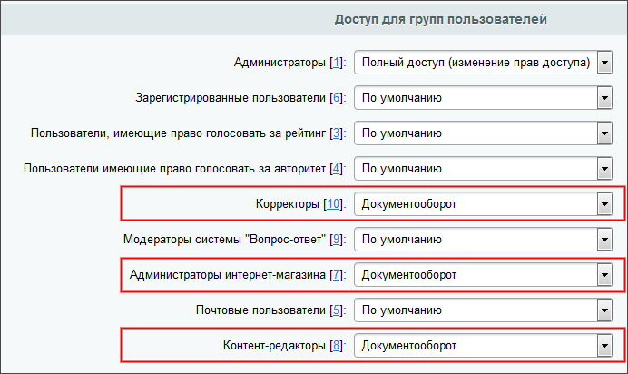

# Как настроить инфоблок на документооборот

**Навигация**
- [← Оглавление курса](index.md)
- [← Предыдущий: 3447 — Создание страниц через документооборот](lesson_3447.md)
- [Следующий: 3835 — Создание новости через документооборот →](lesson_3835.md)

Официальная страница урока: https://dev.1c-bitrix.ru/learning/course/index.php?COURSE_ID=34&LESSON_ID=5217

### Введение

**Документооборот** - полезная функция, если требуется организовать процесс создания, наполнения и публикации страниц **с контролем** со стороны заказчика или администратора сайта. Решим задачу организации документооборота на сайте на примере новостного блока, когда на каждом этапе за новость отвечают

			определенные группы пользователей

                    **Контент-менеджеры** сайта создают и редактируют новости, **корректоры** - правят созданные сообщения, а публикацию новостей выполняют **администраторы интернет-магазина**.

		.

Сначала документооборот настраивается администратором сайта. Мы считаем, что администратором:

- Необходимые для контроля группы пользователей
  			созданы
                      Управление группами пользователей выполняется на странице **Группы пользователей** (Настройки &gt; Пользователи &gt; Группы пользователей).
  [Читать подробнее...](https://dev.1c-bitrix.ru/learning/course/index.php?COURSE_ID=35&CHAPTER_ID=02006&LESSON_PATH=3906.4503.2006)
  		;
- Права доступа для групп
  			даны
                      В менеджере файлов для папок и файлов, где будет размещаться информационный блок, для группы должно быть установлено право доступа **Документооборот**.
  [Читать подробнее...](/learning/course/index.php?COURSE_ID=41&CHAPTER_ID=05049)
  		;
- Статусы
  			 настроены
                      Статусы настраиваются на странице административного раздела Контент &gt; Документооборот &gt; Статусы.
  [Читать подробнее...](/learning/course/index.php?COURSE_ID=41&LESSON_ID=2759)
  		.

### Видеоурок

### Настройка инфоблока

Проведем настройки информационного блока. На странице редактирования настроек новостного инфоблока (Контент &gt; Инфоблоки &gt; Типы инфоблоков &gt; Новости) в поле **Участвует в документообороте или бизнес процессах** выставьте значение **Документооборот**:

Нажмите **Применить** и на закладке **Доступ** укажите права доступа для редакторов сайта, корректоров и администраторов интернет-магазина как **Документооборот**:

### Заключение

В этом уроке Вы узнали, как настроить инфоблок на документооборот на примере инфоблока Новости. Это удобно для организации контроля наполнения сайта. В следующем уроке посмотрите пример, как  осуществляется контроль при создании новой новости через документооборот.

### Дополнительно

- [Организация проверки без документооборота](lesson_13072.md) - урок о том, как организовать контроль наполнения сайта без модуля **Документооборот**.
