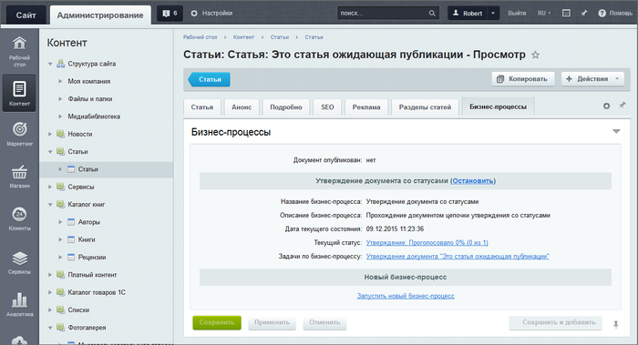
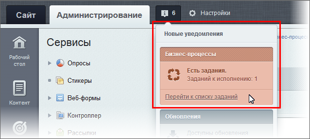

# Бизнес-процессы

**Навигация**
- [← Оглавление курса](index.md)
- [← Предыдущий: 1880 — Загрузка файлов](lesson_1880.md)
- [Следующий: 10183 — Проверьте себя →](lesson_10183.md)

Официальная страница урока: https://dev.1c-bitrix.ru/learning/course/index.php?COURSE_ID=34&LESSON_ID=5320

|  | #### Бизнес-процессы: зачем они и как с ними работать |
| --- | --- |

Контент-менеджеры работают с бизнес-процессами если это требуется при публикации информации на сайте. Бизнес-процессы – это некая автоматизированная последовательность действий, которые будут выполняться, например, над элементом инфоблока при его создании или изменении. Бизнес-процесс существенно облегчает работу всей команды над содержанием сайта. И чем сложнее порядок выпуска информации на сайте, тем больше пользы приносит его использование.

Бизнес-процессы создаются администратором или разработчиком сайта.

Правильно спроектированный Бизнес-процесс всегда уведомит контент-менеджера о том, что пришла его очередь работы над документом (статьёй, страницей сайта). Уведомление может прийти в чат или на почту. Или уведомление может появиться в Центре уведомлений Административной панели:

По ссылке Перейти к списку заданий вы попадёте на страницу Сервисы &gt; Бизнес-процессы &gt; Задания,  где будет видны все невыполненные вами задания.

О создании бизнес-процессов есть отдельный учебный курс [Бизнес-процессы](https://dev.1c-bitrix.ru/learning/course/index.php?COURSE_ID=57).

В нём вы можете посмотреть урок про работу с бизнес-процессами:

			Пример работы с бизнес-процессами

                    Рассмотрим работу с бизнес-процессами на примере создания новости контент-менеджером и утверждение ее администратором информационного портала.

[Подробнее ...](/learning/course/index.php?COURSE_ID=57&LESSON_ID=3140)

		. В примере показан случай, когда контент-менеджер создает новость на сайте, которая будет опубликована только после проверки администрацией сайта.
