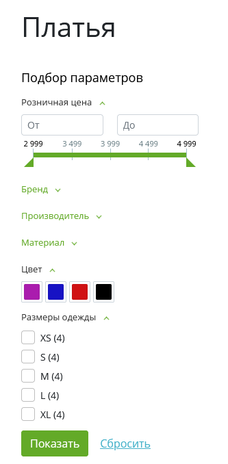
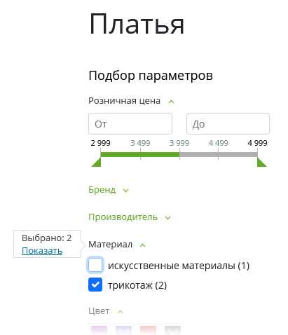
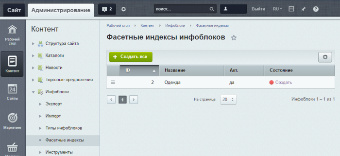
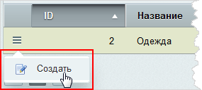
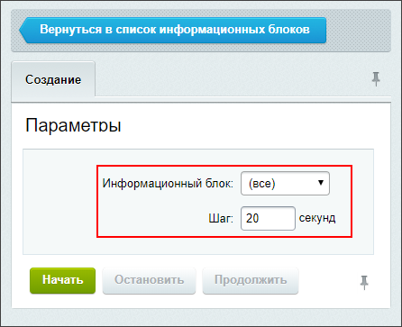
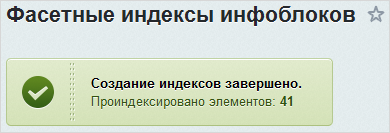
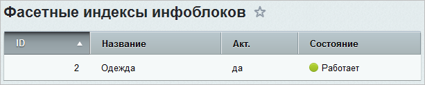

# Фасетный поиск: улучшаем работу каталога товаров

**Навигация**
- [← Оглавление курса](index.md)
- [← Предыдущий: 7341 — Как быстро открыть форму элемента или инфоблока](lesson_7341.md)
- [Следующий: 12876 — Групповая генерация символьных кодов →](lesson_12876.md)

Официальная страница урока: https://dev.1c-bitrix.ru/learning/course/index.php?COURSE_ID=34&LESSON_ID=5364

### О фасетном поиске

До недавнего времени в интернет-магазинах использовался

			полнотекстовый поиск товаров

                    Полнотекстовый поиск — поиск по слову или фразе.

		. С версии 15.0.1 модуля Информационные блоки стал доступен механизм фасетного поиска. Он интегрирован с

			компонентом

                    Компонент – это программный код, оформленный в визуальную оболочку, выполняющий определённую функцию какого-либо модуля по выводу данных в Публичной части. Мы можем вставлять этот блок кода на страницы сайта без непосредственного написания кода. [Подробнее...](https://dev.1c-bitrix.ru/learning/course/index.php?COURSE_ID=34&CHAPTER_ID=04457)

			Умный фильтр

                    Компонент подготавливает фильтр для выборки из инфоблока и выводит форму фильтра для фильтрации элементов.

						[Описание компонента «Умный фильтр» в пользовательской документации.](http://dev.1c-bitrix.ru/user_help/detail.php?ID=541722)

		.

> **Фасетный поиск** — поиск товара по нескольким характеристикам: цвету, размеру, объему памяти, цене и т.п. Внешне он реализован как набор фильтров. Каждый фильтр связан только с одним свойством товара. Значения фильтра — все возможные значения свойства. В отличие от полнотекстового поиска фасетный фильтр отображается, как правило, только на страницах каталога.

### Как работают фасетные фильтры

Фильтр отбирает сами товары и варианты выбора в других фильтрах. Немного сложно звучит, но вы поймёте из пояснений ниже.

С фильтрацией товаров всё просто. Если выбрано:

- одно значение, то отображаются товары, точно совпадающие с этим значением. (Например: все платья.)
- несколько значений в одном фильтре, то отображаются товары, совпадающие хотя бы с одним из значений. (Например, все изделия размеров 46, 48 и 50.)
- значения в нескольких фильтрах, то отображаются товары, совпадающие со значением из каждого фильтра. (Например, все платья зелёного цвета 48-го размера по цене от 2000 до 5600 рублей.)

Фильтрация вариантов выбора в других фильтрах существенно облегчает пользователю дальнейший выбор, показывая в специальном окне, сколько осталось товаров при заданных условиях фильтра:

Благодаря этому покупатель может оставить в поиске только нужные ему товары по любому из критериев. Например, оставить все шлифовальные машины брендов Bosсh или Вихрь. Индикация в отдельном окне оставшихся вариантов позволяет в любой момент остановить поиск или изменить его параметры.

### Видеоурок

### Как настроить фасетный поиск

Создадим **фасетные индексы** за несколько простых действий:

1. Настройте/проверьте отображение в умном фильтре хотя бы одного свойства каталога товаров. Без этого работа фасетного поиска
  			невозможна
                      На странице Контент &gt; Инфоблоки &gt; Фасетные индексы будет недоступно создание фасетных индексов для такого каталога.
  		.
2. Откройте страницу **Фасетные индексы инфоблоков** (Контент &gt; Инфоблоки &gt; Фасетные индексы):
  
3. Нажмите кнопку **Создать все** либо пункт меню
  			Создать
                      
  		. Откроется форма для создания индексов.
4. Задайте
  			два параметра
                      
  		:

  - **Информационный блок** - укажите конкретный каталог товаров или
    			(все)
                        В этом случае создадутся индексы для всех каталогов системы.
    		.
  - **Шаг** - задайте
    			интервал
                        Можно использовать значение по умолчанию. Учтите, что слишком маленький шаг существенно нагружает систему, если элементов очень много, а большой шаг - удлиняет процесс создания индексов.
    		 одного шага создания индекса в секундах.
5. Нажмите кнопку **Начать**. По завершении индексации появится
  			сообщение
                      
  		.
  **Примечание:** Создание индексов занимает продолжительное время, если в каталоге сотни тысяч товаров. Рекомендуется выполнять индексацию в период минимальной нагрузки на сервер.
  			Созданные
                      **Примечание:** для каталога торговых предложений фасетные индексы создаются при создании индексов основного каталога.
  		 фасетные индексы хранятся в базе данных. В таблице для каталогов товаров в колонке **Состояние** отображается
  			Работает
                      
  		. Если фасетные индексы созданы для всех каталогов, то кнопка **Создать все** не отображается.

### Нужно ли пересоздавать фасетные индексы?

Фасетные индексы пересоздаются автоматически или требуется пересоздать их вручную в зависимости от произведенных действий:

| \| **Автоматически** \| Добавили новые или отредактировали существующие **товары**. \| \| --- \| --- \| \| При выгрузке товаров, например, из 1С, если товары **не создают** новых свойств. \|  \| \| **Вручную** \| Перенесли раздел. \| |
| --- |

Система подскажет о необходимости **вручную** пересоздать фасетные индексы с помощью сообщения вверху страниц административного раздела:

**Примечание:** До версии **20.5.0** модуля **Информационные блоки** при добавлении новых или редактировании **разделов каталога** требуется пересоздание фасетных индексов вручную.

### Заключение

Фасетный поиск улучшает работу каталога товаров. Для его использования необходимо:

1. Создать фасетные индексы для каталога с товарами;
2. Следить за оповещением о необходимости пересоздания индексов вручную.

|  | ### Документация по теме |
| --- | --- |

- [Фасетные индексы](https://dev.1c-bitrix.ru/user_help/content/iblock/iblock_reindex_admin.php)
