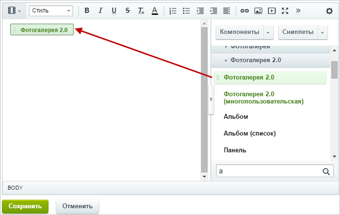
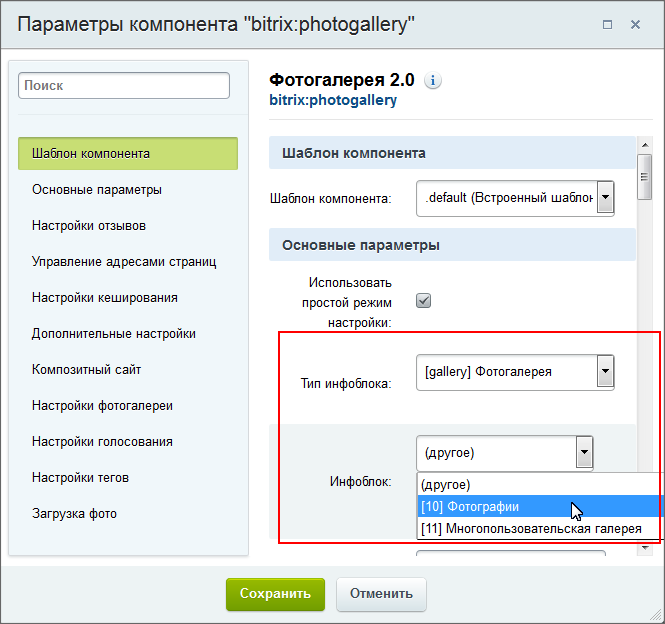

# Настройка простой фотогалереи

**Навигация**
- [← Оглавление курса](index.md)
- [← Предыдущий: 2980 — Основные понятия](lesson_2980.md)
- [Следующий: 2055 — Создание фотоальбома →](lesson_2055.md)

Официальная страница урока: https://dev.1c-bitrix.ru/learning/course/index.php?COURSE_ID=34&LESSON_ID=5365

Работа **Фотогалереи** основана на

			Информационных блоках

                    Информационный блок (или Инфоблок) – специальный инструмент "1С-Битрикс: Управление сайтом" с помощью которого заносится информация в Базу данных.
 [Подробнее...](https://dev.1c-bitrix.ru/learning/course/index.php?COURSE_ID=34&CHAPTER_ID=04477&LESSON_PATH=3905.4477)

		, а также использует возможности модуля

			Блоги

                    Блог - инструмент, позволяющий пользователям сайта вести регулярно добавляемые записи, содержащие текст, изображения или мультимедиа.

 [Подробнее](/learning/course/index.php?COURSE_ID=41&CHAPTER_ID=04555)...

		 для отзывов и модуля

			Поиск

                    Модуль Поиск используется для индексирования и организации поиска информации на сайте.

[Подробнее](https://dev.1c-bitrix.ru/learning/course/index.php?COURSE_ID=35&CHAPTER_ID=04507&LESSON_PATH=3906.4507)...

		 для облака тегов.

### Настройка

Простую фотогалерею в публичном разделе выводит комплексный компонент

			Фотогалерея 2.0

                    Комплексный компонент **Фотогалерея 2.0** позволяет получить полнофункциональную фотогалерею,
 создавая физически только одну страницу.

						[Описание компонента «Фотогалерея 2.0 (комплексный компонент)» в пользовательской документации.](http://dev.1c-bitrix.ru/user_help/detail.php?ID=91321)

		. Просто

			создайте физическую страницу

                    Для создания страницы с помощью Мастера нажмите **Создать страницу**.

[Подробнее](lesson_1911.md)...

		 в нужном разделе,

			разместите этот компонент

                    

		 на ней и настройте его.

Настройка параметров компонента определяет внешний вид фотогалереи:

- отображение облака тегов;
- размеры картинок анонса (эскиз фото), детального просмотра фотографии, а также размеры картинки-анонса и картинки фотоальбома;
- настройки голосования и отзывов;
- и другие параметры, многие из которых стандартны для комплексного компонента.

Эти настройки не обязательны, кроме одной - задание

			Основных параметров

                    

		: типа инфоблоков и инфоблока, где будет храниться информация. (Тип инфоблоков и сам инфоблок должны быть уже созданы к этому моменту.)

**Внимание**: Функционал авторского знака устарел и не поддерживается с версии **14.5.0** Главного модуля (**main**).

### Дополнительно

- [Описание компонентов модуля Фотогалерея 2.0 (документация)](http://dev.1c-bitrix.ru/user_help/service/photogallery/components_2/index.php)
