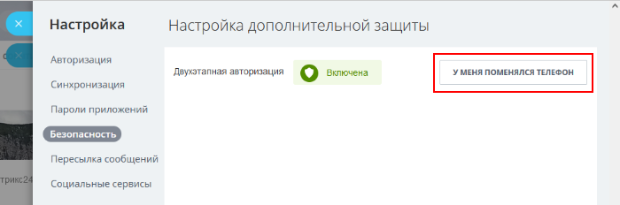
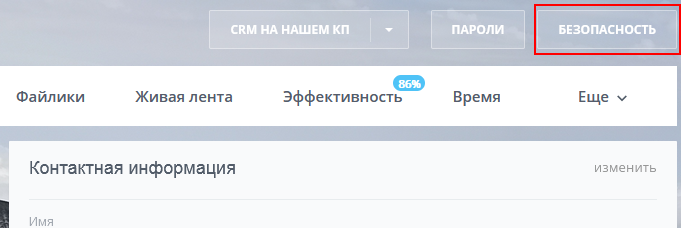
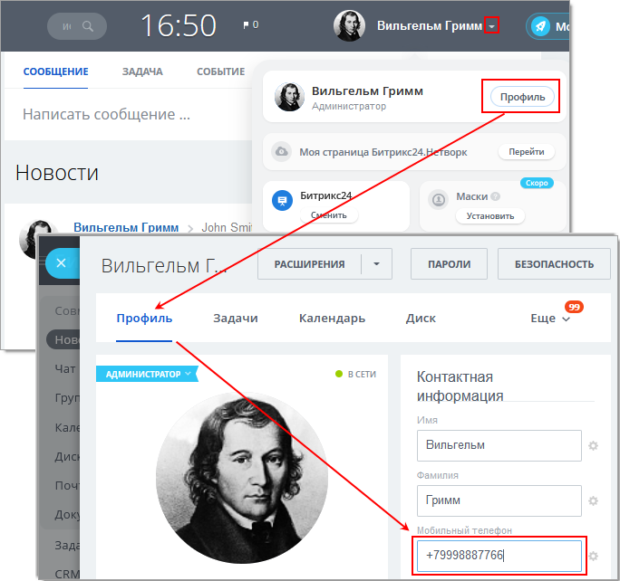
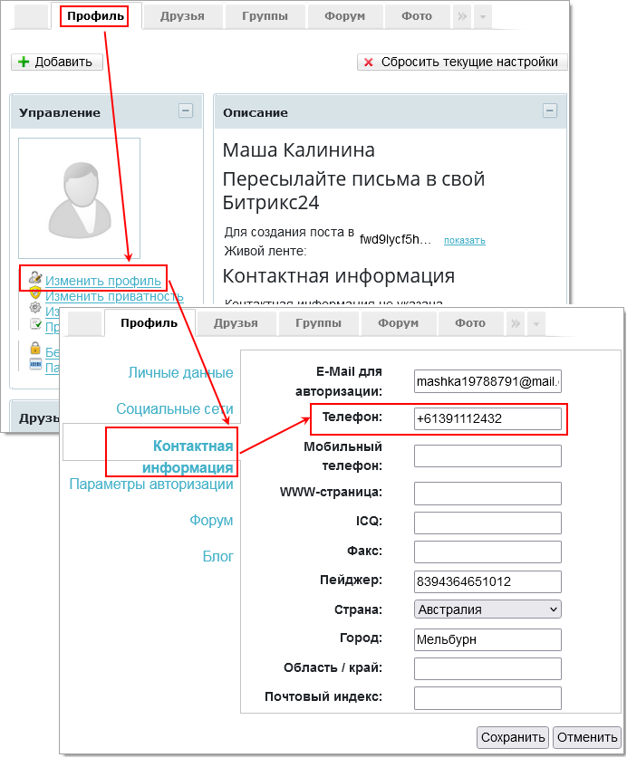
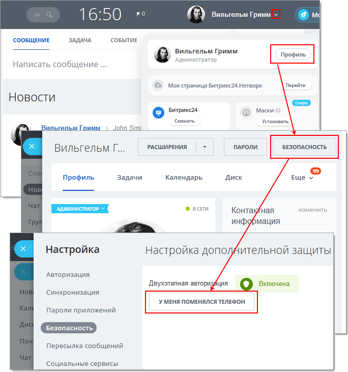
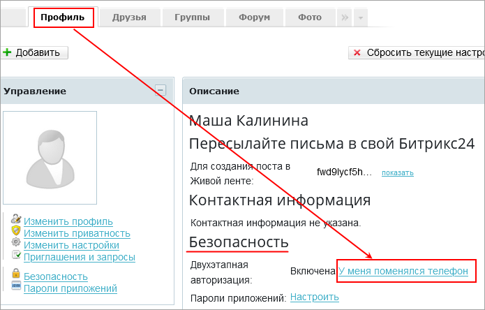
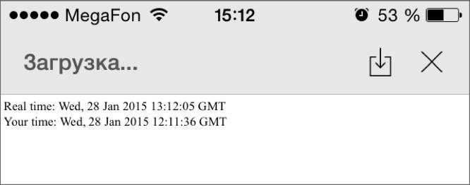

# Решение проблем, связанных с OTP

**Навигация**
- [← Оглавление курса](index.md)
- [← Предыдущий: 6860 — Аппаратное устройство одноразовых паролей (USB-токен)](lesson_6860.md)
- [Следующий: 2460 — Проверьте себя →](lesson_2460.md)

Официальная страница урока: https://dev.1c-bitrix.ru/learning/course/index.php?COURSE_ID=34&LESSON_ID=5421

Что делать, если не удаётся авторизоваться?

Использование одноразовых паролей может создать проблемы со входом на сайт (портал), если:

### Потерян телефон

Если потерян телефон, то для авторизации на портале вам помогут

			Резервные коды

                    Если вы, к несчастью, потеряли телефон или брелок, то вас спасут резервные коды. Их можно получить на странице *Моя страница &gt; Резервные коды*, где можно их **Распечатать**, **Сохранить в текстовый файл** или **Сгенерировать новые коды**...

[Подробнее ...](lesson_6920.md)

		. К сожалению, наличием резервных кодов пользователи озадачиваются только тогда, когда телефон уже утерян.

Если утерян телефон у обычного сотрудника, то администратор отменит ему одноразовый пароль для входа на время настройки нового телефона. Для настройки нового телефона воспользуйтесь ссылкой

			У меня поменялся телефон

                    

		 на Личной странице по кнопке

			Безопасность

                    

Если утерян телефон у администратора, то действуйте так:

- Если есть второй администратор, то он снимет на время ограничение по OTP для первого в его профиле.
- Обратитесь в [техподдержку](https://helpdesk.bitrix24.ru/ticket.php) компании Битрикс. Укажите свой портал *Битрикс24*, логин и пароль без одноразового кода. Доступ по одноразовому паролю будет отключён для этого портала.
  **Внимание!** Этот вариант действует только для платных тарифов!
   Если у вас бесплатный тариф Битрикс24, то в случае одного администратора на портале у вас есть все шансы потерять портал и всю информацию на нём. Будьте очень внимательны при работе с включённым OTP!

### Новый телефон

Если вы просто сменили SIM-карту или номер, то никаких проблем с авторизацией не возникнет - ведь у вас осталось установленное приложение для двухэтапной авторизации, в нём вы и будете получать одноразовые коды. Желательно, конечно,

			сменить номер в профиле

                    **В Битрикс24** номер можно поменять так:

 

 **В 1С-Битрикс: Управление сайтом** - в компоненте Социальная сеть. Номер меняется в Профиль &gt; Изменить профиль &gt; Контактная информация:

 

		, чтобы получать СМС-уведомления или информацию от администратора сайта.

Если же вы поменяли сам аппарат, то двухэтапную авторизацию нужно подключить заново. Для настройки нового телефона воспользуйтесь ссылкой У меня поменялся телефон в профиле.

- **В Битрикс24** она находится в Профиль &gt; Безопасность
  
- **В 1С-Битрикс: Управление сайтом** - в компоненте Социальная сеть (или на специальной странице, размещенной администратором) в разделе Профиль &gt; Безопасность
  

### Сбито время на телефоне

**Внимание!** Двухэтапная авторизация допускает расхождение времени на устройстве со временем сервера **не более одной минуты**.

Одноразовые пароли создаются на основе времени, следовательно, при расхождении времени на вашем устройстве и на сервере *Битрикс24* или сайта вы не получите верного кода доступа. Что делать в случае ошибки доступа?

Первое что нужно сделать в случае неверного пароля: проверьте время и часовой пояс и настройте их. Главное правило: время, установленное при настройке OTP не должно меняться **вручную**.

Если вы пользуетесь приложением

			Bitrix OTP

                    Мобильное приложение Bitrix OTP от компании «1С-Битрикс» специально разработано для двухэтапной авторизации. Оно генерирует секретные коды для входа на порталы и сайты под управлением «Битрикс24» и «1С-Битрикс» и позволяет обойтись без использования брелоков или посторонних программ.

[Подробнее ...](lesson_6819.md)

		 или *FreeOTP*:

**Ваш телефон на Android**

1. Перейти в Настройки &gt; Дата и время.
2. Проверить установлено ли автоматическое получение времени (Automatic date & time).
3. Проверить установлено ли автоматическое получение часового пояса (Automatic time zone). Если установлено, то ни в коем случае нельзя переводить время вручную, достаточно снять флажок автоматического получения часового пояса и выбрать правильный часовой пояс самостоятельно.

**Ваш телефон на iOS**

1. Перейдите в меню Настройки &gt; Основные &gt; Дата и время &gt; Часовой пояс.
2. Введите название вашего или ближайшего к вам города в поисковой строке. После того как вы выберете город, на вашем смартфоне автоматически определится часовой пояс и установится дата и время. Если автоматическая синхронизация не работает:

  - Проверьте подключение к интернету.
  - В меню Настройки &gt; Основные &gt; Дата и время переместите переключатель **Автоматически** вправо.

Бывает так, что правильный город не соответствует правильному часовому поясу, например, если ваш гаджет не получает обновлений, тогда необходимо выбрать город соответствующий правильному часовому поясу. В случае с Калининградом, это может быть, например, Иерусалим.

Если вы пользуетесь *Google Authenticator* - просто запустите ручную синхронизацию времени в приложении (Settings &gt; Time correction &gt; Sync Now).

**Примечание**: При работе с коробочной версией *Битрикс24* или с сайтом на основе *«1С-Битрикс: Управление сайтом»* нужно сверять время на телефоне с временем на вашем сервере.

При работе на облачном портале *Битрикс24* есть возможность сверки времени вашего устройства и времени сервера *Битрикс24*: перейдите в телефоне по адресу: [http://www.1c-bitrix.ru/buy_tmp/otp.php](http://www.1c-bitrix.ru/buy_tmp/otp.php). Там будет правильное время сервера (Real time) и время полученное с телефона. Если вы увидите что время не совпадает, то возвращайтесь к настройкам времени и проводите её заново.

На иллюстрации выше: значение Real time отличается от значения на телефоне на 1 час и 29 секунд, ОТР работать не будет.

### Заключение

Двухфакторная авторизация надёжна, но требует аккуратности. Если вы администратор и потеряли телефон, то без резервных кодов помочь вам может только другой администратор. В противном случае есть шанс потерять портал и его данные.

Если сбито время (разница должна быть меньше минуты), то достаточно установить нужное. Но не вручную!
