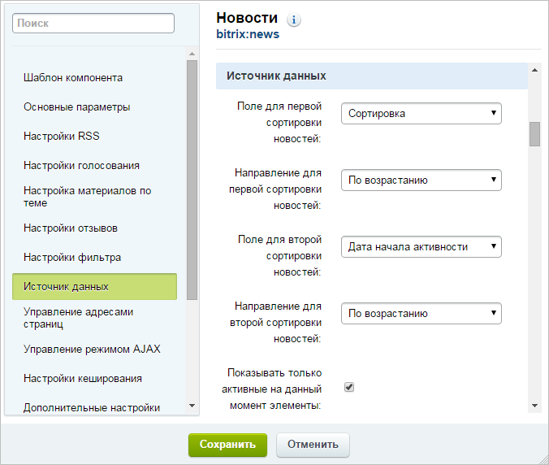

# Как закрепить новость наверху списка

**Навигация**
- [← Оглавление курса](index.md)
- [← Предыдущий: 3512 — Как добавить новость](lesson_3512.md)
- [Следующий: 13072 — Организация проверки без документооборота →](lesson_13072.md)

Официальная страница урока: https://dev.1c-bitrix.ru/learning/course/index.php?COURSE_ID=34&LESSON_ID=5523

### Как закрепить новость наверху списка

Порой происходит ситуация, когда требуется закрепить новость (объявление) на самом верху списка так, чтобы она не смещалась при добавлении свежих новостей. Станьте более находчивым, правильное использование сортировки новостей решит задачу:

1. Откройте форму редактирования новости, которую необходимо закрепить.
2. Установите для нее сортировку,
  			равной единице
                      
  		.
  **Примечание:** если поле **Сортировка** отсутствует, выполните
  			настройку формы.
  При работе с товарами, материалами статей, каталогами справочников вы зачастую обращаете внимание на следующий момент: в форме присутствуют поля, которые не используются на сайте. Лишние поля увеличивают размеры формы редактирования и затрудняют внесение данных.
  Облегчите свой труд, используйте инструмент настройки форм инфоблоков. Инструмент учитывает индивидуальные потребности,  позволяет настроить формы редактирования разделов и элементов инфоблока под себя:
  - удаляйте лишние поля или целые вкладки;
  - перемещайте поля между вкладками;
  - создавайте свои вкладки.
  [Подробнее](lesson_1883.md)...
3. Перейдите на страницу со списком новостей на сайте и откройте
  			параметры компонента.
  В режиме правки наведите мышь на область компонента, появится панель настроек. Выберите пункт **Редактировать параметры компонента**. Откроется форма настройки.
  [Подробнее](lesson_9165.md#pub)...
4. Перейдите к группе параметров **Источник данных**.
5. В параметре **Поле для первой сортировки новостей** укажите *Сортировка*, а в параметре **Направление для первой сортировки новостей** - *По возрастанию*:
  
6. Сохраните настройки.

Теперь требуемая новость закреплена наверху списка.

### Видео-пример

Содержание видеоролика внешним видом несколько отличается от текущей версии продукта.

### Заключение

Задача закрепления новости решается путем установки наименьшего значения сортировки и настройкой сортировкой в компоненте.
