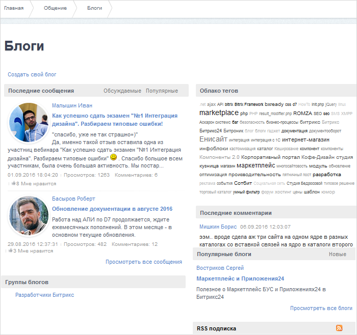

# Основные понятия

**Навигация**
- [← Оглавление курса](index.md)
- [← Предыдущий: 2740 — Рабочий стол, веб-стикеры](lesson_2740.md)
- [Следующий: 2934 — Группы блогов →](lesson_2934.md)

Официальная страница урока: https://dev.1c-bitrix.ru/learning/course/index.php?COURSE_ID=34&LESSON_ID=6

### Возможности модуля Блоги

Этот модуль - отличный инструмент для создания блогов на Вашем собственном сайте! Владелец блога может не только добавлять новые записи блога, но и получать комментарии посетителей относительно этих сообщений. Такой функционал позволяет автору (владельцу блога) предлагать посетителям блога различные темы для обсуждения, организовывать обмен мнениями по поводу мыслей, высказанных в сообщениях блога, и т.п.

> Блог
>
>
>
>
>  
>
>
>
>
> 		  - это сетевой журнал (дневник), позволяющий вести тематические записи в хронологическом порядке.

Модуль **Блоги** позволяет:

- создавать неограниченное число блогов;
- управлять правами пользователей на доступ к блогам, в том числе правами на такие операции, как:

  - создание блога;
  - администрирование/модерирование блога;
  - чтение блога;
  - добавление новых сообщений;
  - добавление комментариев к чужим сообщениям;
- использовать смайлики и теги при показе сообщений и комментариев;
- создавать черновик сообщения;
- использовать календарь сообщений;
- импортировать блоги в **RSS**;
- группировать сообщения блога по произвольным темам (tags);
- создавать древовидные комментарии;
- присоединять изображения и видео к сообщениям.

**Внимание**: в системе предусмотрено следующее правило создания блогов: каждый пользователь (т.е. посетитель с уникальным логином и паролем) может завести **только один блог**.

### Основные понятия

Трактовка некоторых терминов отличается от привычных пользователям социальных сетей трактовок:

**Владелец блога** - пользователь, ведущий блог (создатель блога).

**Псевдоним** - имя пользователя (возможно, вымышленное), отображаемое всем посетителям блога. Псевдоним определяется в форме редактирования профайла пользователя.

**Аватар** - любое изображение, анимированное или статичное, которое представляет пользователя в блоге.

**Группа пользователей** - для каждого блога может быть создан собственный набор групп пользователей, обладающих определенными правами на доступ к сообщениям и комментариям блога.

**Друг** - пользователь, добавленный в группу (или несколько групп), созданную владельцем блога, и обладающий определенными правами на доступ к блогам (например, правами на чтение сообщений и добавление комментариев). Список друзей пользователя отображается на странице с профайлом данного сотрудника.

**Лента друзей** - страница, содержащая список (выборку) последних записей друзей блога.

**Группа блогов** - совокупность блогов, обладающих некоторым общим признаком (например, блоги сотрудников одной компании) и доступных для показа на одном портале.

**Сообщение (тема)** - запись в блоге, принадлежащая владельцу или посетителю блога.

**Категории сообщения** - объединение сообщений блога по некоторому признаку (например, по признаку принадлежности к определенной тематике, по назначению).

**Комментарий** - ответ (реакция) посетителя на сообщение блога, высказывание посетителя по предложенной теме.

### Работа с модулем

Администратор производит только

			настройку модуля

                    Глобальные параметры блогов определяются на странице настроек модуля **Блоги** (Настройки &gt; Настройки продукта &gt; Настройки модулей &gt; Блоги).

[Читать подробнее...](https://dev.1c-bitrix.ru/learning/course/index.php?COURSE_ID=41&LESSON_ID=2860)

 и

			настройку прав

                    Права доступа к группам блогов, блогам и комментариям блогов настраиваются на закладке **Права на доступ** на странице административного раздела Настройки &gt; Настройки продукта &gt; Настройки модулей &gt; Блоги.

[Читать подробнее...](https://dev.1c-bitrix.ru/learning/course/index.php?COURSE_ID=41&LESSON_ID=5854)

		. Всю остальную работу, как правило, выполняет контент-менеджер.

### Документация по теме

- [Пользовательская документация по модулю "Блоги"](http://dev.1c-bitrix.ru/user_help/service/blogs/index.php)
