# Внешний вид редактора

**Навигация**
- [← Оглавление курса](index.md)
- [← Предыдущий: 9201 — Где используется редактор](lesson_9201.md)
- [Следующий: 9235 — Форматирование текста →](lesson_9235.md)

Официальная страница урока: https://dev.1c-bitrix.ru/learning/course/index.php?COURSE_ID=34&LESSON_ID=6301

### Из чего состоит редактор

В предыдущем уроке мы узнали, где в системе *"1С-Битрикс: Управление сайтом"* используется визуальный редактор. Во всех этих случаях общий внешний вид редактора остается неизменным. Давайте разберем внешний вид редактора и его панели подробнее.

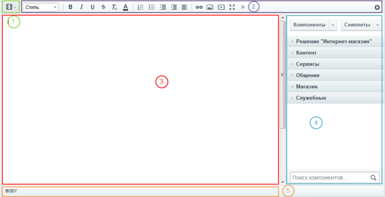

1 - панель переключения режимов редактирования. На этой панели мы переключаемся между визуальным режимом и режимом исходного кода.

2 - панель инструментов визуального редактора. Здесь расположены все те инструменты и команды, которые мы будем использовать для работы с текстом и графикой.

3 - рабочая область. Это непосредственно зона для редактирования.

4 - панель компонентов и сниппетов.

5 - панель навигации.

Теперь разберемся для чего нужна каждая панель.

### Видеоурок

### Панель переключения режимов редактирования

Визуальный редактор может работать в двух режимах. Визуальный режим - более простой и интуитивно понятный вариант. Мы сразу видим, как будут выглядеть элементы на странице и используем панель инструментов для форматирования текста. Второй вариант - режим исходного кода. Он предназначен для опытных пользователей, умеющих работать с кодом, и позволяет произвести дополнительную настройку (например, задать значения параметров). В этом режиме панель инструментов становится неактивной.

Также существует совмещенный режим - рабочая область делится на

			две части

                    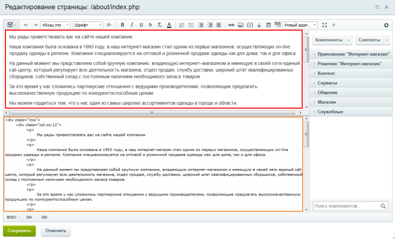

		 для визуального режима и режима кода.

Соответственно на панели мы видим кнопки для переключения между этими режимами:

-  - режим исходного кода.
-  - режим визуального редактирования.
-  - совмещенный режим по горизонтали.
-  - совмещенный режим по вертикали.

### Панель инструментов

Кнопки инструментов разделены по группам по своему назначению. Например, группа для форматирования текста включает в себя кнопки жирного текста, курсива, подчеркивания и т.д. Обратите внимание - набор кнопок на панели может немного отличаться в зависимости
    от режима работы и настроек.

**Описание кнопок:**

| \| Кнопка \| Описание \| \| --- \| --- \| \|  \| Отменить выполненное действие. \| \|  \| Вернуть отменённое действие. \| \| 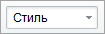 \| Стиль и форматирование текста. \| \| 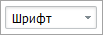 \| Шрифт. \| \|  \| Размер шрифта. \| \|  \| Жирный. \| \|  \| Курсив. \| \|  \| Подчёркнутый. \| \|  \| Зачеркнутый. \| \|  \| Удалить форматирование. \| \| 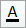 \| Цвет текста. \| \|  \| Нумерованный список. \| \|  \| Маркированный список. \| \|  \| Увеличить отступ. \| \|  \| Уменьшить отступ. \| \|  \| Выравнивание абзаца по выбранному краю. \| \|  \| Вставить ссылку. \| \|  \| Удалить ссылку. \| \|  \| Добавить изображение. \| \|  \| Вставить видеоролик. \| \|  \| Добавить якорь. \| \|  \| Создать таблицу. \| \| 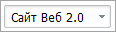 \| Шаблон сайта. \| \|  \| Переключение в полноэкранный режим. \| \|  \| Вставить специальный символ. \| \|  \| Вставить разрыв страницы для печати. \| \|  \| Вставить разделитель страниц. \| \|  \| Проверка орфографии. \| \|  \| Отправить уникальный текст в Яндекс. \| \|  \| Нижний индекс. \| \|  \| Верхний индекс. \| \|  \| Настройки. \| |
| --- |

### Панель компонентов и сниппетов

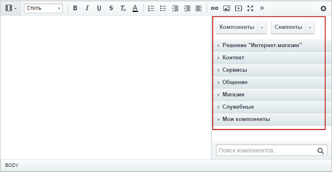

**Компоненты**

                    Компонент – это программный код, оформленный в визуальную оболочку, выполняющий определённую функцию какого-либо модуля по выводу данных в Публичной части. Мы можем вставлять этот блок кода на страницы сайта без непосредственного написания кода. [Подробнее...](https://dev.1c-bitrix.ru/learning/course/index.php?COURSE_ID=34&CHAPTER_ID=04457)

		  - это своеобразный блок из конструктора LEGO. И из этих блоков мы "выстраиваем" публичную часть сайта.

Обратите внимание, что при работе с информационными блоками панель **Компоненты** не отображается. Также панель может быть скрыта при редактировании страницы. Раскройте её нажатием на

			стрелочку

		 в правой части формы.

**Сниппет** - это заранее подготовленный фрагмент текста или кода, этакие заготовки. Предположим, что вам каждый день приходится вставлять на страницы сайта одну и ту же таблицу или форму. Вы можете сохранить эту таблицу в сниппетах и затем простым перетаскиванием размещать ее в нужном месте.

## Пример работы со сниппетами

Например, вам часто приходится размещать на страницах сайта фрагмент, который включает в себя заголовок, текст и небольшую таблицу. Добавим этот фрагмент в сниппеты, это сэкономит значительное количество времени.

Сниппеты редактируются, добавляются и удаляются прямо в визуальном редакторе. Мы можем создать целую структуру сниппетов для того, чтобы было удобнее ориентироваться в заготовках. Добавим новый сниппет:

1. В панели задач визуального редактора выберем Сниппеты -
  			Добавить сниппет
                      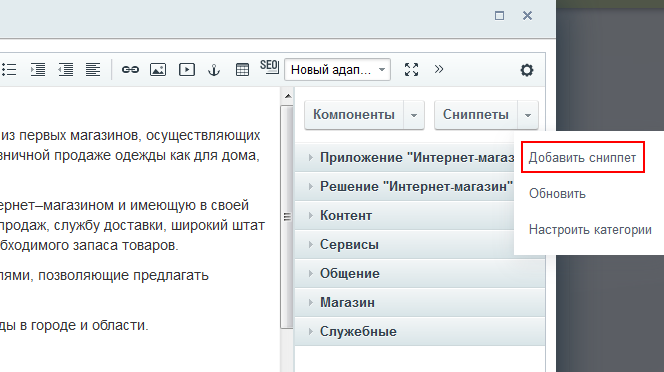
  		;
2. На закладке
  			Основные параметры
                      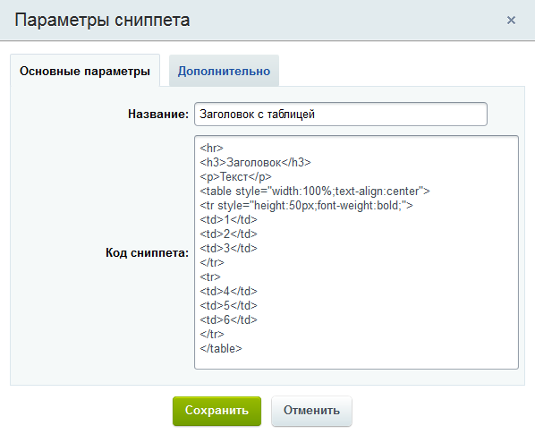
  		 укажем название и добавим код нужного нам фрагмента;
3. На закладке
  			Дополнительные параметры
                      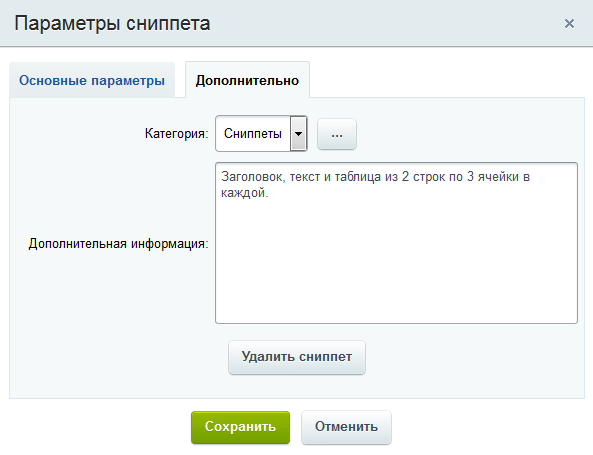
  		 укажите текст для всплывающей подсказки, он будет появляться при наведении мыши на сниппет в списке. Также укажите раздел, в котором расположить нашу заготовку.

После сохранения сниппет

			появится

                    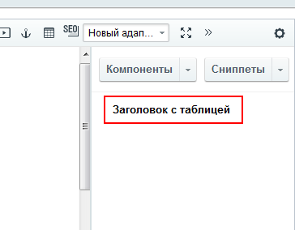

		 в списке.

Для использования сниппета просто перетащим его мышью на рабочее поле.

Готово

                    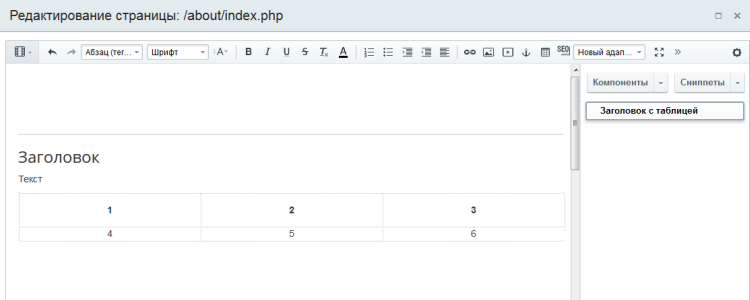

		, теперь нам останется только заполнить необходимый текст.

### Панель навигации по элементам и сущностям

Панель навигации помогает нам работать с выбранным в рабочей зоне элементом (то есть с тем элементом, на котором находится фокус мыши). Проще говоря, если мы выбрали в рабочей зоне ссылку - с помощью панели навигации можем

			настроить

                    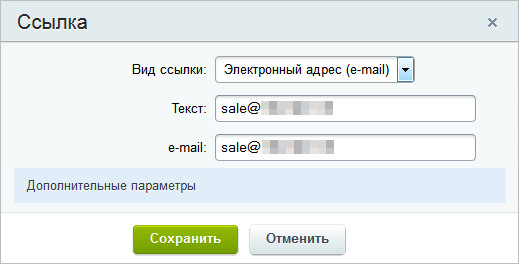

		 ее параметры. Выбрали компонент - можем настроить его параметры и т.д.

### Заключение

Визуальный редактор состоит из следующих панелей: инструменты, режимы отображения, компоненты/сниппеты и навигация. Состав панелей может быть разным в зависимости от ситуации. Дальше мы подробнее рассмотрим работу с текстом и графикой в редакторе.
