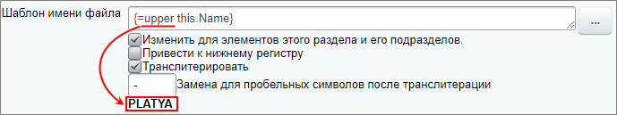
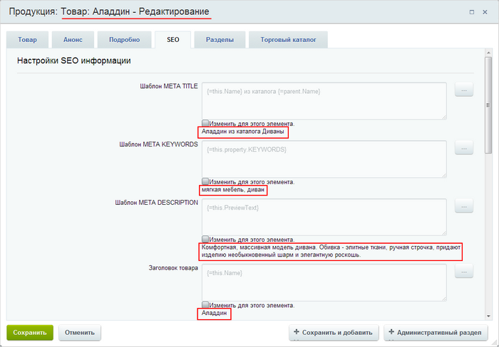
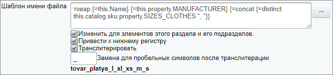
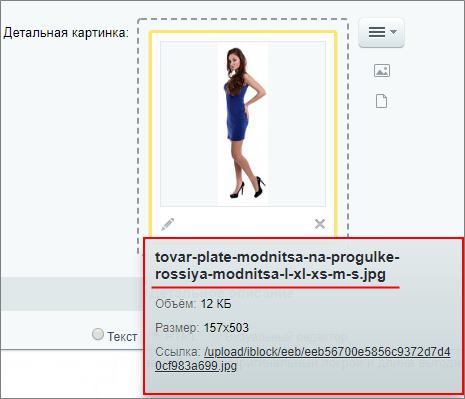

# Настройка SEO информации

**Навигация**
- [← Оглавление курса](index.md)
- [← Предыдущий: 7243 — Редактор изображений в элементах инфоблока](lesson_7243.md)
- [Следующий: 1883 — Настройка форм элементов и разделов под себя →](lesson_1883.md)

Официальная страница урока: https://dev.1c-bitrix.ru/learning/course/index.php?COURSE_ID=34&LESSON_ID=6305

В уроке научимся работать с SEO данными для элементов и разделов

			инфоблока

                    Мы рассмотрим пример настройки инфоблока каталога товаров. SEO торговых предложений настраивается по аналогичному алгоритму. Настройте сам инфоблок, а затем, по необходимости, SEO конкретных торговых предложений индивидуально.

		 . Допустим, что у нас на сайте опубликован инфоблок **Продукция**, в котором уже заданы некоторые настройки SEO.

### Видеоурок

### Как выполняется настройка?

Как вы знаете, шаблоны

			SEO данных

                    Данные подставляются в именительном падеже. Склонение по падежам не предусмотрено. Воспользуйтесь **Маркетплейсом** для поиска дополнительных решений.
[Подробнее](https://marketplace.1c-bitrix.ru/)...

		  могут быть настроены сразу для всего

			инфоблока.

Настройки шаблонов метаданных можно выполнять как для всего инфоблока, так и для конкретных разделов или для некоторых элементов конкретного раздела. При этом вы всегда можете сделать настройку для всего инфоблока, а потом для конкретного раздела (или элементов раздела) переопределить на свою персональную.

Шаблоны метаданных для всего инфоблока (всех его разделов и всех элементов) настраиваются в форме редактирования инфоблока (Контент &gt; Инфоблоки &gt; Типы инфоблоков &gt; _ваш_инфоблок_) на вкладке **SEO**. В первых двух секциях вкладки выполняются настройки шаблонов мета-тегов *TITLE*, *KEYWORDS*, *DESCRIPTION* и заголовков страницы раздела/элемента (html-тег *H1*). Для выбора необходимого шаблона служит кнопка **[...]**, расположенная рядом с каждым полем.

[Подробнее](lesson_5840.md)...

		 Но эти настройки можно переопределить (задать собственные) непосредственно для конкретного раздела или даже элемента.

Рассмотрим работу с шаблонами SEO данных на примере раздела **Мягкая мебель** (для элемента настройки выполняются аналогично).

1. Включите режим правки и откройте раздел на
  			редактирование
                      
  		.
  **Важно!**Изменение раздела будет возможным, если вы обладаете правом доступа к инфоблоку **Изменение** или **Полный доступ**. Если вы не можете изменить раздел, обратитесь к администратору.
2. Перейдите на вкладку **SEO**. В нашем случае мы видим, что настройки SEO данных уже выполнены:
  

  - По шаблонам **META TITLE** (1) и **Заголовок раздела** (4) строятся
    			заголовки
                        
    		 окна браузера и страницы раздела соответственно.
  - С помощью шаблонов **META KEYWORDS** (2) и **META DESCRIPTION** (3) задаются ключевые слова и описание раздела для поисковой выдачи. Так, если пользователь в поисковике введет фразу из ключевых слов, заданных для раздела, то найденный раздел будет отображен с соответствующим ему
    			описанием
                        
    		.
3. Если вам необходимо переопределить/создать некоторый шаблон, то отметьте расположенную под полем опцию **Изменить для этого раздела и всех его подразделов** и затем допишите необходимый текст вручную или выберите подходящий шаблон с помощью кнопки
  			
                      
  		.
  В системе создан набор специальных конструкций, прописанных в фигурных скобках и работающих по принципу отложенных функций. Указывается такая конструкция достаточно просто, например, чтобы вывести название текущего элемента, нужно задать конструкцию вида: `{=this.Name}`
  ## Cписок зарезервированных слов
  Список слов для конструкций:
  - `this` - текущий элемент. Например, `{=this.Code}` покажет символьный код элемента.
  - `parent` - родительская секция. Например, `{=parent.PreviewText}` покажет текст анонса родительского элемента.
  - `sections` - родительские секции, начиная с верхнего уровня. Например, если у вас большая вложенность категорий, то {=sections.Name} покажет все имена родительских категорий в порядке вложенности.
  - `iblock` - инфоблок текущего элемента или раздела. Например, `{=iblock.PreviewText}` - описание инфоблока.
  - `property` - свойство. Например, `{=this.property.ARTNUMBER}` выведет артикул текущего элемента. Естественно, на каждом сайте есть свой набор свойств у элементов.
  Для редакций, имеющих модуль **Торговый каталог**, можно также получить:
  - `{=this.catalog.sku.property.ARTNUMBER}` -  свойство **ARTNUMBER** торгового предложения. Пример: `{=distinct this.catalog.sku.property.ARTNUMBER}` - выведет значения данного свойства у всех торговых предложений, но без повторяющихся значений .
  - `{=this.catalog.sku.price.BASE;}` - цены торговых предложений. Пример: `{=max this.catalog.sku.price.BASE}` - выведет максимальную цену торговых предложений.
  - `{=this.catalog.price.BASE;}` - цена простого товара.
  - `{=this.catalog.weight}` - вес товара.
  - `{=this.catalog.measure}` - единица измерения.
  - `{=catalog.store}` - покажет склады. Например, `{=concat catalog.store ", "}` - склады, перечисленные через запятую.
  Набор готовых конструкций достаточно большой и решает большую часть задач описания мета-данных. Дополнением к данным конструкциям служат предопределенные обработчики.
  ## При создании шаблона можно использовать фильтры-обработчики
  Создавая шаблоны, при необходимости, используйте фильтры-обработчики вручную:
  - `{=lower arg1 ... argN}` - приведение к нижнему регистру;
  - `{=upper arg1 ... argN}` - приведение к верхнему регистру;
  - `{=ucfirst arg1 ... argN}` - приведение
    			первого символа
                        Если в фигурных скобках перечислено несколько аргументов, то в верхний регистр будет приведен символ только первого аргумента.
    		 в верхний регистр, если этот символ является буквой. Доступен с версии 21.600.0 модуля Информационные блоки;
  - `{=ucwords arg1 ... argN}` - приведение в верхний регистр первого символа каждого слова. Доступен с версии 21.600.0 модуля Информационные блоки;
  - `{=concat arg1 ... argN ", "}` - сцепление строк через разделитель;
  - `{=limit arg1 ... argN "<delimiter>" NN}` - ограничение NN элементов по разделителю ;
  - `{=translit arg1 ... argN}` - транслитерация выбранных аргументов;
  - `{=min arg1 ... argN}` - выборка минимального числового значения;
  - `{=max arg1 ... argN}` - выборка максимального числового значения;
  - `{=distinct arg1 ... argN}` - уникальные (без дублей) значения.
  Пример: у нас указано `{=lower this.Name}`. А мы хотим привести к верхнему регистру. Заменим вручную *lower* на *upper*. Результат применения сразу отобразится под полем ввода:
  
  Например, настроим шаблоны мета-тегов для всех элементов раздела **Мягкая мебель**:
  
  - Для заголовка окна браузера (тег **META TITLE**) зададим шаблон, который подставляет название элемента и название родителя: **{=this.Name} из каталога {=parent.Name}**.
  - Для списка ключевых слов (**META KEYWORDS**) выберем шаблон, который будет подставлять значение из имеющегося у нас свойства элементов **Ключевые слова**: **{=this.property.KEYWORDS}**.
  - Описание (тег **DESCRIPTION**) будет браться из текста анонса элемента: **{=this.PreviewText}**.
  - Для заголовка страницы (поле **Заголовок товара**) задаем шаблон, который будет подставлять только название элемента: **{=this.Name}**.
4. Сохраните настройки и откройте на редактирование любой элемент этого раздела, чтобы убедиться, что настройки применились
  			правильно
                      
  		.
5. Аналогичным образом настройте теги для картинок. Настройка шаблонов мета-тегов осуществляется как для анонсовых, так и для детальных изображений разделов и элементов инфоблока. Для
  			картинок
                      
  		 можно с помощью шаблонов делать читаемые названия файлов, а также устанавливать атрибуты:
  **Обратите внимание, что** все настройки файлов работают только для тех файлов, которые были загружены в систему после выполнения настроек. Для ранее загруженных файлов настройки не применяются.

  - **ALT** - он необходим, если в настройках браузера у пользователя отключена функция показа изображений; Заполнение тега также важно для ранжирования сайта,
  - **TITLE** - шаблон мета-тега для заголовка.

### Пример настройки шаблона имени файла для картинок

Для наглядности примера установки шаблона имени файла выполним такие настройки SEO:

- Откроем вкладку **SEO** для раздела **Платья**;
- В настройках для детальных картинок элементов в поле **Шаблон имени файла** укажем через пробелы:

  - вручную слово
    			товар
                        Нужные слова в названии шаблона, которые не меняются в зависимости от выбранного элемента, можно писать вручную. Те, что меняются, укажем далее с помощью шаблонов.
    		;
  - шаблоны с помощью кнопки **[...]**:

    - шаблон *Поля элемента &gt; Название текущего элемента* (`{=this.Name}`);
    - шаблон *Свойства &gt; Производитель* (`{=this.property.MANUFACTURER}`);
    - шаблон *Свойства предложений &gt; Размеры одежды* (`{=concat {=distinct this.catalog.sku.property.SIZES_CLOTHES ", "}}`).
- Установим **Привести к нижнему регистру** и **Транслитерировать**;
- Замена для пробельных символом - нижнее подчеркивание `_`.

Результат:

Т.е. наименование картинки должно состоять из слова товар, названия товара, имени производителя и размерного ряда.

Перейдем к элементу раздела **Платья** и загрузим детальное изображение с названием `Платье1.jpg`.

Сохраним изменения и вернемся к загруженной картинке. Теперь её название изменилось в соответствии

			с шаблоном

                    В названии **tovar-plate-modnitsa-na-progulke-rossiya-modnitsa-l-xl-xs-m-s.jpg**:

1. **tovar** - слово товар из шаблона;

2. **plate-modnitsa-na-progulke** - название товара;

3. **rossiya-modnitsa** - имя производителя;

4. **l-xl-xs-m-s** - размерный ряд товара.

		:

Шаблон работает только для **Картинки для анонса** и **Детальной картинки** элемента.

**Примечание:** Настройка касается только SEO. Наименование самого файла в папке `/upload` регулируется настройкой **Сохранять исходные имена загружаемых файлов** Главного модуля (Настройки &gt; Настройки продукта &gt; Модули &gt; Главный модуль ):

- если опция выключена - название файла
  			сгенерируется автоматически
                      Название файла будет иметь такой вид: eeb56700e5856c9372d7d40cf983a699.jpg
  		;
- если опция включена - файл сохранится с исходным именем.

Настройка доступна только Администратору сайта.

### Заключение

Настройка SEO данных заключается в создании шаблонов заголовков, ключевых слов, описаний для разделов и элементов, а также в создании шаблонов тегов для изображений. Все эти данные помогают лучше ранжировать информацию с вашего сайта поисковыми системами.
