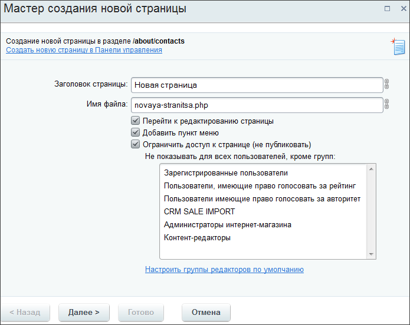
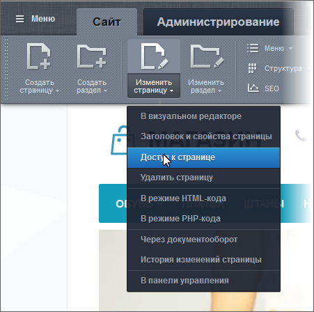
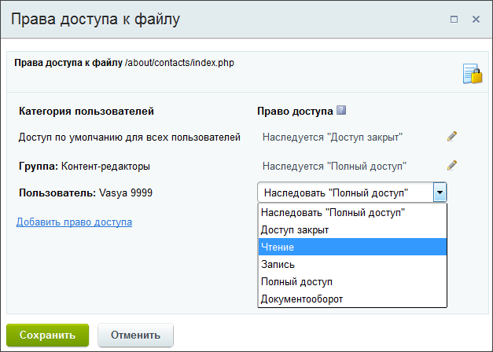

# Назначение прав доступа к статическим страницам

**Навигация**
- [← Оглавление курса](index.md)
- [← Предыдущий: 4492 — Управление доступом к информации](lesson_4492.md)
- [Следующий: 6677 — Наследование прав доступа статических страниц →](lesson_6677.md)

Официальная страница урока: https://dev.1c-bitrix.ru/learning/course/index.php?COURSE_ID=34&LESSON_ID=6676

Разрешает или запрещает кому-либо доступ к статической странице, как правило, Администратор. Если администратор дал контент-менеджеру права на страницу не ниже **Полный доступ**, то вы тоже управляете допуском к странице. Действия по заданию прав очень простые и понятные.

### Видеоурок

### Назначение прав доступа

На первом шаге

			Мастера создания

                    

[Подробнее](lesson_1911.md)...

		 страницы или раздела для назначения прав доступа используется опция **Ограничить доступ к странице/разделу (не публиковать)**.

Просто

			укажите группы

                    Несколько групп выбираются с помощью клавиши CTRL.

		, для которых страница должна быть доступна.

### Редактирование прав доступа

Возможности задания прав при редактировании заметно богаче: ограничиваются не только группы пользователей, но и отдельные пользователи и группы социальной сети (если есть на сайте).

Откройте на редактирование

                    
[Подробнее](lesson_1962.md)...

		 страницу или раздел и укажите нужные правила доступа для различных групп.

Для добавления нового правила используйте ссылку Добавить право доступа. При этом откроется

			окно выбора пользователя или группы

                    

		. Выберите того, для кого задаются права доступа, и задайте для него нужный уровень прав.

### Индикация ограниченных прав и отмена ограничений

Если для страницы или раздела установлены какие-то ограничения на доступ, то кнопки **Изменить страницу/Изменить раздел** на административной панели будут отображаться с символом

			замок

                     

		.

Для снятия ограничений

			откройте на редактирование

                    
[Подробнее](lesson_1962.md)...

		 свойства страницы или раздела и используйте ссылку Отменить ограничения доступа для этого раздела/страницы.

### Важно запомнить!

Администратор может определить «Группы редакторов по умолчанию», для которых устанавливаются полные права на файлы и папки. Это облегчит работу контент-менеджера по заданию прав доступа при создании большого числа страниц. В этом случае вид параметров настройки доступа будет несколько иной:

При необходимости с помощью поля **Настроить дополнительно...** задайте новые группы, которым будет видна страница.

### Заключение

Вы научились управлять правами доступа на статические страницы, которые задаются как при создании, так и при редактировании. Однако администратор сайта может ограничить такую возможность для контент-менеджера.

Далее мы познакомимся с наследованием прав доступа.
