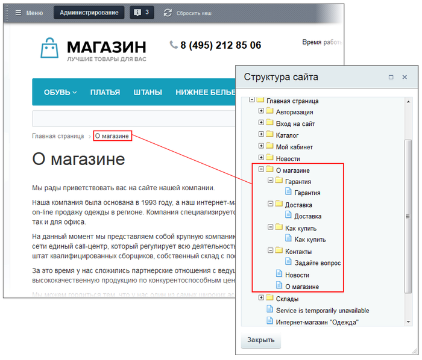
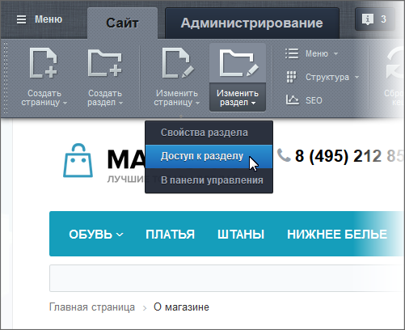
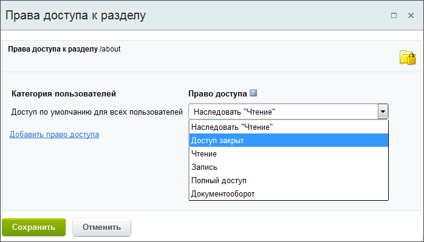
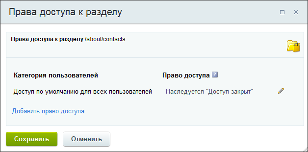

# Наследование прав доступа статических страниц

**Навигация**
- [← Оглавление курса](index.md)
- [← Предыдущий: 6676 — Назначение прав доступа к статическим страницам](lesson_6676.md)
- [Следующий: 6909 — Определение прав доступа динамических страниц →](lesson_6909.md)

Официальная страница урока: https://dev.1c-bitrix.ru/learning/course/index.php?COURSE_ID=34&LESSON_ID=6677

### Видеоурок

Наследование права доступа - это когда вы установили на раздел определённые права доступа и на все нижележащие страницы и разделы автоматически устанавливаются те же права. Наследование сделано в "1С-Битрикс: Управление сайтом" для облегчения труда Контент-менеджера. Ему не придётся бегать по всем подразделам и страницам для задания одних и тех же прав. При этом разработчики продукта сохранили и гибкость: для любого "дочернего" раздела задаются, при необходимости, свои, индивидуальные права доступа.

### Пример наследования

Поясним принцип наследования на конкретном примере. В разделе **О магазине** имеется одноименная страница и вложенные подразделы и страницы (структура показана с помощью

			кнопки Структура

                    Кнопка Структура - удобный и практичный инструмент для наглядного представления всей структуры сайта без перехода в административный раздел. Кнопка позволяет выполнять управление структурой.

[Подробнее](lesson_1852.md)...

		 на Административной панели):

Допустим, перед нами стоит задача запретить доступ ко всем страницам раздела **О магазине**. Если отдельно для страницы данного раздела и страниц его подразделов не изменялись права доступа, то все они будут наследовать право вышележащего раздела. Поэтому нам достаточно изменить право доступа для раздела **О магазине**.

Находясь на странице данного раздела, нажмите на кнопку **Изменить раздел** и выберите пункт

			Доступ к разделу

                     

		.

В открывшейся форме показано, что раздел наследует от вышележащего раздела (**Главная страница**) для всех пользователей право доступа **Чтение**. Изменим его на **Доступ закрыт**:

После сохранения внесенных изменений доступ к каждой странице раздела будет закрыт для всех пользователей, в чем вы можете убедиться, проверив права доступа у любой страницы раздела:

### Заключение

Наследование доступа позволяет быстро менять права доступа на раздел и вложенные в него подразделы и страницы.
