# Пошаговый пример создания статьи в Wiki

**Навигация**
- [← Оглавление курса](index.md)
- [← Предыдущий: 24536 — Теги](lesson_24536.md)
- [Следующий: 26232 — Проверьте себя →](lesson_26232.md)

Официальная страница урока: https://dev.1c-bitrix.ru/learning/course/index.php?COURSE_ID=34&LESSON_ID=6774

|  | ### Раздел "рецепты |
| --- | --- |

Создадим и наполним раздел "Рецепты" в Wiki в группе "Кулинария".

- Переходим в группу, кликаем на пункте Wiki в меню.
  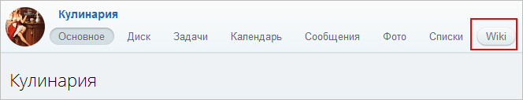
- На главной странице нажимаем кнопку 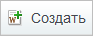
- Вводим заголовок страницы **Рецепты**, в поле текста 5 строк: **Салаты**, **Супы**, **Вторые блюда**, **Выпечка**, **Напитки** и
  			оформляем их в виде заголовка
                      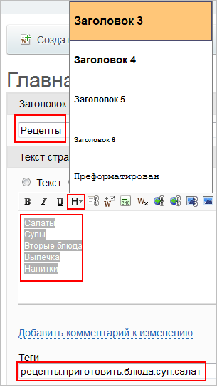
  		. Добавляем теги: **рецепты**, **приготовить**, **блюда**, **суп**, **салат**.
- Добавляем и форматируем тексты определений в каждый раздел.
  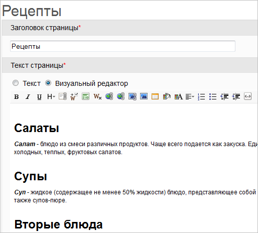
- Задаем [внутренние гиперссылки](lesson_2005.md#inside_hyper) для тех понятий, для которых будут созданы отдельные соответствующие страницы.
  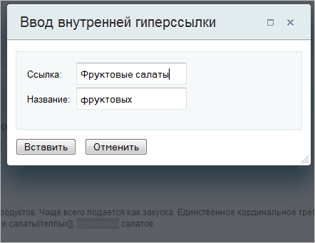
- Из получившихся [красных ссылок](lesson_2005.md#red_ssil)
  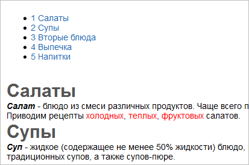
  	создаем
  			соответствующие страницы
                       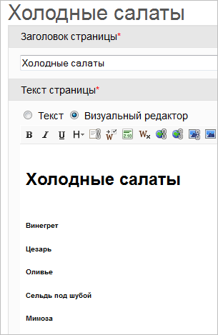
  		.
- Указываем [категорию](lesson_2005.md#category)
  			для страницы
                       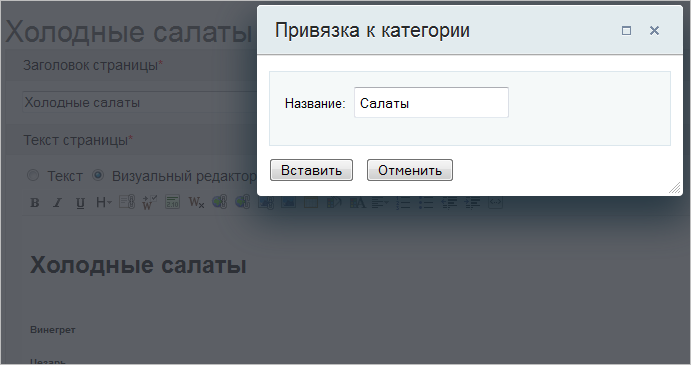
  		.
- Заполняем страницу нужным текстом, картинками, с помощью [визуального редактора](lesson_2005.md#vis_red) форматируем страницу в соответствии с предпочтениями или корпоративными стандартами.
- После нажатия на кнопку 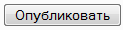  получаем готовую страницу, где можно проверить наполнение информацией, форматирование, переходы по ссылкам и т.д.
  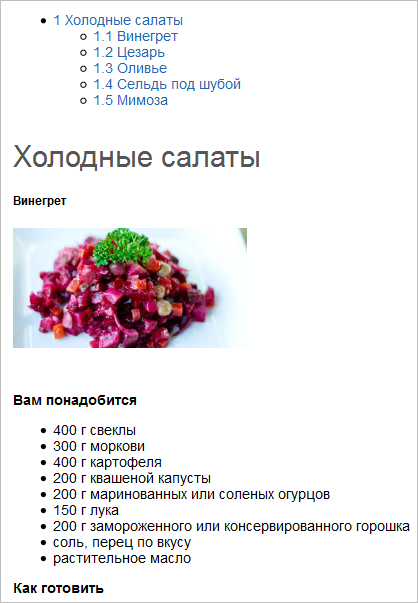
- Нажав на ссылку [Категории](lesson_2054.md#kategor) в конце страницы, можно
  			проверить состав и наполненность
                      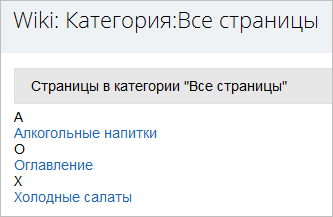
  		 категорий, корректность переходов по страницам.
- В случае необходимости, страницы можно [отредактировать](lesson_2052.md#redakt) или восстановить какую-либо из предыдущих [версий](lesson_2052.md#versii).
