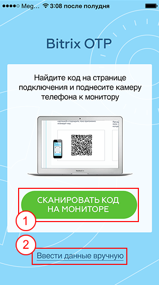

# Мобильное приложение Bitrix24 OTP

**Навигация**
- [← Оглавление курса](index.md)
- [← Предыдущий: 6920 — Резервные коды](lesson_6920.md)
- [Следующий: 1974 — Авторизация с помощью Bitrix24 OTP →](lesson_1974.md)

Официальная страница урока: https://dev.1c-bitrix.ru/learning/course/index.php?COURSE_ID=34&LESSON_ID=6819

BitrixOTP - фирменное приложение для авторизации

### Подключение мобильного устройства

Мобильное приложение *Bitrix OTP* от компании «1С-Битрикс» специально разработано для двухэтапной авторизации. Оно генерирует секретные коды для входа на порталы и сайты под управлением *«Битрикс24»* и *«1С-Битрикс»* и позволяет обойтись без использования брелков или посторонних программ. Мобильное приложение *Bitrix OTP* работает быстро, а данные для подключения в приложение можно ввести как вручную, так и автоматически с использованием QR-кода.

**Внимание!** Перед подключением двухэтапной (двухфакторной) авторизации проверьте правильность установленного времени и часового пояса в вашем мобильном устройстве.

#### Подключение мобильного устройства

- Скачайте приложение
  			Bitrix24 OTP
                      Иконка приложения на вашем телефоне:
  
  		:
   
- После запуска приложения выберите удобный вам способ получения кода:
  

  - 1 **Сканировать QR-код**. Для сканирования кода, поднесите камеру мобильного телефона к монитору с картинкой QR-кода на странице подключения OTP и подождите, пока приложение сканирует код.
  - 2 **Ввести данные вручную**. Если вам не удалось сканировать код, выберите ручной ввод данных.
    При
    			ручном вводе
                        
    		 необходимо указать:
    **Внимание!** Тип используемого ключа уточните у администратора.

    - **Адрес сайта** вида www.site.ru или портала **Битрикс24** вида example.bitrix24.ru (без http://);
    - **E-mail**, с которым был зарегистрирован пользователь на сайте или портале;
    - **Секретный ключ**, который указан на странице подключения двухэтапной авторизации на сайте (можно не обращать внимания на пробелы);
    - выбрать тип ключа: **по времени** или **по счетчику**
- Приложение
  			выведет код
                      
  		. Скопируйте этот код в буфер обмена, если вход осуществляется c помощью мобильного устройства.
  Или введите полученный код на странице подключения в браузере:
  
  **Внимание!** Если используется тип ключа **по счетчику**, то нужно будет ввести второй код подтверждения, нажав соответствующую кнопку.
- Двухэтапная авторизация на сайте или портале
  			успешно подключена
                      
  		.

|  | #### Заключение |
| --- | --- |

**Bitrix24 OTP** - фирменное бесплатное приложение для одноразовой авторизации на сайтах и порталах. Оно удобно в работе, постоянно обновляется.

### Работа со списком сайтов/порталов

Одно приложение можно использовать для авторизации на многих сайтах и порталах. Надо просто повторить описанные выше действия для каждого из них. После подключения все порталы и сайты отобразятся в списке аккаунтов:

Для редактирования или удаления аккаунта из списка приложения нужно перейти в список подключенных аккаунтов (нажать на ссылку **Список** в левом верхнем углу) и далее

			смахнуть влево нужный пункт

                     

		.
