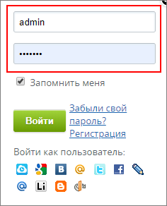
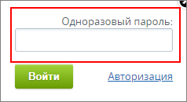

# Аппаратное устройство одноразовых паролей (USB-токен)

**Навигация**
- [← Оглавление курса](index.md)
- [← Предыдущий: 1974 — Авторизация с помощью Bitrix24 OTP](lesson_1974.md)
- [Следующий: 5421 — Решение проблем, связанных с OTP →](lesson_5421.md)

Официальная страница урока: https://dev.1c-bitrix.ru/learning/course/index.php?COURSE_ID=34&LESSON_ID=6860

### Токен - альтернатива телефону

Вместо телефонов в двухэтапной авторизации иногда используются аппаратные устройства, например компании *"Аладдин Р.Д."*: [JaCarta WebPass](https://www.aladdin-rd.ru/catalog/jacarta-webpass).

Такое устройство предварительно регистрируется на сайте. Выдается в использование администратором сайта.

Токен используется посредством USB. Полное описание и информация об использовании устройства указана на [сайте компании.](https://www.aladdin-rd.ru/catalog/jacarta-webpass)

**Примечание**: Ранее использовались устройства компании *"Аладдин Р.Д."* линейки *eToken*. Сняты с продаж с начала 2017 года.

### Авторизация на сайте

Процесс авторизации на сайте зависит от того, какое аппаратное устройство вы решили использовать. Для **JaCarta WebPass** это происходит так:

1. Внесите данные для авторизации на сайте (**логин** и **пароль**) и нажмите кнопку **Войти**:
  
2. После успешного ввода данных появится поле для ввода одноразового пароля:
  
3. Поставьте курсор в поле и нажмите
  			кнопку
                      О настройках нажатия кнопки на устройстве подробнее описано в документации к устройству JaCarta WebPass.
  [Подробнее](https://www.aladdin-rd.ru/catalog/jacarta-webpass)...
  		 на аппаратном устройстве OTP. Одноразовый пароль подставится автоматически.
4. Двухэтапная авторизация завершена.
