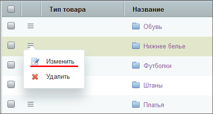
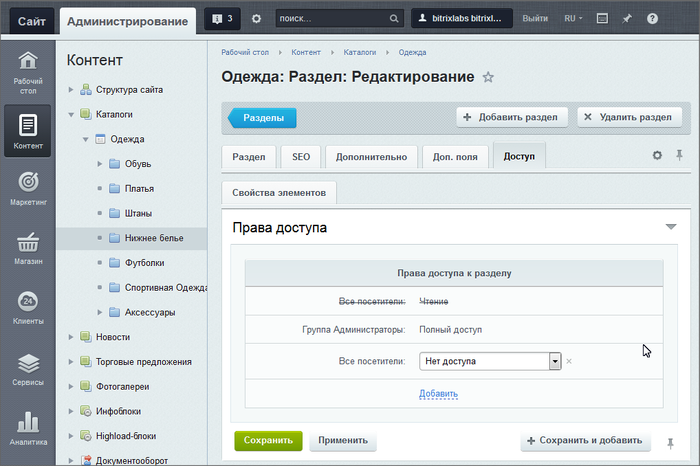

# Определение прав доступа динамических страниц

**Навигация**
- [← Оглавление курса](index.md)
- [← Предыдущий: 6677 — Наследование прав доступа статических страниц](lesson_6677.md)
- [Следующий: 8595 — Примеры работы прав доступа →](lesson_8595.md)

Официальная страница урока: https://dev.1c-bitrix.ru/learning/course/index.php?COURSE_ID=34&LESSON_ID=6909

### Видеоурок

Информационные блоки

                    Информационный блок - специальный инструмент "1С-Битрикс: Управление сайтом" с помощью которого заносится информация в Базу данных [Подробнее...](https://dev.1c-bitrix.ru/learning/course/index.php?COURSE_ID=34&CHAPTER_ID=04477&LESSON_PATH=3905.4477)

		 позволяют задавать удобную иерархическую структуру, в которой права доступа наследуются по иерархии, то есть от Инфоблока к Разделу и, следом, к Элементу. Если администратор определил для контент-менеджера права доступа на информационный блок **Полный доступ**, то контент-менеджер тоже управляет доступом.

### Пример наследования прав

Рассмотрим наследование прав на конкретном примере. В целом механизм задания прав аналогичен статичным страницам, но есть важные особенности:

1. Необходимо включение
  			расширенного режима управления доступом
                      **Расширенный режим управления доступом** - возможность задавать права доступа не только для группы пользователей, но и для отдельного пользователя.
  Уровень доступа групп пользователей к информационным блокам настраивается отдельно для каждого инфоблока. Более того, в **Расширенном режиме** доступна установка прав для каждого раздела или элемента по отдельности.
  Подробнее в курсе [Администратор. Базовый](/learning/course/index.php?COURSE_ID=35&LESSON_ID=2017).
  		 для информационного блока.
2. Задание прав производится в
  			административном разделе
                      Административный раздел - раздел системы, недоступный для просмотра обычным посетителям сайта. В нём производятся настройки сайта и системы для работы. У контент-менеджера есть к нему доступ, но работать там не рекомендуется. [Подробнее...](https://dev.1c-bitrix.ru/learning/course/index.php?COURSE_ID=34&CHAPTER_ID=04459&LESSON_PATH=3905.4455.4459)
  		.

Допустим, перед нами стоит задача запретить доступ к разделу **Нижнее белье**. Если отдельно для разделов каталога **Одежда** не изменялись права доступа, то все они будут наследовать право **Типа инфоблока**: **Каталоги**. Поэтому нам достаточно изменить право доступа для раздела **Нижнее белье**.

В административной части в разделе Контент &gt; Каталоги &gt; Одежда  выбираем в таблице типов товаров строку **Нижнее белье** и в меню действий выбираем

			Изменить

                    

		.

Во вкладке **Доступ** показано, что права доступа к разделу для группы **Все посетители** уже установлены на уровне **Чтение**.

Перейдите по ссылке Добавить, выберите **Все посетители** и установите **Нет доступа**:

После сохранения внесенных изменений пункт **Нижнее белье** не будет демонстрироваться в меню для всех посетителей, в чем вы можете убедиться, выйдя из аккаунта администратора:

### Заключение

Задание прав на элементы и разделы информационного блока выполняется аналогично заданию прав на статические страницы. Только делается это из Административного раздела и если включено расширенное управление правами для информационного блока.
