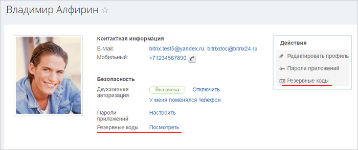

# Резервные коды

**Навигация**
- [← Оглавление курса](index.md)
- [← Предыдущий: 6921 — Подключение пользователем двухэтапной авторизации](lesson_6921.md)
- [Следующий: 6819 — Мобильное приложение Bitrix24 OTP →](lesson_6819.md)

Официальная страница урока: https://dev.1c-bitrix.ru/learning/course/index.php?COURSE_ID=34&LESSON_ID=6920

|  | ### Резервные коды - ваше спасение в нештатной ситуации |
| --- | --- |

Если вы, к несчастью, потеряли телефон или брелок, то вас спасут резервные коды. Их можно получить на странице вашего профиля Моя страница &gt;

			Резервные коды

                    

		, если на сайте размещён компонент

			Социальная сеть

                    Секции настроек компонента

						[Описание компонента «Социальная сеть (комплексный компонент)» в пользовательской документации.](http://dev.1c-bitrix.ru/user_help/detail.php?ID=125720)

		. С этой страницы эти коды можно **Распечатать**, **Сохранить в текстовый файл** или **Сгенерировать новые коды**:

Действительны только коды, созданные последними.

|  | #### Заключение |
| --- | --- |

Резервные коды - ваша "палочка-выручалочка" в случае непредвиденной ситуации. Не ждите неприятностей, заготовьте резервные коды заранее.

**Внимание!** Если у вас бесплатный тариф Битрикс24, то в случае одного администратора на портале и отсутствия резервных кодов у вас есть все шансы потерять портал и всю информацию на нем. Будьте внимательны при работе с включенной двухэтапной авторизацией.
