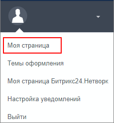
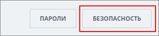
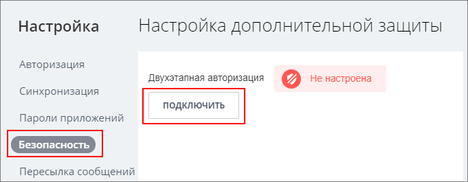
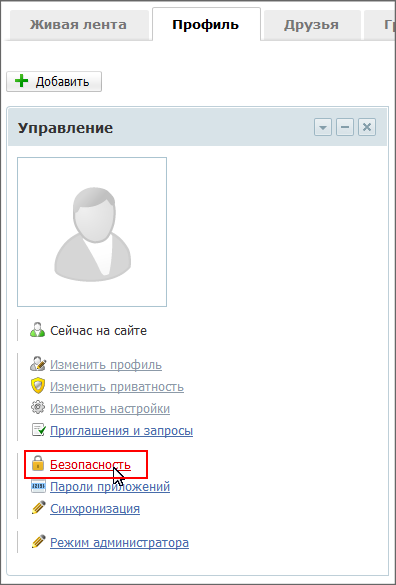
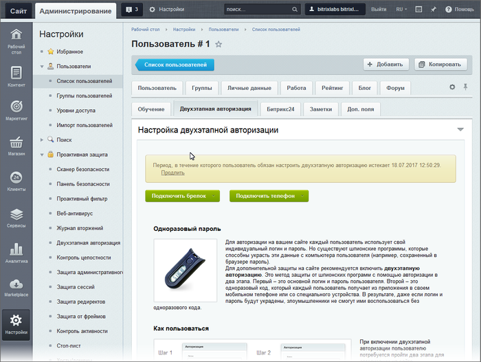
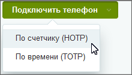
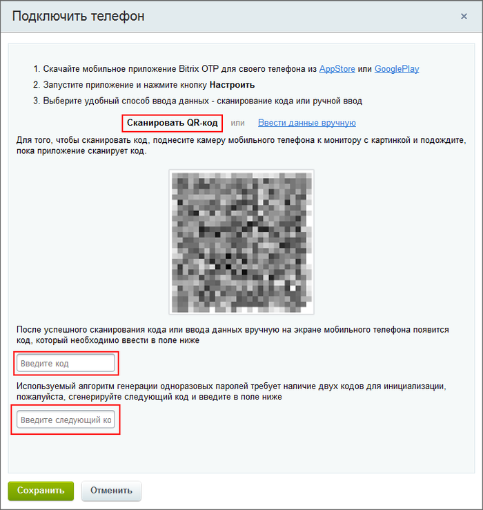
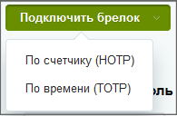

# Подключение пользователем двухэтапной авторизации

**Навигация**
- [← Оглавление курса](index.md)
- [← Предыдущий: 2003 — Двухэтапная авторизация](lesson_2003.md)
- [Следующий: 6920 — Резервные коды →](lesson_6920.md)

Официальная страница урока: https://dev.1c-bitrix.ru/learning/course/index.php?COURSE_ID=34&LESSON_ID=6921

Двухэтапная авторизация включается после указания администратора и

			настройки

                    Включение/отключение механизма двухэтапной авторизации на сайте производится на странице Двухэтапная авторизация (Настройки &gt; Проактивная защита &gt; Двухэтапная авторизация).

[Подробнее ...](https://dev.1c-bitrix.ru/learning/course/index.php?COURSE_ID=35&LESSON_ID=5002)

		 им системы. Подключение возможно как с публичной части, так и с административной.

**Внимание!** Перед подключением двухэтапной авторизации

			проверьте правильность

                    Одноразовые пароли создаются на основе времени, следовательно, при расхождении времени на вашем устройстве и на сервере Битрикс24 или сайта вы не получите верного кода доступа. Что делать в случае ошибки доступа?

[Подробнее ...](lesson_5421.md#time_settings)

		 установленного времени и часового пояса в вашем мобильном устройстве.

Для всех продуктов компании *1С-Битрикс* ("1С-Битрикс: Управление сайтом" и Битрикс24) механизм подключения двухэтапной авторизации одинаков.

### Видеоурок

### Подключение с публичной части

**В Битрикс24**

- Откройте
  			профиль пользователя
                      
  		;
- В правом верхнем углу нажмите кнопку
  			Безопасность
                      
  		;
- В открывшемся окне указано, что двухэтапная авторизация не подключена. Нажмите
  			Подключить
                      
  		;
- Следуйте инструкции по подключению.

Также смотрите видео и читайте статью о подключении Двухэтапной авторизации в **Битрикс24**  на [helpdesk.bitrix24.ru](https://helpdesk.bitrix24.ru/open/6641271/).

**В 1С-Битрикс: Управление сайтом** с помощью

			комплексного компонента

                    Предположим, вы хотите расположить на странице сайта список новостей. Компоненты облегчат вашу жизнь и помогут выполнить задачу.
[Подробнее](https://dev.1c-bitrix.ru/learning/course/index.php?COURSE_ID=34&CHAPTER_ID=04457&LESSON_PATH=3905.4457)...

			Социальная сеть

                    Секции настроек компонента

						[Описание компонента «Социальная сеть (комплексный компонент)» в пользовательской документации.](http://dev.1c-bitrix.ru/user_help/detail.php?ID=125720)

		:

- На странице сайта должен быть размещен компонент **Социальная сеть**;
- Перейдите на специальную страницу **Настройка дополнительной защиты** (Профиль &gt; меню Действия:
  			Безопасность
                      
  		);
- Следуйте инструкции по подключению.
  **Примечание**: В редакциях **Стандарт** и **Малый бизнес** отсутствует модуль **Социальная сеть**.
  			Страницу с инструкцией
                      В редакциях Стандарт и Малый бизнес есть модуль Проактивная защита, но нет модуля Социальная сеть, которая выводит форму для подключения пользователями двухэтапной авторизации. Администратор должен создать публичные страницы для размещения компонентов подключения и резервных кодов.
  [Подробнее ...](/learning/course/index.php?COURSE_ID=35&LESSON_ID=5034)
  		 по подключению в этом случае размещает Администратор сайта.

### Подключение с административной части

Для подключения перейдите на страницу

			редактирования пользователя

                    Управление учетными записями пользователей в системе выполняется на странице Список пользователей (Настройки &gt; Пользователи &gt; Список пользователей)...

[Подробнее ...](/learning/course/index.php?COURSE_ID=35&LESSON_ID=2004)

		, вкладка

			Двухэтапная авторизация

                    Вкладка отображается только если администратором системы включено использование механизма двухэтапной авторизации.

		:

Перед подключением узнайте у Администратора сайта какой

			алгоритм генерации паролей

**По счетчику** ([HMAC-Based One-time Password](http://ru.wikipedia.org/wiki/HOTP), **HOTP**) – код будет доступен до тех пор, пока пользователь не запросит новый;

**По времени** ([Time-based One-time Password](http://ru.wikipedia.org/wiki/Time-based_One-time_Password_Algorithm), **TOTP**) – код будет доступен в течение 30 секунд с момента его получения, после чего он автоматически обновится.

		 он установил. Убедитесь, что

			Приложение в телефоне

                    При каждой авторизации пользователь вводит новый секретный код, что исключает возможность его подбора злоумышленниками. Одноразовый пароль вы можете получить с помощью специальной программы у вас на телефоне или используя специальный брелок – токен.

[Подробнее ...](lesson_2003.md#otp_app)

		, которое вы собираетесь использовать, поддерживает этот алгоритм.

## Подключение телефона

С помощью кнопки

			Подключить телефон

                    

		 выберите нужный алгоритм. В открывшейся форме выполните шаги, указанные в пунктах 1-3.

Далее отсканируйте с помощью приложения на телефоне **QR-код**:

При использовании алгоритма **по счетчику** дважды сгенерируйте код в приложении на телефоне и введите его в два поля.
В случае использования алгоритма **по времени** *код* генерируется один раз.

Если приложение не умеет сканировать QR-код, воспользуйтесь ссылкой **Ввести данные вручную**. Система выдаст секретный ключ, который нужно ввести в приложение вместе с другими полями:

- **Адрес сайта** вида `www.site.ru` (без http://);
- **E-mail**, с которым был зарегистрирован пользователь на сайте;
- **Секретный ключ**, который указан в форме (можно не обращать внимания на пробелы);
- **Тип ключа**.

## Подключение аппаратного устройства

С помощью кнопки

			Подключить брелок

                    

		 выберите нужный алгоритм. Для алгоритма «По времени» в открывшейся форме:

введите секретный ключ, полученный от администратора сайта и пароль с устройства. Для некоторых брелков может понадобится ввести

			начальное значение счётчика времени

                    Поле добавлено в версии 23.100.0 модуля Проактивная защита. Подробнее о поле рассказываем в уроке учебного курса [Администратор. Базовый](https://dev.1c-bitrix.ru/learning/course/index.php?COURSE_ID=35&LESSON_ID=5006).

		.

В случае с алгоритмом **по счётчику** пароль с устройства вводится

			дважды

                    

		.

**Внимание!** Одновременно возможно использовать только одно

			средство

                    Мобильное приложение или аппаратное устройство.

		 для двухэтапной авторизации. При подключении нового авторизация со старым уже невозможна.

#### Результат подключения в административной части

Подключение завершено, форма на вкладке **Двухфакторная авторизация** имеет вид:

где:

- **Отключить** – отключает двухэтапную (двухфакторную) авторизацию **бессрочно** или же на **определенное** количество дней.
- **Резервные коды** – позволяет перейти к форме работы с
  			резервными кодами
                      Функционал резервных кодов используется для доступа на сайт в тех случаях, когда нет возможности использовать устройство двухэтапной авторизации. Например, если утерян брелок или телефон с приложением.
  [Подробнее ...](http://dev.1c-bitrix.ru/learning/course/index.php?COURSE_ID=35&LESSON_ID=5007)
  		.
  **Примечание:** Резервные коды доступны, если на странице настроек двухэтапной (двухфакторной) авторизации отмечена соответствующая опция.
- **Синхронизировать** – позволяет перейти к форме
  			синхронизации
                      Синхронизация необходима для случаев, когда на устройстве генерации одноразовых паролей по счетчику была произведена генерация паролей несколько раз (например, случайно нажата кнопка на аппаратном устройстве), но не было выполнено ни одной удачной аутентификации.
  [Подробнее ...](http://dev.1c-bitrix.ru/learning/course/index.php?COURSE_ID=35&LESSON_ID=5008)
  		 устройств.
- **Подключить новый брелок/телефон** – позволяет произвести подключение нового устройства двухэтапной (двухфакторной) авторизации.

|  | #### Заключение |
| --- | --- |

Подключение двухэтапной авторизации производится после настроек администратором этого функционала. Для подключения необходимо:

- знать тип выбранного администратором алгоритма;
- подобрать приложение, подходящее под ваше устройство, и тип алгоритма.
