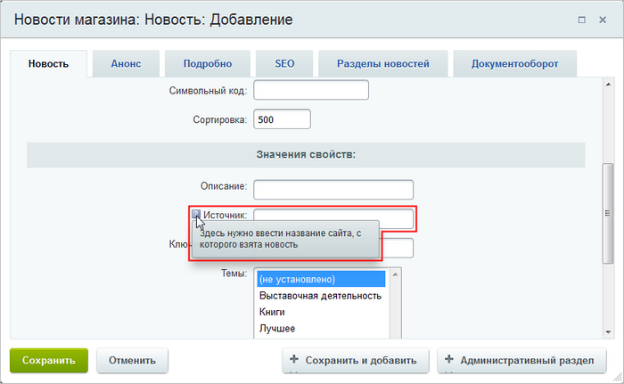
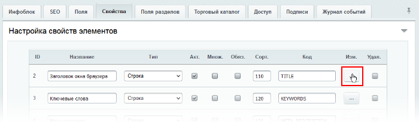
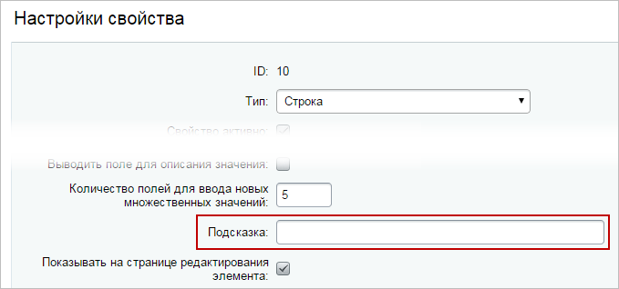

# Подсказки в форме элемента

**Навигация**
- [← Оглавление курса](index.md)
- [← Предыдущий: 1883 — Настройка форм элементов и разделов под себя](lesson_1883.md)
- [Следующий: 13034 — Практические задания →](lesson_13034.md)

Официальная страница урока: https://dev.1c-bitrix.ru/learning/course/index.php?COURSE_ID=34&LESSON_ID=7051

### Видеоурок

### Подсказки в форме элемента

Записываете памятки на листочке о том, как заполнять значения свойств элемента? Это прошлый век. Используйте подсказки:

### Как создать подсказки?

1. Откройте форму редактирования вашего инфоблока.
2. Перейдите на закладку **Свойства**.
3. Напротив нужного свойства нажмите кнопку
  			
  
  		.
4. Заполните поле **Подсказка**:
  
5. Сохраните настройки.

Подсказка готова к использованию. Стоит лишь навести курсор мыши на значок в форме редактирования элемента.

### Заключение

Итак, пояснения по заполнению значений свойств можно хранить в подсказках. Для этого:

1. откройте нужное свойство на редактирование;
2. заполните поле **Подсказка**.
