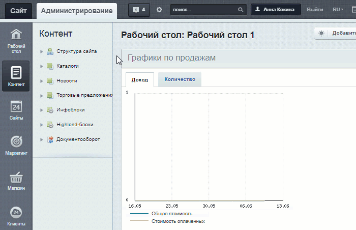
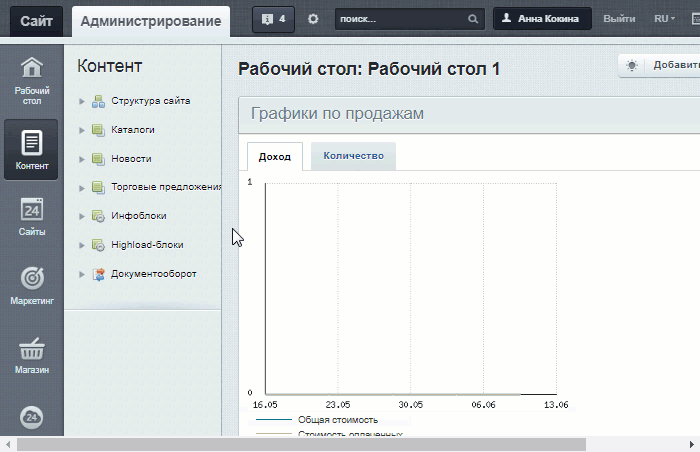
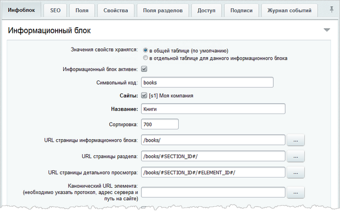
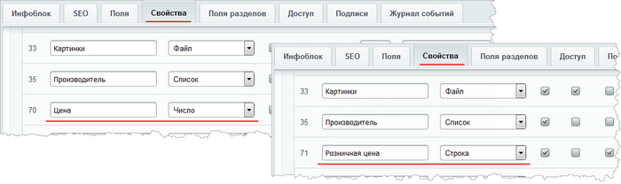
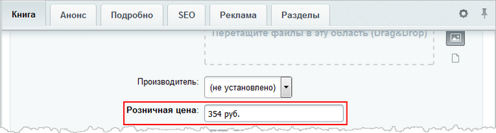
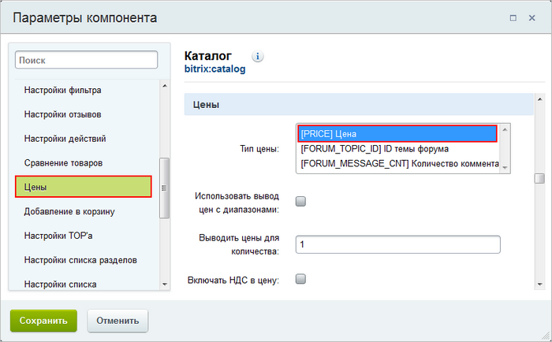
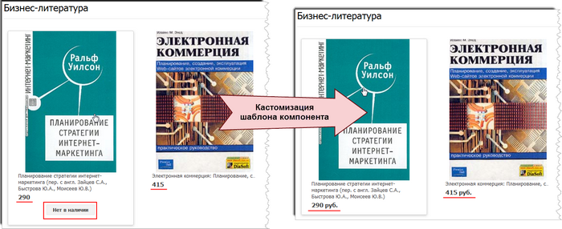
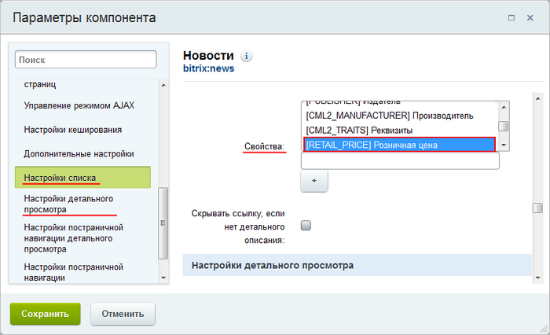
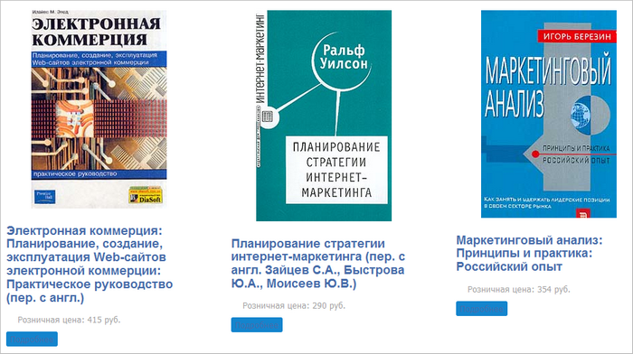

# Каталог товаров без использования модуля Торговый каталог

**Навигация**
- [← Оглавление курса](index.md)
- [← Предыдущий: 12487 — Если не добавляется видео со стороннего сервиса](lesson_12487.md)
- [Следующий: 23876 — Страница с файлами для скачивания →](lesson_23876.md)

Официальная страница урока: https://dev.1c-bitrix.ru/learning/course/index.php?COURSE_ID=34&LESSON_ID=7153

В данном уроке рассмотрим, как использовать возможности модуля **Информационные блоки** для создания простого каталога товаров без использования модуля **Торговый каталог**.

### Создание инфоблока и цен

В первую очередь необходимо

			создать тип инфоблоков

                    Создание типа выполняется в административном разделе сайта на странице

**Типы информационных блоков** (Контент &gt; Инфоблоки &gt; Типы инфоблоков).

[Читать подробнее..](lesson_2010.md)

		, а затем в этом типе

			добавить инфоблок

                    Добавление инфоблока выполняется на странице Контент &gt; Инфоблоки &gt; Типы инфоблоков &gt; название_типа,

где вместо *название_типа* у вас отображается реальное название нужного типа инфоблоков.

[Читать подробнее..](lesson_4534.md)

		, в котором будут храниться товары:

Решение проблемы с вводом цен для товаров каталога заключается в создании свойств инфоблока, хранящих величины цен. Выбор подходящего типа свойства для цен определяется используемыми у вас компонентами для публикации каталога. Так, если будут использоваться компоненты каталога (компоненты, расположенные в визуальном редакторе по пути Контент &gt; Каталог), то тип свойства должен быть **Число**, а если новостные компоненты (Контент &gt; Новости), то можно использовать свойство типа **Строка**.

Кроме того, свойство с ценой полезно сделать обязательным к заполнению, чтобы не забывать указывать цену при заполнении карточки товара.

**Примечание:** при использовании свойства типа **Строка** валюту цены товара можно указывать непосредственно в карточке товара:

### Создание публичного интерфейса

Процесс создания публичного интерфейса зависит от ваших требований к структуре и внешнему виду каталога товаров. Он может быть создан с помощью компонентов каталога или новостных компонентов как простых, так и комплексных. Поэтому детально рассматривать создание публичного интерфейса не будем, отметим лишь связанные с отображением цен особенности:

- При использовании [компонентов каталога](http://dev.1c-bitrix.ru/user_help/content/iblock/components_2/catalog/index.php) свойство с ценой указывается в секции **Цены** формы настроек компонента:
  
  Кроме того, дополнительно следует провести
  			кастомизацию шаблона компонента
                      Пользовательские шаблоны компонента - это шаблоны, которые изменены под нужды конкретного проекта.
  [Читать подробнее..](/learning/course/index.php?COURSE_ID=43&LESSON_ID=2829)
  		, чтобы, например, убрать надпись **Нет в наличии** и добавить отображение валюты к цене товара:
  
- При использовании [новостных компонентов](http://dev.1c-bitrix.ru/user_help/content/iblock/components_2/news/index.php) свойство с ценой указывается в параметре **Свойство** секций **Настройки списка** и **Настройки детального просмотра**:
  
  А использование в компонентах встроенного шаблона **flat** позволяет представить каталог товаров в следующем виде:
  
