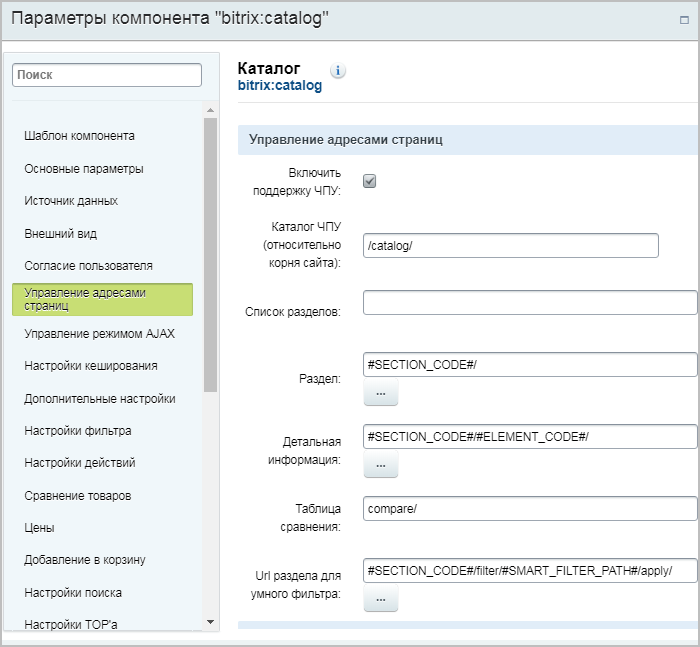
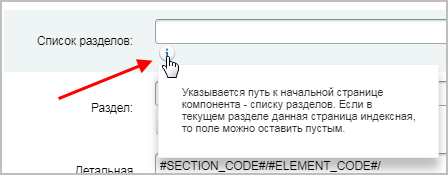
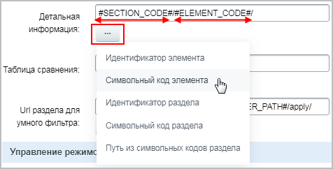
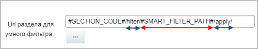

# Красивые адреса для фильтра товаров

**Навигация**
- [← Оглавление курса](index.md)
- [← Предыдущий: 7199 — Основная страница элемента среди дублей](lesson_7199.md)
- [Следующий: 7250 — Каталог товаров на простых компонентах →](lesson_7250.md)

Официальная страница урока: https://dev.1c-bitrix.ru/learning/course/index.php?COURSE_ID=34&LESSON_ID=7180

### Видеоурок

### Красивые адреса для фильтра товаров

Представьте, что ваш покупатель отобрал интересующие его товары с помощью фильтра и решил поделиться ссылкой с другом. Ссылка имеет примерно следующий вид:

http://mysite.ru/e-store/books/business/?FILTER_P1_MIN=&FILTER_P1_MAX=&FILTER_19_1218211285=Y&FILTER_23_964515751=Y&set_filter=Показать

Согласитесь, что это нечитабельно и несколько пугающе. Сделайте ссылки удобными и интуитивно понятными с инструментом поддержки человеко-понятных URL (**ЧПУ**) в фильтре товаров:

http://mysite.ru/e-store/books/business/filter/year-is-2002/publisher-is-exmo/apply/

**Примечание:** поддержка ЧПУ в умном фильтре доступна с версии 15.5.0 модуля **Информационные блоки**

|  |
| --- |

|  | #### Как включить ЧПУ |
| --- | --- |

Режим использования ЧПУ включается в настройках компонента/-ов, выводящих каталог:

- Если каталог показывается на сайте с помощью комплексного компонента
  			Каталог
                       Комплексный компонент осуществляет вывод полного каталога товаров из определенного инфоблока.
  						[Описание компонента «Каталог (комплексный компонент)» в пользовательской документации.](http://dev.1c-bitrix.ru/user_help/detail.php?ID=62978)
  		, то никаких отдельных настроек для фильтра выполнять не нужно. В настройках этого компонента следует всего лишь
  			Включить поддержку ЧПУ
                      
  		 и
  			настроить компонент
  Задайте настройки для ЧПУ:
  **-** При наличии разделов в инфоблоке в поле **Раздел** (или **Страница раздела**) замените `#SECTION_ID#/` на `#SECTION_CODE#/`. Построение ссылки будет выполняться с помощью символьного кода раздела, а не его идентификатора.
  **-** Если разделов нет, то оставьте поле пустым.
  В поле **Страница детального просмотра** измените `#SECTION_ID#/#ELEMENT_ID#/` на `#SECTION_CODE#/#ELEMENT_CODE#/` в случае наличия разделов.
  [Подробнее](lesson_10233.md)...
  		 на работу в режиме ЧПУ.
  ## Пример настройки ЧПУ в комплексном компоненте Каталог
  
  У полей есть
  			всплывающие подсказки,
  
  		 а также
  			кнопка подстановки данных
  
  		 раздела или элемента (т.е. вы выбираете, что подставлять в адрес: числовые идентификаторы или символьные коды).
  **Примечание**: в поле
  			Url раздела для умного фильтра
  
  		 обязательно должен быть блок ЧПУ умного фильтра (`#SMART_FILTER_PATH#`), ограниченный с двух сторон выражениями-ограничителями (по умолчанию стоят `/filter/` и `/apply/`, но вы можете заменить их на произвольные слова).
- Если же каталог товаров построен на нескольких
  			простых компонентах,
  Бывают ситуации, что для построения каталога товаров на сайте не подходит комплексный компонент **Каталог**. Требуется собрать каталог вручную на простых компонентах. Рассмотрите процедуру создания такого каталога на небольшом примере.
  [Подробнее](lesson_7250.md)...
  		 то настройте поддержку ЧПУ во всех простых компонентах каталога, особенно
  			в компоненте
                      
  		 **Умный фильтр** (
  			catalog.smart.filter
                      Компонент подготавливает фильтр для выборки из инфоблока и выводит форму фильтра для фильтрации элементов.
  						[Описание компонента «Умный фильтр» в пользовательской документации.](http://dev.1c-bitrix.ru/user_help/detail.php?ID=541722)
  		).

### Откуда берутся значения для подстановки в ссылку фильтра?

Формирование адресной ссылки фильтра зависит от типов свойств, участвующих в фильтрации:

- для строковых свойств подставляется само значение свойства;
- для свойств типа **Список** - внешний код;
- для свойств **Элемент** и **Раздел** - символьный код, если есть, иначе - название;
- для **Пользовательских свойств** подставляется результат метода *GetExtendedValue* или [GetPublicViewHTML](https://dev.1c-bitrix.ru/api_help/iblock/classes/user_properties/GetPublicViewHTML.php) с "MODE" =&gt; "SIMPLE_TEXT" (зависит от автора свойства).

### Заключение

Итак, чтобы не только адреса страниц каталога сделать понятными, но и значительно улучшить вид ссылки с отфильтрованными товарами, отметьте флаг **Включить поддержку ЧПУ** в компонентах каталога.
